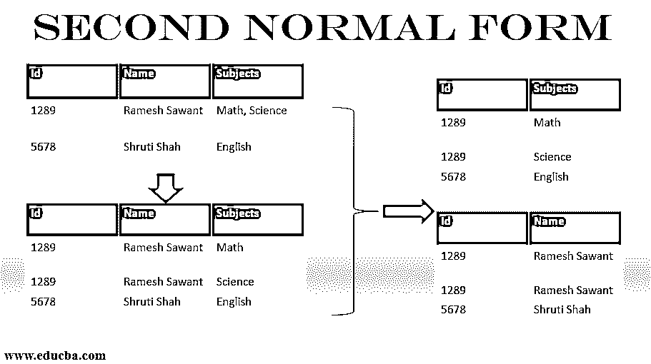

# 第二范式

> 原文：<https://www.educba.com/second-normal-form/>

## 什么是第二范式？

*   在关系数据库管理系统中，数据的一致性和依赖性至关重要。通常使用[范式](https://www.educba.com/normal-forms-in-dbms/)来避免数据冗余。数据中的冗余会导致异常，如更新、插入和删除。在更新异常中，如果一个表有冗余数据，那么更新记录就没有被正确地更新，从而导致数据不一致。
*   在插入异常的情况下，如果表不允许空值，我们可以通过一个不能用空值更新的列的例子来更好地理解它。删除异常进入图片；如果我们需要删除某个记录，并且该记录存在于表的其他行中，那么删除该特定记录也会从其他行中删除该记录。
*   为了克服更新、插入和删除异常，需要对数据进行规范化。规范化消除了冗余数据，也确保了数据依赖性。此外，规范化有助于逻辑地存储数据，并减少存储数据库的空间。
*   关系数据库管理系统中常用的各种范式有第一范式、第二范式、[第三范式](https://www.educba.com/third-normal-form/)、 [Boyce-Codd 范式(BCNF)](https://www.educba.com/bcnf/) 等。要达到第二范式，首先要达到第一范式，这是使表格或数据达到第二范式的标准之一。[第一范式(1NF)](https://www.educba.com/first-normal-form/) 规则是一列的一个属性不能包含多个值；相反，它应该包含原子值。

### 它是如何工作的？

在深入探讨规范化的概念之前，让我们先关注一下数据库表和关系中涉及的一些基本元素。[RDBMS 中的一个键](https://www.educba.com/what-is-rdbms/)用来唯一标识一个表中的记录，一个键可以是单列，也可以是多列。主键是用于唯一标识记录的单列。复合主键由多个列组成，也用于标识唯一的记录。在第二范式中，我们需要实现一个单列主键。一个表中的外键用于唯一标识另一个表中的记录。在第二范式中，关系中的每个非键属性在功能上必须依赖于主键。

以下是确保数据处于第二范式的几个步骤:

<small>Hadoop、数据科学、统计学&其他</small>

1.  第一范式应该实现。
2.  删除适用于表中多行的数据子集，并将它们放在不同的表中。
3.  使用外键来确保创建的表之间的关系。

#### 例子

为了更好地理解范式，让我们看看下表，然后看看实现第二范式的步骤。

让我们以下表“教师详细信息”为例。

| **Id** | **名称** | **科目** |
| One thousand two hundred and eighty-nine | 拉梅什·萨万特 | 数学，科学 |
| Five thousand six hundred and seventy-eight | Shruti Shah | 英语 |
| One thousand two hundred and sixty-seven | Nikhil Das | 历史、社会研究 |
| Three thousand four hundred and nine | 普佳·夏尔马 | 经济学 |

上表包含了每位教师教授的具体科目。这里的“主题”列不包含原子值，对于 Id 1289 和 1267，“主题”列中有多个主题。正如我们可以看到的，列“Subjects”没有原子值，我们需要首先按照下面的方法使表符合第一范式。

| **Id** | **名称** | **科目** |
| One thousand two hundred and eighty-nine | 拉梅什·萨万特 | 数学 |
| One thousand two hundred and eighty-nine | 拉梅什·萨万特 | 科学 |
| Five thousand six hundred and seventy-eight | Shruti Shah | 英语 |
| One thousand two hundred and sixty-seven | Nikhil Das | 历史 |
| One thousand two hundred and sixty-seven | Nikhil Das | 社会学科 |
| Three thousand four hundred and nine | 普佳·夏尔马 | 经济学 |

现在上表是第一范式，因为所有属性都有原子值。

这里的复合主键是‘Id**’**和‘Name’。列“Subjects”是非主属性。同样，这里的“主题”列只依赖于列 **'** 名**'，**，它是复合主键的一部分。所以这个表不满足第二范式的条件。

为了使表符合第二范式，我们需要将上面的表分成如下所示的两个表。

**表格教师 _ 信息如下图:**

| 身份 | 名字 |
| One thousand two hundred and eighty-nine | 拉梅什·萨万特 |
| Five thousand six hundred and seventy-eight | Shruti Shah |
| One thousand two hundred and sixty-seven | Nikhil Das |
| Three thousand four hundred and nine | 普佳·夏尔马 |

**表格 subject_details 如下图:**

| 身份 | 学科 |
| One thousand two hundred and eighty-nine | 数学 |
| One thousand two hundred and eighty-nine | 科学 |
| Five thousand six hundred and seventy-eight | 英语 |
| One thousand two hundred and sixty-seven | 历史 |
| One thousand two hundred and sixty-seven | 社会学科 |
| Three thousand four hundred and nine | 经济学 |

我们已经从表格中删除了初始的[函数依赖关系](https://www.educba.com/functional-dependency-in-dbms/)。因此，在表 subject_details 中，列“Subjects”完全依赖于表的主键，即“Id”。

### 第二范式的优势

下面是使用第二范式的一些优点。

1.  更有效地减少冗余数据。
2.  数据库中的数据是一致的。
3.  它提高了设计数据库的灵活性。
4.  它还改进了数据库中数据的整体组织。
5.  它还提高了数据库的安全性。

### 结论

*   对于满足企业系统数据需求的[数据库管理系统](https://www.educba.com/database-management-system/)的成功实施，数据库的设计至关重要。通过确保数据的一致性和依赖性，规范化有助于实现数据库管理系统的设计和维护。
*   虽然它通过使用外键删除了适用于一个表中多行的数据子集并确保了表之间的关系，但由于需要删除任何超级键上的非素属性的传递函数依赖性，导致了第三范式的使用。因此，它的使用取决于业务设置的需求，在设计数据库管理系统时应该仔细选择。

### 推荐文章

这是第二范式的指南。这里我们讨论了什么是第二范式？第二范式是如何工作的？并附有一个适当的例子。您也可以浏览我们推荐的其他文章，了解更多信息——

1.  [SQL Server 中的联接类型](https://www.educba.com/types-of-joins-in-sql-server/)
2.  [什么是 SQL 注入？](https://www.educba.com/what-is-sql-injection/)
3.  [Oracle PL/SQL 面试问题](https://www.educba.com/oracle-pl-sql-interview-questions/)
4.  [SQL 职业](https://www.educba.com/careers-in-sql/)

