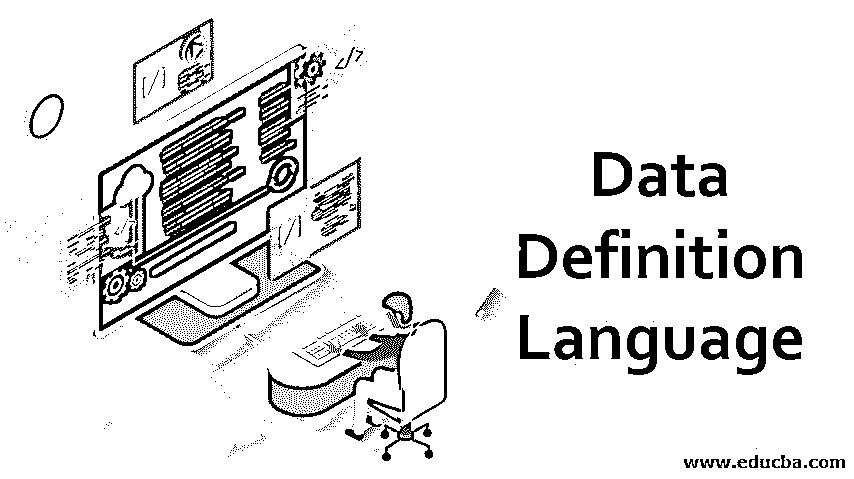
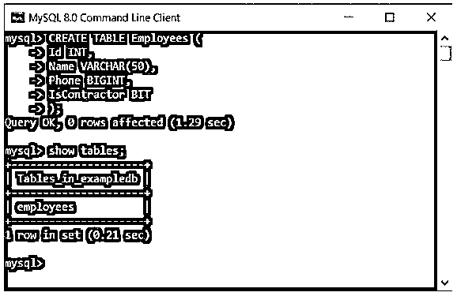
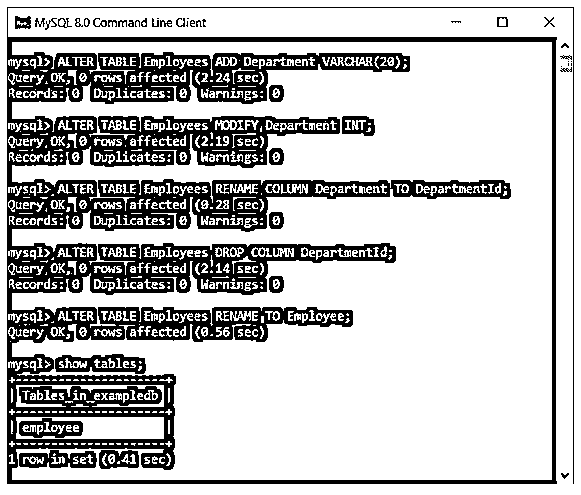
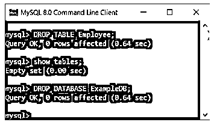

# 数据定义语言

> 原文：<https://www.educba.com/data-definition-language/>

## 数据定义语言简介

数据定义语言是一种编程语言，通过它来定义数据结构。缩写为 DDL，它可以被认为是一种指定命令的标准，通过这些命令来定义数据结构。

有四种数据语言:

<small>Hadoop、数据科学、统计学&其他</small>

*   **数据定义语言(DDL):** 对数据结构进行编码。
*   **数据操作语言(DML):** 存储和处理那些结构中的数据。
*   **数据控制语言(DCL):** 决定谁可以处理结构和数据。
*   **数据查询语言(DQL):** 查询数据库进行结果和数据挖掘。

因此，用最简单的术语来说，DDL 是一种用于编码数据结构的计算机语言。

### 为什么是数据定义语言？

数据定义语言可以追溯到 CODASYL 数据库模型。数据库的模式是用语法语言编写的。它完整地描述了记录、集合、字段和模型。这逐渐成为在结构化查询语言 (SQL)中声明表、列、约束等的标准。因此，随着时间的推移，DDL 成为 SQL 的一个子集。

### 数据定义语言是如何工作的？

DDL 是所有结构化查询语言都遵循的一套准则。与计算机编程语言一样，我们有所有编程语言都遵循的 OOPS 准则，同样，我们有所有数据库语言都遵循的数据定义语言标准，如 MySQL、Oracle、SQL Server 等。

数据定义语言处理存储数据的数据库的结构。它不处理数据本身。因此，在任何结构化查询语言中，可以修改数据库的结构或表或关系的命令是 DDL 命令。修改存储数据的命令是 DML 命令。修改授权规则的命令是 DCL 命令。查询数据库以获取结果的命令是 DQL 命令。

### 数据定义语言命令

有一点需要彻底记住——DDL 处理的是数据库的结构，而不是数据本身。

#### 1.创造

因此，DDL 下的第一个命令是 Create 命令。Create 命令用于创建新的数据库或数据库中的新组件，如表、存储过程、索引等。

让我们一个接一个地看看所有命令的运行情况。

**Note 1:** The examples below use MySQL v8.0.16 CLI.**Note 2:** Most of the structured query languages are case insensitive, which means the commands are the same whether in upper case or lower case.

##### 创建数据库

Create Database 命令创建一个新数据库。

**语法:**

`CREATE DATABASE <DatabaseName>`

**举例:**

`CREATE DATABASE ExampleDB;
CREATE TABLE`

现在我们已经创建了一个新的数据库，我们需要在数据库中创建表。

**语法:**

`CREATE TABLE <TableName> (
<Column1> <DataType>,
<Column2> <DataType>,
<Column3> <DataType>,
.
.
.
<ColumnN> <DataType>,
)`

**举例:**

`CREATE TABLE Employees (
Id INT,
Name VARCHAR(50),
Phone BIGINT,
IsContractor BIT
);`

我们的表创建完毕。现在，我们可以向它添加数据，并在需要时查询结果。

#### 2.改变

现在让我们看看 DDL 中的 Alter 命令。它们用于修改表，以添加、重命名、编辑或删除列。Alter 命令还可以重命名表本身。

##### 更改表格

让我们看看各种 Alter DDL 命令:

*   添加列
*   Alter Table 命令允许我们向现有的表中添加一列。

**语法:**

`ALTER TABLE <TableName> ADD <ColumnName> <DataType>`

##### 修改列

Alter Table 命令允许我们修改现有表中的现有列。这在修改列的类型或大小时很有用。

**语法:**

`ALTER TABLE <TableName> MODIFY <ColumnName> <DataType>`

需要记住的重要一点是，我们不能用 modify 子命令重命名列。要重命名，有一个单独的子命令。

##### 重命名表格

Alter Table 命令允许我们重命名表。

**语法:**

`ALTER TABLE <TableName> RENAME TO <NewTableName>`

##### 重命名列

Alter Table 命令允许我们重命名现有表中的列。

**语法:**

`ALTER TABLE <TableName> RENAME COLUMN <ColumnName> TO <NewColumnName>`

##### 删除列

Alter Table 命令允许我们从现有的表中删除一列及其全部数据。

**语法:**

`ALTER TABLE <TableName> DROP COLUMN <ColumnName>`

**举例:**

按顺序运行下面几行命令，向表中添加新列，修改列的类型，重命名列，删除列，最后重命名表本身。

`ALTER TABLE Employees ADD Department VARCHAR(20);
ALTER TABLE Employees MODIFY Department INT;
ALTER TABLE Employees RENAME COLUMN Department TO DepartmentId;
ALTER TABLE Employees DROP COLUMN DepartmentId;
ALTER TABLE Employees RENAME TO Employee;`

#### 3.滴

DROP 命令用于从数据库或模式中删除对象。它可以删除表、视图、存储过程、索引甚至数据库。

##### 翻桌

Drop Table 命令删除整个表以及所有数据。

**语法:**

`DROP TABLE <TableName>`

**举例:**

`DROP TABLE Employee;`

##### 删除数据库

Drop Database 命令删除数据库和其中的所有对象。

**语法:**

`DROP DATABASE <DatabaseName>`

**举例:**

`DROP DATABASE ExampleDB;`

### 优势

下面是解释的一些优点。

*   数据定义语言最大的优点是统一性。
*   所有结构化查询语言都遵循的一组标准。
*   通过 DDL，数据库模式可以用命令形式编写，并且很容易存储。
*   随着时间推移，这也变得易于理解和编写新命令。
*   因此，DDL、DML、DCL 和 DQL 在所有结构化查询语言的最基本层次上实现了统一。

### 结论

在这篇文章中，我们学习了数据定义语言，它的概念，它的目的和 MySQL 中的一些例子。建议理解 DDL 的概念，因为它是信息技术世界中一种常见的知识测试。

### 推荐文章

这是数据定义语言的指南。这里我们讨论基本概念，它是如何工作的，以及数据定义语言的优缺点。您也可以看看以下文章，了解更多信息–

1.  [数据分析过程](https://www.educba.com/data-analysis-process/)
2.  [Cassandra 数据类型](https://www.educba.com/cassandra-data-types/)
3.  [最佳数据可视化工具](https://www.educba.com/best-data-visualization-tools/)
4.  [什么是 R 编程语言？](https://www.educba.com/what-is-r-programming-language/) 

