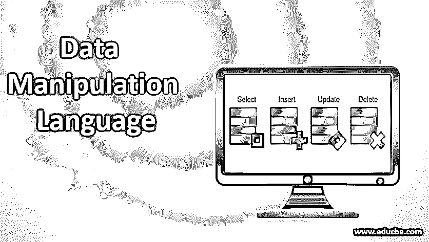

# 数据操作语言

> 原文：<https://www.educba.com/data-manipulation-language/>

## 数据操作语言简介

在本文中，我们将学习数据操作语言。众所周知，SQL(结构化查询语言)是处理数据库中结构化数据的广泛使用的语言之一。尽管我们可以在数据库中执行某些操作，比如与模式相关的操作，与数据库中的数据相关的操作，处理事务等。创建数据库、查询已经存在的数据、操纵数据等。是这些行动的一部分。在 SQL 中，这些操作大致分为四类，即 DDL、DML、DQL 和 DCL。DML 这个名字表明所有的 SQL 操作都与数据库中已经存在的数据的操作有关，比如插入新记录、删除记录、更新记录等等都属于 DML 的范畴。像插入、更新、删除、选择等 SQL 命令都是 DML 命令。

### 为什么我们需要数据操作语言？

考虑一个终端用户的场景，其中用户已经开始使用一个应用程序。用户通过提交基本细节在应用程序中注册。为了保存所有注册用户的数据，所有条目都需要插入到指定的表中。当用户登录应用程序时，将显示与该用户相关的所有数据。然后，用户可以在他们的配置文件中执行相应的操作，如根据需要插入、删除、检索等。所有这些操作都是使用 DML 命令在后台处理的。由于 DML 命令是经常使用的命令，并且是最终用户为了与系统交互而使用的命令，所以它根据需求向用户提供各种设施。用户可以使用各种子句和条件来执行所需的任务，例如 WHERE HAVING、GROUP BY 以及 SQL 命令。

<small>Hadoop、数据科学、统计学&其他</small>

### 数据操作语言是如何工作的？

实际上，DML 操作既可以在单个对象上进行，也可以批量进行。例如，可以对单个记录执行更新，或者在某些情况下需要更新整个表。如果用户需要对整个表执行操作，应该触发一个查询来批量执行操作，而不是一次触发一个记录，因为这非常耗时，并且有助于避免调控器限制，而调控器限制反过来又会影响查询处理的整体性能。为了扩展 SQL 功能和执行操作，在 PL/ SQL 程序中使用 DML 语句。它们使用两种类型的 DML，即程序性 DML(允许程序员指定需要什么数据以及如何检索该数据)和声明性 DML(允许程序员指定需要什么数据而不指定如何访问该数据)。处理后一个问题相对容易，因为系统会找到有效检索数据的最佳方式。

### 数据操作语言命令

如前所述，数据操作语言命令用于操作数据库中的数据。DML 命令用于更新、插入、删除和更改数据库中的数据。下面是程序员在处理数据库时常用的一些 DML 命令:

#### 1.挑选

SELECT 命令用于从表中检索记录。这是处理数据库时最常用的命令之一，因为最终用户希望在任何操作(无论是更新、删除还是修改)之后检索结果。

**语法:** `SELECT [column_name(s)] from [table_name] where [condition]`

#### 2.插入

INSERT 命令用于在表中插入一条或多条记录。

**语法:** `INSERT into [table_name] values (val1, val2, val3, …)`

如果我们想在特定的列上插入数据，需要在 SQL 命令中指定列名。

**语法:** `INSERT into [table_name] (col1, col2, col3, …) values (val1, val2, val3, …)`

#### 3.删除

DELETE 命令用于根据命令中指定的 where 条件从表中删除一条或多条记录。

**语法:** `DELETE from [table_name] where [condition to be specified]`

如果在带有 DELETE 的 SQL 命令中没有指定 where 条件，则整个表都将被删除。

**语法:** `DELETE from [table_name]`

#### 4.更新

UPDATE 命令用于修改现有表中的一条或多条记录。

**语法:** `UPDATE [table_name] SET [col1 = val1, col2 = val2,...] where [condition to be specified]`

#### 5.合并

合并命令是插入、更新和删除的组合。当需要合并两个表(源表和目标表)时，使用 MERGE 命令一起执行上述三个操作。

### 数据操作语言的优势

虽然当谈到在结构化数据库中执行操作时，DML 是生命线。下面给出了 DML 的一些优点:

*   通过使用 WHERE 子句应用条件，DML 命令为我们提供了根据需求检索数据的灵活性。
*   存储在数据库中的数据可以很容易地随时修改，使用 DML 命令也非常容易。
*   DML 提供了人(使用系统的最终用户)与系统或存储在数据库中的后端数据进行高效快速交互的便利。
*   我们可以在模式级别应用各种限制，同时为最终用户提供一些特权，以便在受控环境下操作和检索数据。
*   此外，最终用户不能使用 DML 在数据库的模式级别进行任何修改，这在讨论隐私问题时又是一个优势。

### 结论

上面的描述清楚地解释了什么是 DML，以及为什么它在处理对数据库/表中已经存在的记录的查询时很重要。在准备好表的整个模式(包括列的数据类型、限制等)之后，主要的事情是处理数据。事实上，使用系统的最终用户执行这些基本操作，如插入、删除、更新、检索反映在他/她的系统上的数据，都是由后端的 DML 命令控制的。

### 推荐文章

这是一个数据操作语言指南。这里我们讨论为什么我们需要数据操作语言？它是如何工作的？以及 DML 命令及其优点。您也可以浏览我们的其他相关文章，了解更多信息——

1.  [SQL Server 上重要的数据库管理工具](https://www.educba.com/database-management-tools/)
2.  [MySQL 中的通配符](https://www.educba.com/wildcards-in-mysql/)
3.  [SQL 数据类型](https://www.educba.com/sql-data-types/)
4.  [SQL 关键字](https://www.educba.com/sql-keywords/)

