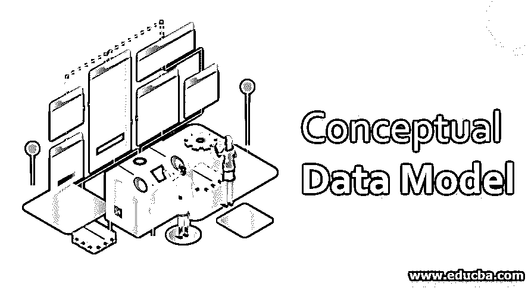
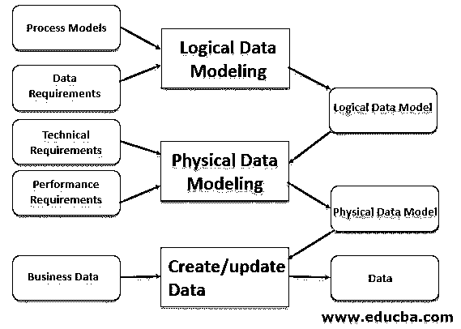

# 概念数据模型

> 原文：<https://www.educba.com/conceptual-data-model/>

## 概念数据模型简介

每当有数据时，总是需要将数据存储在数据库中。数据模型用于表示数据库中的数据对象、数据对象之间的关联以及规则。数据模型定义了在数据库中存储数据的规则。数据模型分为三类，即概念模型、逻辑模型和物理模型。它用于定义实际系统包含的内容。这基本上是被数据架构师和业务涉众起诉的。它用于定义范围和管理业务规则和概念。

### 什么是概念数据模型？

它用于提供关于业务规则和业务概念的信息，这些信息可以由业务领域的人员开发。该模型用于定义模型所使用的关系和数据实体。实体可以被定义为现实世界的对象，而关系是任何两个实体之间的依赖关系。

<small>Hadoop、数据科学、统计学&其他</small>

它主要用于表示这些关系和实体。组织基本上使用这个模型来获得业务概念的更广泛的想法，并更好地理解系统。这个模型基本上是独立于任何硬件规格开发的。规格包括位置、软件规格或数据存储容量。概念数据模型的另一个名称是业务模型。

由于概念数据模型是高层的，它的结构中通常不包含属性。该模型用于定义数据实体之间的关系，但不提供关于基数属性的信息。概念数据模型的目的是定义一个独立于任何数据库管理系统或任何数据库技术的模型。这个模型通常是在最初构建的，它涵盖了最初的需求，也包含了定义业务结构的高级概念。

概念数据模型的另一个用途是识别系统实体、高级关键业务，以及定义数据实体之间存在的关系。它用于填补需求文档和解决方案模型之间的空白。它包含可以由业务分析师设计的业务概念。

### 什么是数据模型？

数据模型意味着逻辑关系和在各种数据元素之间流动的数据。数据模型用于定义数据存储和从数据库中检索的过程。数据模型主要用于确定信息系统的需求，并设计对所有这些需求的响应。数据模型有助于表示数据，需要使用什么样的数据格式，因为格式根据业务流程而变化。

数据模型以抽象的形式呈现。数据模型的组件是数据类型、数据项、数据源、链接和事件源。[数据建模](https://www.educba.com/what-is-data-modeling/)符号用于表示主要以图形格式呈现的数据模型。数据模型用于定义数据的正确格式，因为数据可以以各种其他格式呈现。由于数据模型能够定义数据库表之间的关系，因此当数据存储在数据库中时，它有自己的意义。使用数据模型可以很容易地执行数据库操作。

### 使用

以下是数据模型的一些用途，解释如下:

*   通过使用该模型来定义实体和概念。通过使用该模型，所有重要的实体和关系被初步发现。
*   项目范围由概念数据模型定义。通过定义项目范围，可以适当地管理时间安排和时间管理。
*   概念数据模型用于在整个软件开发生命周期中获得对系统的高级理解。通过使用概念模型，业务主管和业务经理可以很容易地理解系统，并将获得关于系统的高水平知识。

### 数据模型的使用

让我们看看数据模型的一些用途，如下所示:

*   它用于准确地表示数据库中的所有数据对象。如果遗漏了任何数据，就会在执行数据库操作时产生问题。
*   数据模型有助于在逻辑和物理层面上表示数据。'
*   关系表、外键和主键都是由数据模型定义的。
*   可以从数据库中消除数据冗余，因为数据模型可以容易地识别冗余数据。数据模型还可以用来识别丢失的数据，并据此采取适当的措施。
*   由于数据模型有助于虚拟地表示数据，开发人员使用这种虚拟表示来创建实际的数据库。
*   在创建数据库时使用数据模型有助于维护数据库，并有助于以较少的工作量升级数据库。

### 数据模型的类型

让我们看看下面给出的数据模型的类型:

#### 1.概念的

这种类型的数据模型用于定义系统实际包含的内容。概念数据模型主要由数据架构师和业务涉众使用。通过使用概念数据模型来管理业务概念和业务规则。

#### 2.逻辑学的

这种类型的数据模型用于定义在不知道数据库管理系统的情况下，系统将如何实际实现。逻辑数据模型由业务分析师和数据架构师开发。该模型定义了数据结构和实现规则。

#### 3.身体的

这种类型的数据模型用于定义在不知道数据库管理系统的情况下，系统将如何实际实现。物理数据模型由数据库开发人员和数据库管理员开发。物理数据模型用于实际实现数据库。

### 结论

数据架构师基本上使用概念数据模型来获得系统更高层次的想法。概念数据模型基本上包含三个租户实体、属性和关系。该模型不包括关于系统中使用的实体和关系的详细信息，它只包含高级信息。概念模型包含任何数据库结构的高级细节。

### 推荐文章

这是概念数据模型的指南。在这里，我们讨论什么是数据模型及其用途和不同类型的概念数据模型。您也可以看看以下文章，了解更多信息–

1.  [数据科学的应用](https://www.educba.com/data-science-applications/)
2.  [数据仓库测试方法](https://www.educba.com/data-warehouse-testing/)
3.  [数据建模工具](https://www.educba.com/data-modelling-tools/)
4.  [数据科学技术](https://www.educba.com/data-science-techniques/)

