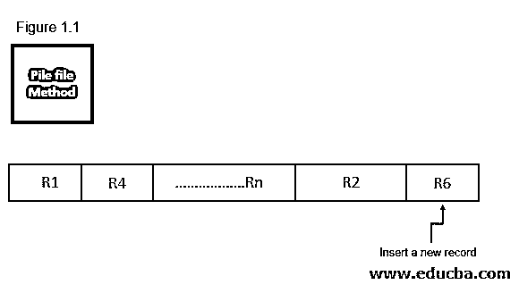
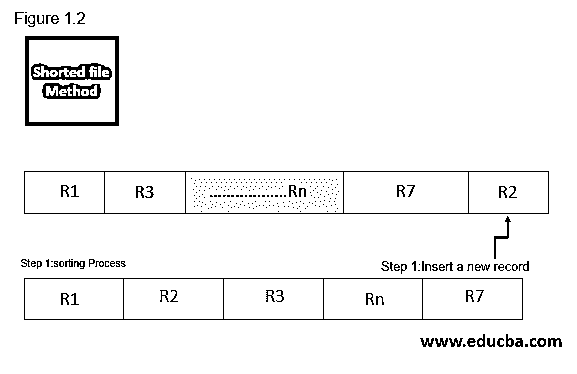

# 顺序文件组织

> 原文：<https://www.educba.com/sequential-file-organization/>

## 顺序文件组织介绍

顺序文件组织是数据库管理系统(DBMS)中一种流行的文件组织。这是一种简单的文件组织结构技术。这种技术以二进制格式依次组织的顺序方式存储数据元素。DBMS 中的文件组织支持各种数据操作，如插入、更新、删除和检索数据。该文件存储用于识别的唯一数据属性，这有助于将数据元素放置在序列中。计算机内存中的逻辑顺序为数据库管理系统存储数据元素。

### 顺序文件组织方法

顺序文件组织是各种文件组织类型中的一种。有两种常用方法可用于组织文件存储中的数据元素。这些方法对于管理和处理用于顺序文件组织的数据存储是有用的

<small>Hadoop、数据科学、统计学&其他</small>

顺序文件组织方法如下:

#### 1.堆文件方法

这是顺序文件组织的标准方法，在这种方法中，数据元素按照插入的顺序一个接一个地插入。并且在插入新记录的情况下，它被放置在最后插入的数据元素或记录之后的文件的结束位置。

在数据修改或数据删除操作的情况下，通过存储器块中的序列搜索特定的数据元素，并且在找到它之后，对该数据元素应用更新或删除操作。此外，对于删除操作，标识的数据元素被标记为删除，并且插入记录的新块。

我们将讨论插入操作，以使用一个示例场景来演示顺序文件组织中的堆文件方法。

在图 1.1 中，通过插入一个新的记录场景来表示堆文件方法。我们将每个数据元素表示为一个存储块，例如 R1 是第一个数据元素，R4 是第二个数据元素，R2 是文件的最后一个数据元素。一旦名为 R6 的新数据元素被插入到文件结构中，它将被放置和存储在 R2 之后，并且它是文件位置的结束。

图 1.1 显示了数据库管理系统中顺序文件组织中的堆文件方法的工作过程。

#### 2.分类文件方法

排序文件方法是数据库管理系统中另一种流行的顺序文件组织方法。该方法规定数据元素以缩短的顺序排列和存储。基于主键或任何其他键引用，数据元素按升序或降序存储。

在短文件方法场景的情况下，新数据元素或新记录被插入到文件的结束位置。在插入步骤之后，它会根据密钥按升序或降序短路。

对于更新或数据修改场景，搜索数据元素，并基于条件进行更新。并且，在更新操作完成之后，短路过程碰巧重新排列数据元素，并且更新的数据元素被放置在顺序文件结构的正确位置。

类似地，对于删除操作，通过缩短的序列搜索数据项，并且一旦它被识别，就标记为删除。删除操作完成后，其他数据元素被缩短，并以原来的升序或降序重新排列。

我们将讨论插入操作，以使用一个示例场景来演示顺序文件组织中的短文件方法。

让我们假设，有一个顺序文件包含 R1、R3、Rn、R7 数据元素，并且基于主键引用以升序出现。在 R7 之后插入一个新的记录 R2，它是文件位置的结尾，所有的记录被缩短，R2 被放在记录 R1 之后的第二个位置。

图 1.2 显示了用于顺序文件组织的短文件方法的两步过程。

步骤 1-在文件位置的末尾插入一个新的记录 R2

步骤 2-在 R2 插入完成后，它以升序变短。

### 优点和缺点

在这一节中，我们将从使用、效率和资源依赖性方面讨论顺序文件组织的一些优点和缺点。

#### 优势

*   对于大量数据，顺序文件组织是高效的，并且处理速度更快。
*   与其他可用的文件组织方法相比，这是一种简单的文件组织方法。
*   这种方法可以使用更便宜的存储设备如磁带来实现。
*   存储和维护数据元素需要更少的工作。
*   顺序文件组织技术对于报告生成和统计计算过程是有用的。
*   这种文件组织是计算聚合的首选方法，聚合涉及在执行计算过程时必须访问的大多数数据元素。一些流行的用例是为学生计算分数，为员工生成工资单，以及在业务中生成发票。

#### 不足之处

*   对于顺序文件组织中的缩短文件方法，缩短操作是一个耗时的过程并且需要更多的存储空间。
*   短路操作针对每个写入操作(如插入、更新或删除)进行迭代
*   在顺序文件组织中，遍历时间很长，因为对于每个写操作，系统或程序控制不能一次直接找到一个特定的数据项，它必须遍历整个数据项序列。

### 结论

顺序文件组织是对大量数据存储和处理系统有用的数据存储技术的基本形式。顺序文件组织，按顺序保存辅助存储器(如磁盘、光盘和磁表)上的指定信息集合。

### 推荐文章

这是一个顺序文件组织的指南。这里我们讨论顺序文件组织的介绍、方法、优点和缺点。您也可以浏览我们的其他相关文章，了解更多信息——

1.  [运行数据库](https://www.educba.com/operational-database/)
2.  [大数据架构](https://www.educba.com/big-data-architecture/)
3.  [Matlab 备选方案](https://www.educba.com/matlab-alternatives/)
4.  [信息学与数据阶段](https://www.educba.com/informatica-vs-datastage/)

