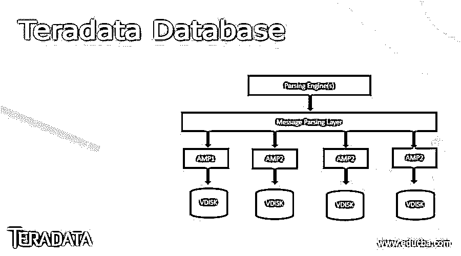
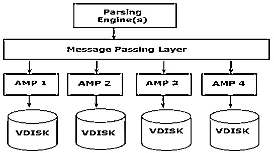

# Teradata 数据库

> 原文：<https://www.educba.com/teradata-database/>

## Teradata 数据库的定义

Teradata 数据库是关系管理系统中最流行的数据库，这种数据库主要适用于大规模数据和数据仓库应用，它是利用并行性概念实现的。基本上，它是由 teradata 公司开发的。我们可以说，teradata 在医疗保健、制造和运输等许多行业中使用，通过使用该数据库来优化他们的流程。

### 什么是 Teradata 数据库？

*   我们可以在 Linux、windows 和 UNIX 操作系统上运行。所以我们可以说它不是面向平台的。
*   它支持包含大量数据的数据应用。该数据库由不同类型的部署选项组成。
*   该数据库支持来自多个平台的各种用户。该应用程序由并行架构组成。
*   我们可以使用它来生成大型报告，如业务趋势。基本上，这些报告对于未来的预测是有用的，它被用来改进一个组织的决策。
*   它包含增强操作或前线决策的操作智能工具。

### Teradata 数据库的历史

下面是历史如下。

<small>Hadoop、数据科学、统计学&其他</small>

*   1979 年–这一年，teradata 数据库并入。
*   1984 年——在今年的发布中，第一台数据库计算机 DBC/1012 问世。
*   1986 年——这一年《财富》杂志将 teradata 数据库命名为产品年。
*   1999 年——这一年，它将成为世界上最大的数据库。
*   2002 年–今年 teradata 将发布主索引分区和压缩。
*   2006 年–这一年推出了 teradata 数据库管理解决方案。
*   2008 年–今年 teradata 13.0 将发布，其中包含活跃的数据仓库。
*   2012 年–今年推出了新版本 14.0。
*   2014 年—今年推出了新版本 15.0。
*   2016 年–今年推出了新版本 16.0。
*   该数据库支持智能策略，提供查询、智能工具和用于决策的实用程序。

### 为什么使用 teradata 数据库？

我们可以将它用于以下目的，即与另一个 RDBMS 系统分离。

*   它将提供完全适合的服务，并且只专注于数据仓库。
*   它建立在一个开放的架构上。因此，每当我们向系统中添加任何速度更快的器件时，该器件都会融入这种架构。
*   最大的优势是它将支持 50 Pb 以上的海量数据。
*   它包含使用工作站的大型 teradata 系统的单一视图。
*   该数据库与广泛用于获取数据的 BI 工具兼容良好。
*   我们可以通过使用单点来管理这个数据库，所以 DBA 管理这种类型的数据库非常容易。
*   它包含对工作负载的良好管理，还包含对数据的高性能检索和多样化的查询。
*   该数据库提供了一个解决方案，允许在多个部署平台上使用相同的数据。
*   处理包含大量数据的大型数据库应用程序是非常有用和重要的。

### 它是如何工作的？

*   索引是用来访问和存储表中数据的物理机制。
*   正如我们所知，在其他数据库管理系统中索引就像一本书，它将加快数据的检索。
*   Teradata 数据库将按照表创建时创建的主索引来分发数据。
*   当我们运行查询来插入记录时，数据库服务器的解析引擎会将记录发送到 BYNET。
*   teradata 数据库通过使用主索引的哈希算法进行哈希处理。在 teradata 数据库中使用哈希算法，它产生哈希桶。
*   BYNET 将根据存储在相关磁盘中的哈希值将记录发送到相应的 AMP。
*   基本上，它将使用哈希值来存储来自各种 AMP 的数据。为了查看表的数据分布，我们需要使用散列函数。
*   哈希函数用于从实际的主索引分发列中查找数据。

### Teradata 数据库功能

Terada 数据库由多个特性组成。

*   **无限并行—**Teradata 数据库基于数据架构的并行处理。MPP 架构会将工作负载划分到整个系统中。
*   **无共享架构—**Teradata 数据库也称为无共享架构
*   **线性可伸缩性—**众所周知，teradata 数据库具有高度的可伸缩性。我们可以扩展到 2048 个节点。
*   **连接性—**Terada 数据库连接到主机系统或网络连接系统。
*   **成熟的优化器–**我们可以说 optimizer 是唯一可用的成熟优化器。我们可以在每个版本中改进相同的内容。
*   **SQL–**Teradata 数据库支持 SQL，这是行业标准，数据存储在表中。
*   **健壮的实用程序—**该数据库提供了从数据库表导入和导出数据等实用程序。
*   **自动分发—**teradata 数据库自动将数据分发到磁盘上，无需任何人工干预。

### 体系结构

它主要由以下组件组成。

*   它由并行处理的体系结构组成。
*   解析引擎
*   BYNET
*   存取模块处理器
*   唱片

下图显示了数据库体系结构的体系结构和组件。

*   **解析引擎—**该组件用于解析查询并制定执行计划。这将为用户管理会话。此外，它将管理并向用户发送请求。
*   AMP–该组件用于将记录存储在磁盘上。AMP 会在磁盘上做很多活动。
*   **BYNET—**该组件将充当 AMP 和 PE 之间的通道。有两种不同类型的 BYNET，即 Bynet1 和 Bynet0。
*   **磁盘—**Teradata 数据库为 amps 提供虚拟磁盘。每个放大器的存储区域称为虚拟磁盘。

### 结论

Teradata 数据库系统建立在一个开放的体系结构上。Teradata 数据库是关系管理系统中最流行的数据库。它支持包含大量数据的数据应用。该数据库由不同类型的部署选项组成。

### 推荐文章

这是一个 Teradata 数据库指南。在这里，我们讨论了 Teradata 数据库的定义、什么是 Teradata 数据库、为什么要使用它以及它如何与其功能一起工作。您也可以看看以下文章，了解更多信息–

1.  [Teradata 数据类型](https://www.educba.com/teradata-data-types/)
2.  [Teradata 子串](https://www.educba.com/teradata-substring/)
3.  [Teradata BTEQ](https://www.educba.com/teradata-bteq/)
4.  [插入 Teradata](https://www.educba.com/insert-into-teradata/)

