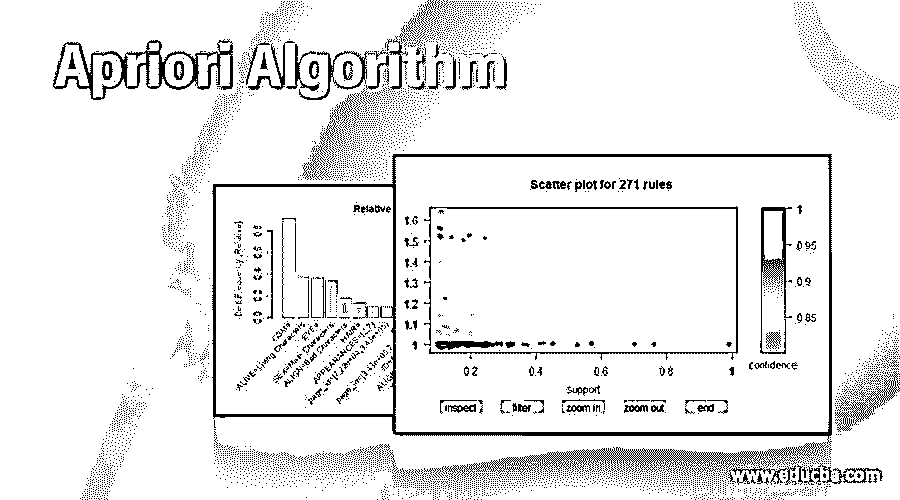
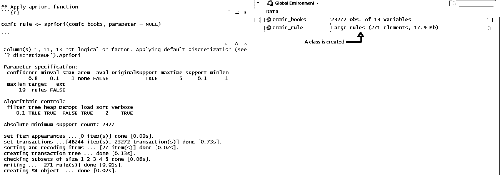
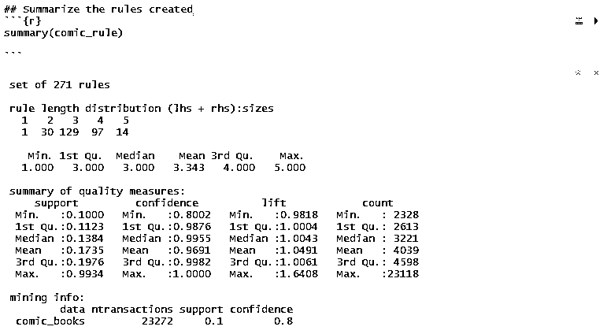
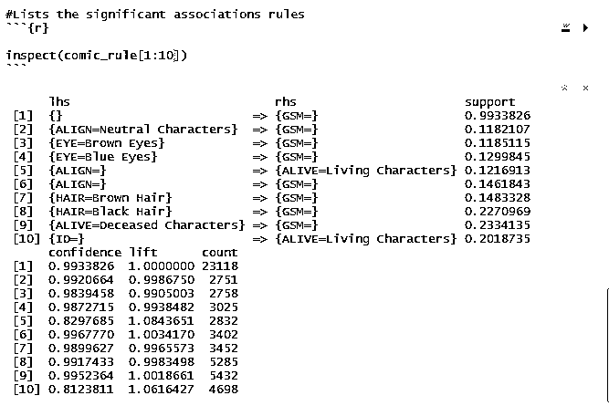
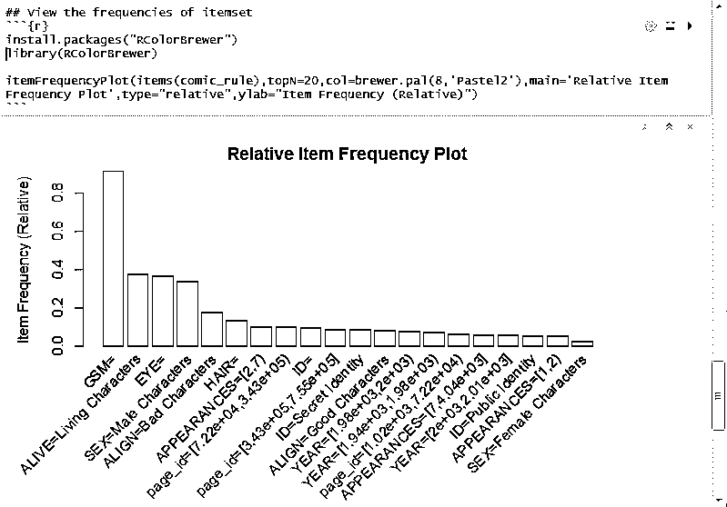
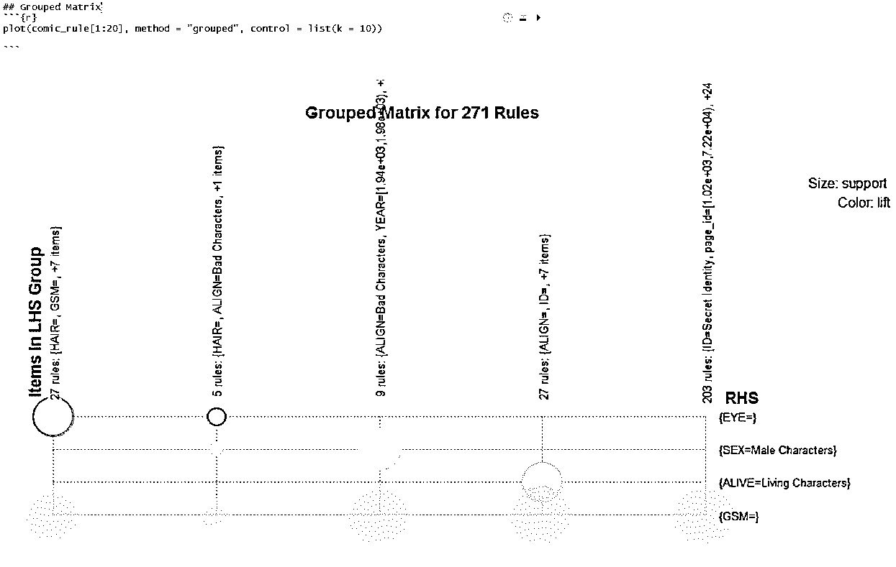
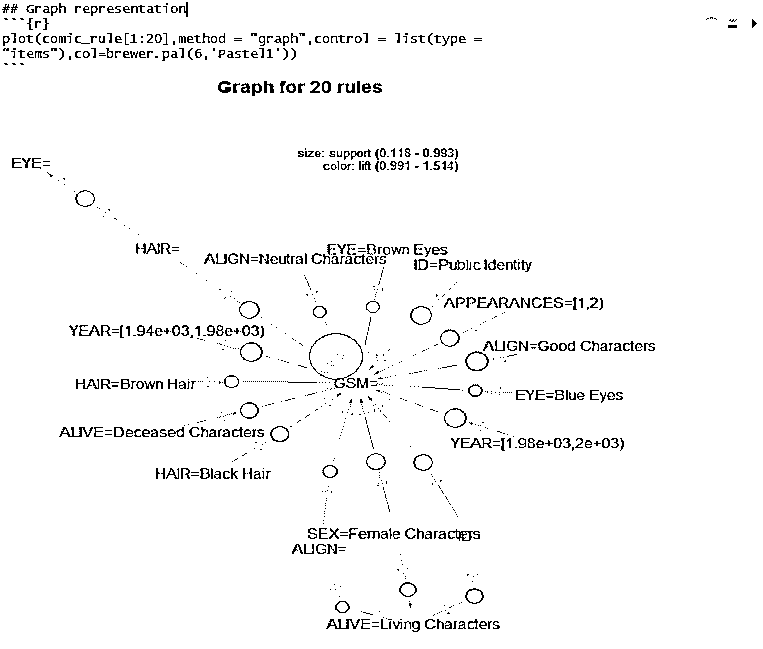
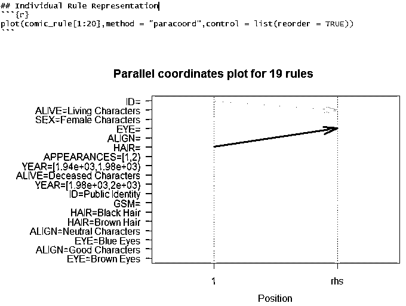
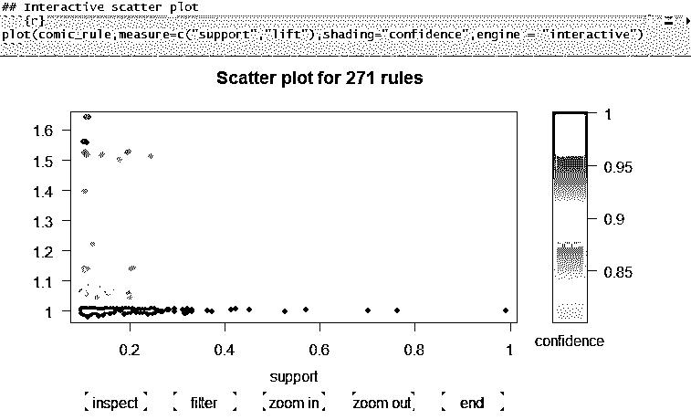

# Apriori 算法

> 原文：<https://www.educba.com/apriori-algorithm/>

## Apriori 算法简介

Apriori 算法是一种有趣的方法，可以知道我们需要购买什么或告诉我们需要什么建议。我们都知道，电子商务平台上有某种可用的方法。不是别人，亚马逊，Flipkart，Snapdeal 等等。当我们试图在网上购物中购买一件商品时，应用程序会给我们一些建议，让我们一起购买。它预测经常一起买东西的其他顾客。这个算法也让我们可以通过多种途径知道对事物的预测。

" Apriori 算法是一种通过对数据集进行关联规则学习来发现频繁项集并发现数据趋势的方法."

<small>Hadoop、数据科学、统计学&其他</small>

该算法广泛应用于购物篮分析，需要大量的数据集。因此，该方法可以尝试足够多的项目组合和出现，以获得每个事务的结果。

### Apriori 算法有什么用？

Apriori 算法基于条件规则工作，被认为是挖掘算法中的经典算法。Apriori 通过执行挖掘关联规则来帮助高效地工作。其他传统算法在项目集生成方面存在瓶颈，并且面临高时间消耗。该算法主要利用挖掘数据集来增强用户兴趣，识别项集的重要性，生成频繁出现的项集。它遵循某些方法，

1.句柄和就绪是数据集

2.应用挖掘关联规则

*   识别频繁项集并生成一组数据。
*   创建规则以找到有效的关联。

3.使用直方图、图形表示探索解释。

### Apriori 算法的重要性

*   提高搜索假设的效率
*   增强频繁集识别的性能
*   事务减少是临时准备的–在后续扫描中消除不太频繁的集合
*   包括基于哈希的计数。
*   简化用户兴趣的构建。
*   标识不同项集的重要性。
*   support 函数有助于识别项集中不同类型的重要性。
*   借助于不必要的项目集减少，存储空间被减少。
*   即兴发挥算法的准确性和效率。
*   致力于监督学习。

### 不同语言的不同方法

数据挖掘中的 Apriori 算法可以用 Python、R 等不同的语言实现。该算法的主要作用是高效地发现关联规则。它被认为是挖掘的首要规则。关联规则的必要条件是，

*   找到保持其支持值大于其阈值支持的可能方式或规则
*   并且其置信度值大于阈值置信度。

在 Python 中，论文以两种可能的方式完成。他们是，

1.  **使用暴力方法—**这是一个较长的过程。首先，列出规则，并确定支持每条规则的&置信水平。然后消除低于其阈值支持&置信度的值。
2.  **使用两步法-**这个过程比暴力破解要好得多。第一步确定项目的频率并形成表格。结果，发现项集大于阈值支持。第二步在频繁集上使用二元划分，并创建称为候选规则的规则。

在 R 语言中，有在公共论坛中讨论的项目。这里讨论了一些技术。

Apriori 的方法是一种迭代方法，其中它使用 k 个项目集来搜索(k+1)个项目集。因此，通过收集每个项目集的计数来找到第一个项目集。所以它使用第 1 个第 1 个项集来寻找第 2 个和第 3 个项集，并继续下去，直到没有可以探索的项集。

一个项目集被称为一篮子产品的数学集合。"

**步骤# 1—**构建数据，并使其结构化，以便进行数据分析。我们可以把一家漫画书店作为案例研究。

**第二步–**。csv 文件用于包含漫画店的图书详细信息。最有趣的部分是，我们正在使用 DC 和漫威收集的数据进行挖掘。

**步骤# 3—**对于 Apriori 算法，R 提供了一个名为**arules**的包。这个包允许我们计算和检查算法的计算。从 CRAN 安装和加载软件包。****

 ****

**步骤# 4–**当我们执行 apriori 函数时，会创建一个带有参数集的类。它们是支持、信心和动力。

在这里，我们可以将参数设置为 NULL，或者将 support = 0.001 设置为最小值&置信度在 0.75 和 0.9 之间。这种支持和信心的变化将导致不同的结果。

**支撑:**是事件发生的基本概率。获得产品 A 的事件，支持(A)是包括 A 的交易数除以总交易数。

**置信度:**是事件发生的条件概率。产品 A 中发生的变化已经在产品 b 中发生了。

**Lift:** 是置信度与预期置信度的比值。它被认为来自 LHS - > RHS 由一个规则中所有项一起出现的概率除以项概率的副产品。升力越高，关联越强。

**第 5 步-**列出 10 大规则，以了解重要的关联。

**第 6 步-**让我们用可视化的方式来解释这些规则。

为了形象化先验关联，使用了 **"** arulesViz **"** 包。

项目频率直方图视图

**关联规则的分组矩阵**

**一个图形模型**

我们可以看到，基于同质/异质特征，客户的交易与 GSM 密切相关。我们还可以看到眼睛和头发是紧密联系在一起的。

我们还可以看到，顾客购买的书是棕色眼睛的中性人物。

### 使用 Apriori 算法的应用

*   用于医疗行业–通过根据药物的特性对 ADRs 原因进行分组来检测患者的药物。
*   电子商务零售店。
*   用于水文系统-预测自然现象。
*   用于糖尿病研究。
*   网络学习平台中的学生选课。
*   用于库存管理。

### 结论

该算法通过使用各种数据解决实时问题，使用户在提高世界上许多销售业绩方面具有更大的优势。这减少了不必要的迭代，提高了性能。因此，Apriori 算法在数据分析中具有更大的价值，因此它解决了所有关键的行业问题，甚至是在医疗保健行业。

### 推荐文章

这是一个 Apriori 算法的指南。这里我们讨论 Apriori 算法的用途以及重要性和不同的方法。您也可以看看以下文章，了解更多信息–

1.  [KMP 算法](https://www.educba.com/kmp-algorithm/)
2.  [Prims 算法](https://www.educba.com/prims-algorithm/)
3.  [DFS 算法](https://www.educba.com/dfs-algorithm/)
4.  [深度学习算法](https://www.educba.com/deep-learning-algorithms/)

****