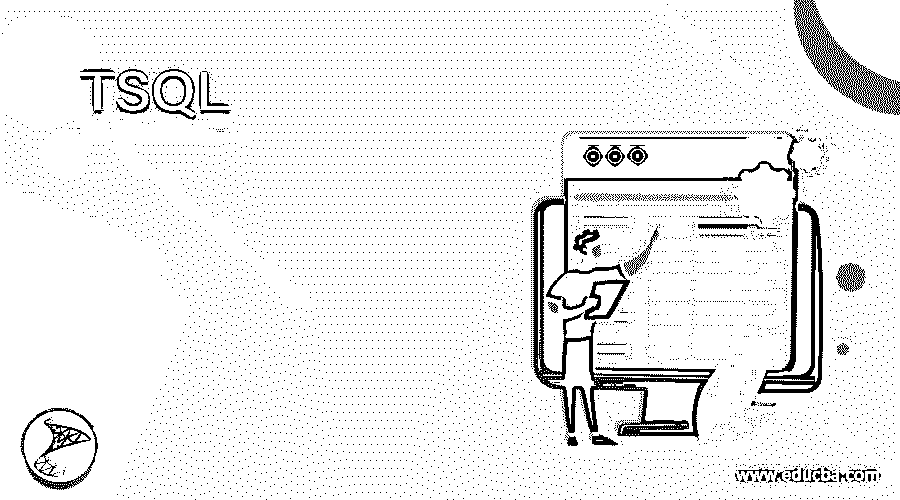

# TSQL

> 原文：<https://www.educba.com/tsql/>

## TSQL 简介

*   SQL 也称为 Transact SQL，被定义为 Microsoft SQL 和 Sybase 特有的查询语言，它为 SQL(结构化查询语言)添加了不同的功能，包括行处理、变量声明、事务控制和异常处理。T-SQL 为数据处理和字符串处理提供支持。

### TSQL 的工作

TSQL 是一种在关系数据库中使用的常规语言，用于从数据库中检索数据并处理从数据库中提取的重要信息。使用 TSQL 本质上很简单，因为它使用类似的 SQL 命令，如 SELECT、INSERT、UPDATE 等，数据管理员使用这些命令从数据库和在数据库中传送数据。TSQL 向用户提供定义他们自己的功能的功能，并根据使用情况定制这些功能。该语言还提供了用户可以直接使用的不同类型的内置函数，包括分析函数、行集函数、标量函数和排名函数。TSQL 是一种功能强大的语言，用于数据分析，也用于执行业务操作。

T-SQL 过程语言提供了 BULK INSERT 语句，该语句为用户提供了在数据库中导入大文件的功能，并且可以以用户定义的格式查看数据。

<small>Hadoop、数据科学、统计学&其他</small>

### 优点和缺点

**优势**

TSQL 有几个优点，使这种语言流行和易于使用。T_SQL 本质上是可靠的，是一种有助于与关系数据库建立通信的高效语言。下面提到了 T-SQL 的一些常见优势:

1.  **快速处理查询**–T-SQL 语言能够快速处理大量数据，还能帮助数据管理员从数据库中提取数据。所有与数据相关的操作，如删除、插入和操作，都可以很容易地执行，不需要花费太多时间。
2.  **安全交易**–从数据库访问数据本质上是安全的，也是统一的。所有的业务策略和业务规则都以封装的形式呈现。
3.  **无需额外的知识**–T-SQL 语言易于使用，数据管理员无需额外努力即可从数据库中检索数据。T-SQL 语言支持所有必要的操作，如插入、选择、更新等等。
4.  **本质上是交互式的**–T-SQL 语言本质上是交互式的，因为该语言能够编写复杂的业务规则来从数据库中获取数据。T-SQL 语言易于使用和理解。
5.  **用户定义的函数**–T-SQL 语言的主要优势之一是为定义的用户定义函数提供功能，这些函数有助于形成可用于不同平台(如电子商务平台)的交易结构，有助于以高效的方式获取数据。
6.  **省力**–T-SQL 语言提供了编写程序的功能，可以将所有命令一次性提交给服务器，有助于节省时间。

**缺点**

T-SQL 为数据库用户提供了几个优点，但是在使用 T-SQL 语言之前，仍然有一些缺点需要注意。下面提到了 T-SQL 的一些缺点:

1.  **本质上成本高昂**–T-SQL 语言本质上成本高昂，会增加运营成本，并成为数据库用户的额外开销。T-SQL 有许多用户无法访问的特性，要访问这些附加特性，用户需要额外付费。
2.  **受限访问**–T-SQL 语言为数据库用户提供有限的控制。数据库中存在一些复杂的业务规则，因此向用户提供了对数据库的有限控制。T-SQL 不提供嵌入 SQL 语言的选项。

### TSQL 的用法

TSQL 用于不同类型系统的数据管理和数据组织，这些系统之间有各种数据关系。TSQL 的主要用途是创建应用程序和在应用程序中添加用户定义的函数。用户更喜欢 TSQL 语言，因为编写一个包含几个命令的程序可以一次性执行。通过使用 TSQL，用户可以选择将这种语言与包括 Tableau 和 PowerBI 在内的不同业务工具相集成。

### 在 TSQL 的职业

TSQL 是 SQL 语言的扩展版本，因为 SQL 开发人员有许多机会，所以它也为 TSQL 开发人员创造了机会。TSQL 的一些就业机会如下:

1.  **DBA(数据库管理员)**–数据库管理员是负责维护 SQL 数据库的人。数据库管理员的角色是设计数据库、实现系统和维护数据库系统。DBA 的另一个角色是寻找系统的安全性，关注系统的高可用性。
2.  **数据科学家**–数据科学家被认为是一个与大数据、机器学习和数据挖掘相关的新职业机会。数据科学家的角色是分析数据，收集数据，并从数据分析过程中预测模式和结果。
3.  **数据库开发人员**——顾名思义，数据库开发人员就是负责为各种类型的应用程序开发数据库系统的人。为了开发数据库，个人应该有 TSQL 和 ETL 解决方案的知识。
4.  **开发人员**–开发人员是将现实世界的应用程序与 SQL server 连接起来的人。用户应该事先了解 TSQL，因为这将有助于提高性能，也有助于改善用户体验。

### 结论

TSQL 语言源于 SQL 编程语言。TSQL 语言有助于减少处理时间，因为它支持在单个流程中执行一批命令。TSQL 的高级功能使其广受欢迎且易于使用。

选择数据库完全取决于项目需求和应用程序。

### 推荐文章

这是 TSQL 旅游指南。这里我们分别讨论 TSQL 的介绍、工作原理、优点、缺点和例子。您也可以看看以下文章，了解更多信息–

1.  [SQL 按天分组](https://www.educba.com/sql-group-by-day/)
2.  [SQL 锁表](https://www.educba.com/sql-lock-table/)
3.  [SQL 交集](https://www.educba.com/sql-intersect/)
4.  [SQL 获取下一个](https://www.educba.com/sql-fetch-next/)

