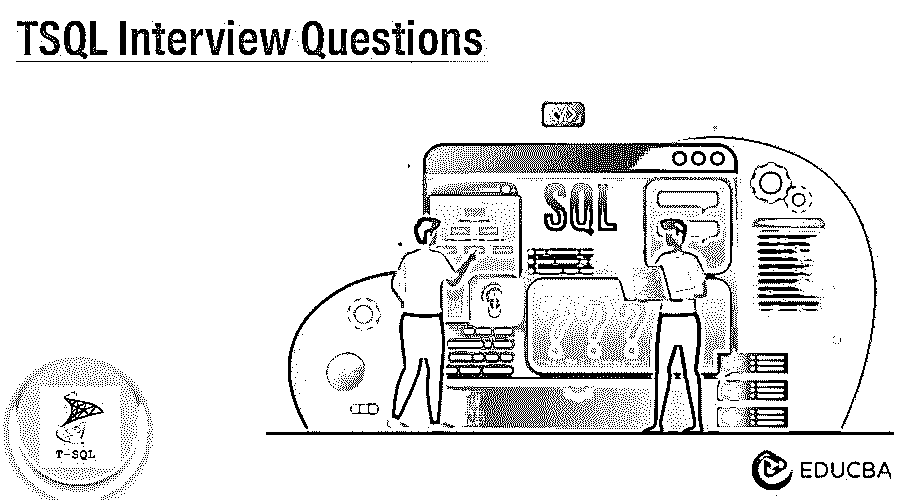

# TSQL 面试问题

> 原文：<https://www.educba.com/tsql-interview-questions/>

## TSQL 面试问答介绍

如果你想找一份与 TSQL 相关的工作，你需要准备 2022 年 TSQL 的面试问题。虽然每个面试都是不同的，工作范围也是不同的，但我们可以帮助你解决 TSQL 面试中的问题和答案，这将帮助你在 TSQL 面试中取得成功。

以下是 2022 年 TSQL 面试中最常被问到的重要问题

<small>Hadoop、数据科学、统计学&其他</small>

### 第一部分 Basic 面试问答(基础)

以下是基本的面试问题和答案

#### 1.解释一下什么是 T-SQL？

**答案:**
T-SQL 代表 Transact-Structured Query Language，是微软 SQL Server 和 Sybase ASE 支持的 SQL 功能的扩展。

#### 2.解释一下 SQL 和 T-SQL 有什么区别？

**答案:**
T-SQL 和 SQL 的区别在于，SQL 是一种对集合进行操作的查询语言，而 t SQL 是 MS SQL Server 使用的专有过程语言。此外，T-SQL 的删除和更新实现与 SQL 不同。

#### 3.请说出至少五个可以操作 T-SQL 代码中文本的命令。例如，替换文本串、获取文本的一部分等。

**答案:**
**LEFT(character _ expression，integer _ expression)–**它返回一个指定字符数的字符表达式的左边部分。
**CHARINDEX(find TextData，text data，[starting position])—**返回表达式在字符串中的起始位置，起始位置可选。
**REPLACE(text data，findTextData，replaceWithTextData)–**为字符串中出现的文本替换一个新值。
**REVERSE(character _ expression)–**返回一个字符表达式的反码。
**LEN(text data)–**返回字符串的长度，不包括尾随空格。
**LOWER(character _ expression)–**将一个大写字符转换成小写后，会返回一个字符表达式。
**LTRIM(text data)–**前导空格将被删除。
**PATINDEX(find text data，text data)–**返回字符串中文本的起始位置整数值。
**REPLICATE(character _ expression，integer _ expression)–**将一个字符表达式重复指定的次数。
**RTRIM(text data)–**删除尾随空格。SPACE(空格数)–它将指定的空格值重复多次。
**STUFF(text data，start，length，insert text data)–**删除指定长度的字符，并在指定的起点插入另一组字符。
**SUBSTRING(text data，startPosition，length)–**返回字符串的一部分。
**UPPER(character _ expression)–**返回小写字符到大写字符的字符表达式。

#### 4.可以不使用 SQL Server Integration Services 直接从 T-SQL 命令导入数据吗？如果有，命令是什么？

**回答:**
是的——有六个命令可以将数据直接导入 T-SQL 语言。这些命令包括:
BCP
批量插入
OpenRowSet
open data source
OPENQUERY
链接服务器

#### 5.提一下 T-SQL 中的‘GO’是什么？

**回答:**
‘GO’不是 Transact-SQL 语句，而是批处理分隔符。它是由 sqlcmd 和 osql 实用工具以及 SQL Server Management Studio 代码编辑器标识的命令。SQL Server 实用工具将“GO”解读为一个信号，表示它们应该将当前一批 TSQL 语句发送到 SQL Server 实例。

#### 6.提及 DELETE 语句和 TRUNCATE 语句之间的区别？

**答案:**
使用删除和截断命令，表格中的所有数据都会丢失。DELETE 语句和 TRUNCATE 语句的区别在于，
DELETE 用于从表中有条件地删除数据记录。这些操作会被记录下来。
TRUNCATE 用于无条件删除表中的数据记录。不会记录截断操作。

### 第二部分- TSQL 面试问题和答案(高级)

以下是高级面试问题和答案

#### 7.何时使用 COALESCE() & ISNULL()函数？

**答案:**
对于 ISNULL 和 COALESCE，结果表达式的可空性是不同的。ISNULL 返回值总是被认为是不可空的(假设返回值是不可空的)，而 COALESCE 不是。因此，表达式 ISNULL(NULL，1)和 COALESCE(NULL，1)虽然等价，但具有不同的可空性值。如果您在计算列中使用这些表达式，并创建键约束，或者使标量 UDF 的返回值具有确定性，以便可以对其进行索引，那么这就有所不同。

#### 8.提什么是子查询？

**答案:**
子查询用于返回数据，这些数据将在主查询中作为条件使用，以进一步限制要检索的数据。子查询可以与 Update、select、delete 和 insert 等语句以及=、>、<、> =、< =等运算符一起使用。

#### 9.SQL Server 中的 XML 索引有哪些类型？

**答案:**
微软 SQL Server 支持不同类型的 XML 索引。XML 索引不同于关系索引。基本上有两种 XML 索引，即。、主 XML 索引和辅助 XML 索引。主 XML 索引是内部表(称为节点表)上的聚集索引，用户不能从其 T-SQL 语句中直接使用该表。为了提高搜索性能，我们创建了辅助 XML 索引。这些在叶级别为现有的基于聚集索引的键页创建二级链接(RID)。应该在创建辅助 XML 索引之前创建主 XML 索引。

#### 10.什么是 SQL Server？

**答:**
SQL Server 是微软推出的一款庞大、简单、功能强大的关系数据库管理(也称数据仓库管理)应用。它提供数据库开发、数据库管理和商业智能功能。这项奇妙的技术非常容易掌握和管理。这提供了以下优势:
易于使用
支持小型、中型和大型数据库存储
与其他 RDBMS 相比更便宜
数据仓库支持
增强的安全特性
企业特性支持
内存处理
商业智能支持
高度可扩展且功能强大
低拥有成本

#### 11.提及 SQL Server 2005 及更高版本中引入的新错误处理命令？他们替换了哪些命令？该命令是如何使用的？

**回答:**
SQL Server 2005 中引入的新命令是尝试和捕捉。虽然它们不直接取代任何特定的命令，但是在许多方面，可以用 TRY 和 CATCH 代替 RAISERROR。TRY 块包含业务逻辑，而 CATCH 逻辑用于捕获错误。

#### 12.提到 TSQL 的顶级是什么？

**答:**
TOP 将查询结果集中返回的行数限制为 SQL Server 中指定的行数或行数百分比。当 TOP 与 ORDER BY 子句结合使用时，结果集限于前 N 个有序行。否则，它将以未定义的顺序检索前 N 行。

### 推荐文章

这是一个 TSQL 面试问题和答案的列表指南，以便候选人可以轻松地解决这些面试问题。这是关于 TSQL 面试问题和答案的最有用和最有价值的帖子。您也可以阅读以下文章，了解更多信息——

1.  [SSIS 面试问答](https://www.educba.com/ssis-interview-questions/)
2.  [Cognos 面试问题及回答](https://www.educba.com/cognos-interview-questions/)
3.  [SSAS 面试问答](https://www.educba.com/ssas-interview-questions/)
4.  [OBIEE 面试问题](https://www.educba.com/obiee-interview-questions/)

