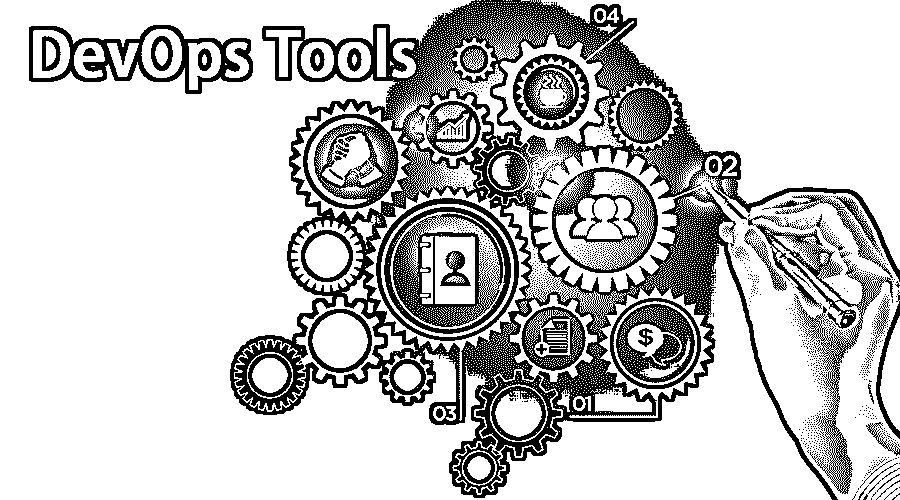
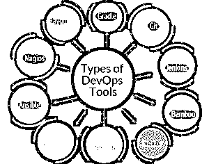
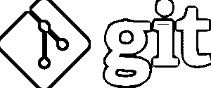
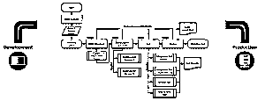
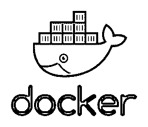
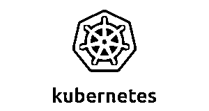
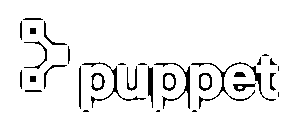
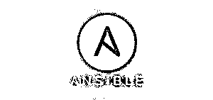

# DevOps 工具

> 原文：<https://www.educba.com/devops-tools/>

## DevOps 工具简介

IT 行业由程序员、[软件开发人员](https://www.educba.com/career-as-a-software-developers/)等等组成。为了简化软件开发周期，公司或程序员使用工具来帮助他们的过程。DevOps 就是这样一种结合了软件开发和 IT 运营的实践。本文将涵盖几个您可以在工作空间中使用的 DevOps 工具，但在此之前，我们将简要介绍 DevOps。

DevOps 可以有不同的解释，因为它不是任何类型的工作流或框架。然而，世界被它的文化所超越。程序员或开发人员将一个问题分解成不同的解释，以便更快地执行工作。为了在市场上领先于竞争对手，公司在运营中使用 DevOps。一个成功依赖于客户的公司需要事情做得更快，这在传统的[软件开发生命周期](https://www.educba.com/what-is-sdlc/)中需要时间。开发人员编写的代码通常充满了错误，因为它是为开发阶段设计的，而不是为生产设计的。集成开发运维自动化了工作流、基础设施和应用性能。自动化、度量、文化和共享是 DevOps 的核心价值观，而原则、价值观、实践、方法和工具是它的实践。

<small>Hadoop、数据科学、统计学&其他</small>

在这三个阶段中，可以实施 DevOps:

*   DevOps 能力的基础是自动化测试和敏捷方法。它通过编写测试来确保跟踪每一个代码变更，测试的成功或失败都可以被评估。这个阶段被称为自动化测试。
*   持续集成是 DevOps 实现的第二阶段。在接收到用于测试的代码之后，整个测试过程可以自动化。要实现持续集成，通常使用 Jenkins。它的工作方式是，在每一次迭代中，许多后台服务器将测试代码，以检查是否可以自动创建任何 bug。最后会生成一个测试失败或成功的报告。
*   持续交付是 DevOps 实现的第三阶段。真正的商业价值是在这个阶段获得的。一小块一小块的代码是用 bug 修复、新特性等编写的。，可以测试和部署。持续交付的工具和管道因公司而异，特定的工具总是支持管道。

DevOps 能够完成如此多的事情是有一定原因的:

*   使用 Jenkins 这样的工具可以完成项目变更的集成、工作执行的监控以及通过访问输出来识别问题。
*   有一些工具像 SVN，Git 等。，它让团队跟踪和管理所有的代码变更。
*   在自动化的方式中，代码可以使用 Puppet、Chef 等工具跨几个服务器部署。

### 不同类型的 DevOps 工具

下面是一些流行的 DevOps 工具:

#### 1\. Gradle

您的 DevOps 工具堆栈需要一个可靠的构建工具。直到 2009 年 Gradle 出现之前， [Ant 和 Maven](https://www.educba.com/maven-vs-ant/) 都是自动化构建工具的先驱。Gradle 的多功能性允许您用任何语言编写代码，如 Java、Python、C++等等。Eclipse、NetBeans 和其他 IDE 也支持 Gradle。Gradle 使用基于 Groovy 的 DSL 而不是 XML 来描述构建工具。剧本也是用科特林语写成的[。Gradle 使用 Maven 的存储库格式，其中包括对依赖管理的熟悉。它有不错的编译时间和增量构建。因为有缓存和守护进程，Gradle 比 Maven 快上百倍。Gradle 的运输也更快。](https://www.educba.com/what-is-kotlin/)

#### 2.饭桶

[Git 广泛用于软件行业，是一个流行的 DevOps 工具。开源贡献者喜欢这个源代码管理工具。您可以使用 Git 跟踪您的工作，并找到任何需要的版本。分支的创建和特性的合并是 Git 的其他一些特性。为了让人们推动他们的工作，需要托管存储库，这将允许 Git 与工作流的集成。GitHub 和 Bitbucket 是目前最常见的两种服务。](https://www.educba.com/what-is-git/)

#### 3.詹金斯

对于许多软件开发团队来说，DevOps 的自动化工具是 Jenkins。交付管道的不同阶段可以通过这个 CI/CD 服务器来自动化。Jenkins 庞大的插件[生态系统是其受欢迎的原因。从 Docker 到 Puppet，Jenkins 几乎可以集成 DevOps 的所有工具。它有一千多个插件。](https://www.educba.com/is-jenkins-free/)

根据您的需求，可以设置和定制 CI/CD 管道。Jenkins 运行从 Windows 到 Linux 的所有操作系统，因此很容易上手。它也可以和 Docker 一起安装。通过 web 界面，可以设置和配置 Jenkins 服务器。第一次使用的用户可以使用常用的插件来安装它。也可以创建自己的自定义配置。Jenkins 可以快速部署代码，并且可以衡量每一步的成功。

#### 4.竹子

竹子是阿特拉斯的 CI/CD 的解决方案，与詹金斯有许多相似之处。输送管道的自动化可以通过两者来实现。与詹金斯不同，竹子有一个与之相关的价格。Jenkins 中的几个手动功能都是在 Bamboo 中预建的，这导致插件比 Jenkins 少，但其开箱即用的功能不需要那么多插件。与 Bitbucket 和吉拉的集成可以通过 Bamboo 无缝实现。使用 Bamboo 可以节省大量的配置时间。Bamboo 中的用户界面也是交互式和直观的。UI 中提供了一些功能，如工具提示、自动完成等。

#### 5.码头工人

自 2013 年成立以来，排名第一的容器平台是 Docker，并且它仍在不断改进。一个非常重要的 DevOps 工具，Docker 的分布式开发能力使容器化在技术世界中流行起来。应用程序的部署也可以通过 Docker 实现自动化。

通过将应用程序隔离到单独的容器中，使它们变得安全和可移植。它是面向操作系统的。它是 VirtualBox 的替代产品。使用 Docker，所有依赖项都可以作为一个独立的单元交付，这使它们摆脱了依赖项管理的麻烦，并使在任何平台上运行应用程序成为可能。如果与 Jenkins 和 Bamboo 服务器集成，交付工作流程将得到改善。像[亚马逊网络服务](https://www.educba.com/what-is-aws/)和谷歌云这样的云提供商已经扩展了对 Docker 的支持。Docker 可以简化云迁移的过程。

#### 6.库伯内特斯

容器化应用程序的部署、扩展和管理可以通过一个叫做 Kubernetes 的开源系统实现自动化；2019 年是 Kubernetes 年。Kubernetes 平台将集装箱化带到了一个新的高度。它可以很容易地与 Docker 等其他工具集成。Kubernetes 背后的想法是大规模管理容器，因此两名谷歌工程师在 2015 年找到了一个解决方案。可以使用 Kubernetes 将容器分组为逻辑单元。

拥有一些容器可能会让您需要一个容器编排平台。然而，要达到一定的复杂程度，就需要扩展资源。通过使用 Kubernetes 实现流程自动化，可以管理数百个容器。Kubernetes 允许我们将容器化的应用程序部署到一群计算机上，而不是绑定到一台机器上。在整个集群中，容器的调度由 Kubernetes 自动完成。Kubernetes 中有一个主节点和几个工作节点结构。当工作节点部署容器时，主节点实现预定义的规则。在必要的情况下，Kubernetes 会重新分发容器，并且它还会注意到所有的事情，甚至是某个工作节点出现故障的时候。

#### 7.傀儡企业

**

** 

一个跨平台的配置管理平台被称为 Puppet Enterprise。作为代码，基础设施可以由 Puppet 工具管理。随着基础设施管理的自动化，软件可以更快、更安全地交付。Puppet 还可以为开发人员提供一个小型项目的开源工具。在处理大型基础设施时，可以发现 Puppet Enterprise 的额外特性。

一些特性是实时报告生成、基于角色的访问控制和节点管理。傀儡企业可以管理成千上万的资源和多个团队。与基础设施的关系是软件开发生命周期的关键过程之一，它由傀儡企业自动化。失败被巧妙的处理，依赖关系被小心的处理。当配置失败时，将跳过所有相关配置。Puppet 中有超过 5000 个模块，许多流行的 DevOps 工具可以与它集成。

#### 8.Ansible

类似于 Chef 和 Puppet，配置管理工具是 Ansible。部署可以是自动化的，基础设施可以使用 Ansible 工具进行配置。与其他工具相比，它的简单性和易用性是主要特点。Ansible 也遵循 Puppet 的基础设施代码方法。Ansible 使用简单的 YAML 语法。任务可以用 Ansible 和 YAML 来定义，而在 Puppet 中有一个声明性的优势。

Ansible 的另一个突出特点是它的无代理架构。对于自动化配置管理，一个安全、轻量级的解决方案是可行的。Ansible 中也有几个模块，类似于 Puppet。在 Jenkins 管道中，可以部署应用程序，并且可以使用 Ansible 工具提供环境。

#### 9.纳吉奥斯

Nagios 是一个免费的开源 DevOps 监控工具。使用 Nagios 工具可以发现并修复问题，因为它有助于监控基础设施。故障、事件等的记录。，可以在这个工具的帮助下进行跟踪。Nagios 的图表有助于跟踪趋势。可以检测到安全威胁，并且可以预测错误。Nagios 的插件系统使其在基础设施监控中脱颖而出。自从 2002 年 Nagios 出现以来，已经有了一个庞大的社区。所有翻译、教程等。和插件都是免费的。Nagios 核心、Nagios 日志服务器、Nagios XI 和 Nagios Fusion 是 Nagios 的监控解决方案，它们是开源的。

由于 Core 是命令行工具，所以用户界面是由 Nagios XI 形成的。可以使用 Nagios 日志服务器搜索日志数据，同时可以使用 Nagios Fusion 监控多个网络。Nagios 向 DevOps 提供了监控基础设施的解决方案，这可能需要一些时间来获得兼容性。

#### 10.射线枪

Raygun 是一个报告崩溃和监控错误的平台。Raygun 最近的产品是 APM。性能问题可以使用 Raygun 工具进行诊断和跟踪。识别出具有最高优先级的问题，并创建问题。Raygun 将开发和操作结合在一起，通过自动将错误链接回源代码，为整个团队提供错误和性能问题原因。

### 结论

DevOps 当然是软件开发周期中的需求过程之一。任何 IT 专业人员都应该对 DevOps 有足够的了解，以便在其职业生涯中保持领先地位。所有公司都在他们的系统中使用 DevOps，这使得 devo PS 成为必须掌握的技能。操作系统、网络服务、软件包、硬件规格等。，由配置管理代码定义。DevOps 团队由开发人员、质量保证人员(根据需求测试代码的人员)和操作人员组成。DevOps 不仅提高了软件开发的速度，还加快了软件上市的速度。在牢记业务目标的情况下，基础设施可以很容易地实现自动化。它生产高效和高质量的软件产品。代码会有更少的错误，交付成本也更低。所有这些优势代表了软件开发生态空间对 DevOps 的需求。

### 推荐文章

这是一个什么是 DevOps 工具的指南？在这里，我们讨论了 DevOps 工具的简介、重要阶段和各种类型。您也可以浏览我们推荐的其他文章，了解更多信息——

1.  [要学习的 OLAP 顶级工具](https://www.educba.com/olap-tools/)
2.  [自动化测试工具](https://www.educba.com/automation-testing-tools/)
3.  [数据可视化工具](https://www.educba.com/data-visualization-tools/)
4.  [战略计划工具](https://www.educba.com/strategic-plan-tools/)

