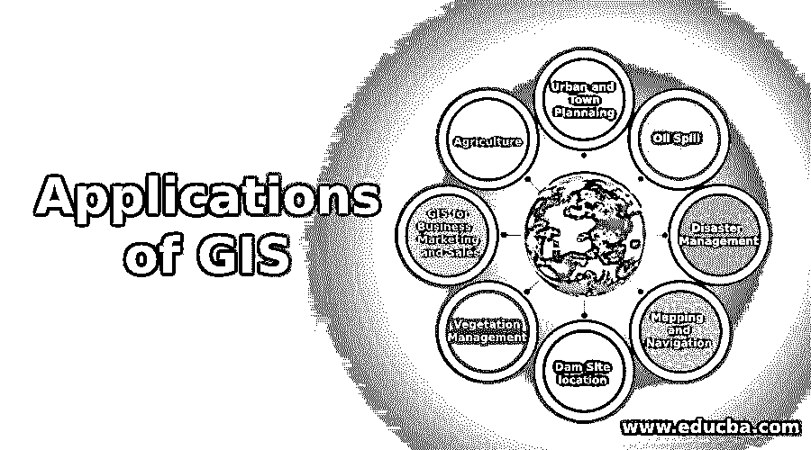

# 地理信息系统的应用

> 原文：<https://www.educba.com/applications-of-gis/>

## 地理信息系统应用导论

地理信息系统是信息技术中的一个广阔领域，像任何其他蓬勃发展的技术一样，在多个领域中也有各种应用。 [GIS 被用于创造意识](https://www.educba.com/what-is-gis/)并分享关于环境、自然资源、潜在灾害和风险以及规划的城市路线的知识。像 ESRI、Here Maps 和雷多斯集团这样的组织正在研究各种各样的模型，涉及自然资源、先进的驾驶系统，甚至国家的防御系统。地理信息系统的应用允许人们和组织进行地质观察和[分析精细格式的空间数据](https://www.educba.com/what-is-spatial-data/)。

### 地理信息系统在各个领域的应用

地理信息系统应用于各个领域。它的应用数量每天都在增长。以下是一些与 GIS 相关的著名应用。

<small>Hadoop、数据科学、统计学&其他</small>

#### 1.农业

农业是人类文明的重要任务之一。这不仅是为了填饱肚子，也是为了经营全球业务。地理信息系统已率先进入这一领域的许多应用。

1.  **干旱:**识别干旱地区或土地，以避免植物种子、人力和昂贵肥料的进一步损害。
2.  **害虫控制:**从特定农业用地的可用空间数据集预测诸如蝗虫和啮齿动物攻击的害虫攻击。这将允许管理机构和农民对各种事情进行规划。
3.  **土地和土壤分析:**使用以前的数据集、卫星图像甚至野外工作人员进行的野外分析。
4.  **规划未来的粮食需求:**根据人口的需求，管理机构和农民可以计划生产足够水平的作物。地理空间数据源和 GIS 将有助于更好地做出决策，并避免进一步的麻烦。

#### 2.城市和城镇规划

开发商、建筑商、建筑师和工程师现在正在使用空间数据集来规划这个未来城镇。在粒度信息的帮助下，工程师和建筑师很容易发现任何细节。像新孟买的 CIDCO 和大孟买的 BMC 这样的管理机构也使用 GIS 数据和工具来规划各种大型项目。这些数据也有助于解决洪水和季风爆发时的水堵塞问题。它也有助于重新设计排水模型。

#### 3.漏油

溢油可能是有意的，也可能是意外的，这取决于具体情况。代价总是由海洋生物和经常出入这条特定航道的人类付出的。地理信息系统和地理空间数据集被用来遏制这种灾难蔓延的泄漏。根据各种报道，大多数石油泄漏发生在 ***马来西亚*** 沿海地区。管理机构已经实施了地理信息系统来处理这种泄漏。它比危险的石油泄漏更划算，因为石油泄漏对海洋生物也有危害。

#### 4.灾难管理

地理信息系统用于监测灾害和自然灾害易发地区。地理空间数据集和数据库允许组织存储所有级别的数据。该数据库可以包含与风险易发区相关的所有信息，如风险易发区附近的医院和隔离中心、快速居住中心、该区域的灾难历史以及过去灾难对进一步应急计划的影响。大多数遥感和地理信息系统用于容易发生火山爆发和地震的地区。在这两种技术的帮助下，任何城市的组织和市政当局都可以做好准备，以避免最大的影响。在灾难中使用 GIS 是为了提高意识，为未来做好准备。

#### 5.制图和导航

当今世界地图和导航最好的例子是谷歌地图。它是人们使用最广泛的谷歌服务。世界各地的人们在旅行到一个新的地方时使用它，也可以查看任何地方。它也已经成为出租车和拼车服务提供商的流行工具。全球定位系统，在地理信息系统的帮助下，增加了清晰和边缘的导航体验。它不仅仅是查看应用程序上的数据，还允许消费者在地图数据集中发布任何未知或未命名的信息。谷歌接受消费者地图编辑，也有自己的地图制作工具。然而，Here Maps 也在其专有工具 Map creator 中收集当地消费者和民众的数据。

#### 6.水库和坝址位置

地理空间数据用于寻找建造水库和大坝的最佳位置。在选择坝址时，应考虑各种因素，如经济因素、环境条件和工程因素。地理空间数据包含这方面的所有信息；因此，在实施任何此类重大工程项目之前使用 GIS 是可行的。

#### 7.砍伐森林和植被管理

利用 GIS 和林地的地理空间数据，组织和政府可以跟踪森林砍伐的速度。不同时期的过去信息被用于分析以规划重新造林和植被。由于森林砍伐的数量不断增加，政府机构也在跟踪森林和树木相关的数据。数据集用于重新造林的进一步分析目的。在热图和图像源的帮助下，可以对数据进行分类和可视化，以便采取进一步的行动。

#### 8.用于商业、营销和销售的 GIS

除了上述所有应用之外，地理信息系统在商业和市场销售中也有不同寻常的用途。地理空间数据库存储目标客户、营销活动和销售区域的数据。该应用程序使公司和组织在市场上更具战略竞争力和实力。

### 结论

看看这个强大的系统，它的应用和用途是永无止境的，就像它庞大的地理空间数据集和数据库一样。日复一日，分析师和研究人员正在创新这项技术的新应用。申请的数量永远不会下降。使用 GIS 不仅仅局限于以上 6 -7 种应用，它在各个领域有大约 1000 多种用途和应用。

考古学、地质学、废物管理、自然资源管理、资产管理，甚至航空和银行业。似乎在不久的将来，GIS 将会与一切整合，这就是为什么像 HERE Maps 和 GOOGLE 这样的公司正在研究像物联网这样的原型概念，在物联网中，一切都将相互连接。

### 推荐文章

这是地理信息系统应用指南。在这里，我们讨论了地理信息系统的 8 大应用，如农业、城市和城镇规划、石油泄漏、灾害管理等。您也可以浏览我们推荐的文章，了解更多信息——

1.  [八大免费数据分析工具](https://www.educba.com/free-data-analysis-tools/)
2.  [数据分析技术的类型](https://www.educba.com/types-of-data-analysis-techniques/)
3.  [什么是数据集成？](https://www.educba.com/what-is-data-integration/)
4.  [GIS 组件|前五名](https://www.educba.com/gis-components/)