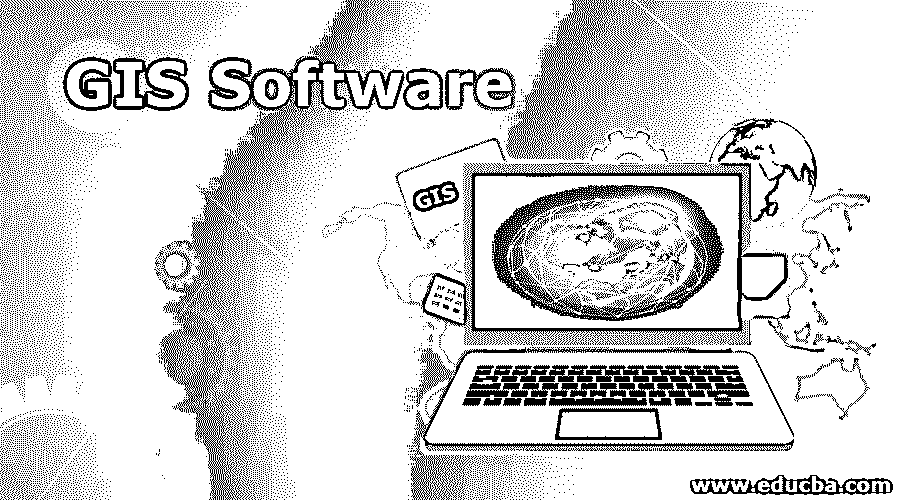
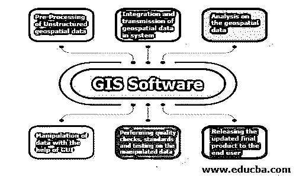
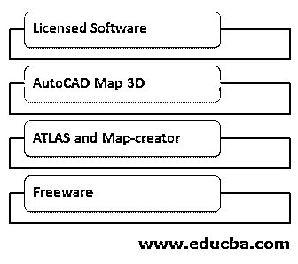

# GIS 软件

> 原文：<https://www.educba.com/gis-software/>

## 地理信息系统软件介绍

用于分析、操作和可视化地理空间数据和数据库的软件、应用程序或系统是 GIS 软件。这些是用于处理大量数据集的健壮包。数据集和文件仅限于电子表格和多媒体文件，如视频驱动文件和各种来源的图像。涉足 GIS 软件的公司有 ESRI、HERE 地图、谷歌、必应地图和欧特克等。除了这些大家伙，还有一些小型的开源免费软件在这个行业表现不错。在本文的后半部分，我将尝试涵盖最广泛和最知名的软件。

GIS 软件:以下流程描述了任何 GIS 软件的一般工作流程和功能。

<small>Hadoop、数据科学、统计学&其他</small>

### GIS 软件的使用

GIS 或 GIS 软件工作流被分为不同的任务集:

1.  **数据预处理:**在向软件中添加任何数据之前，必须使用各种工具对其进行清理和处理。然后应将数据转换成数字格式，以便进一步集成到软件中。
2.  **数据传输和集成:**数据格式化完成后，将被导入关系地理空间数据库。这是一项需要 ETL 和 GIS 数据库专家来处理大量有害数据集的任务。
3.  **数据分析:**然后从不同的方面分析导入的数据，根据需要，在分析部分采取行动。
4.  **数据操作和输入:**GIS 分析师和技术人员使用 GIS 软件的 GUI 来更改属性，并将更改更新到系统中。
5.  **质量检查和测试:**进行质量检查和测试是为了避免 bug 和错误数据。这些检查基于各种质量标准。像 HERE maps 这样的组织使用精益和六适马技术来保持基准。还执行内部和 ISO 认证的审计，以保持数据的可信度。
6.  **发布和支持:**更新后的 GIS 数据随后将通过准确的更改发布给相关客户。组织随时准备接受关于数据数量和质量的反馈和调查。

像许多其他领域级软件一样，GIS 软件分为授权软件和免费软件。大型项目中用于处理复杂地理空间数据及其查询的软件被归类为许可软件。客户必须订购许可软件。这完全取决于合同条款和客户的要求。免费版软件是免费的，它不需要任何订阅或协议。这些软件包可在服务提供商的网站上免费获得。两套软件有不同的目标受众。地理信息学应届毕业生广泛使用免费版软件，机构使用付费版。

一些著名的付费 GIS 软件:ESRI 的 ArcGIS、Autodesk 的 AutoCAD Map 3D、HERE Maps 的 Atlas 和 Hexagon geospatial 的 Geo-media。

**免费软件:** QGIS by Quantum GIS，GRASS GIS，gVSIG，Open Jump。

### GIS 软件的类型

以下是各种类型的 GIS 软件:

#### 1.许可软件

*   **ArcGIS:** ArcGIS 是 ESRI 打造的企业软件。这是地理信息系统软件领域的前沿。他们有各种集成技术的产品。主要分为 ArcGIS Online、ArcGIS Pro、ArcGIS Enterprise 和 ArcGIS Developers。
*   **ArcGIS Online:** 这是一个部署在 web 服务器上的原型和社区版本，感兴趣的用户可以使用该服务。ESRI 直接在主网站上添加了使用链接。
*   **ArcGIS Pro:** 此工具用于创建地图要素的 2D 和 3D 模型。网站上还有一个试用版。
*   **ArcGIS Enterprise:** 组织主要注册该选项和批量软件。这些公司通常会大规模购买。
*   **ArcGIS 开发人员:**开发人员使用此工具创建地理编码的解决方案和应用程序，以便技术人员可以使用它进行数据操作和分析。

此外，对于这些初级产品，它还为各种业务用户和业务领域提供了各种其他工具。

#### 2.AutoCAD Map 3D

与 ESRI 不同，这家公司正在为不同的领域开发绘图工具。AutoCAD Map 3D 就是一个很好的例子，其中可以处理和操纵大量的地理空间数据。大部分工作属于 2D 和三维地图的功能创建。Autodesk 允许组织在订阅的基础上购买这些产品，并根据功能进行不同的定价。他们还为工程、建筑和工业设计提供解决方案。

#### 3.地图集和地图创建者

这些是 HERE maps 开发的专有工具。与该技术相关的 GIS 分析师和技术人员只能使用这些工具。ATLAS 是一个桌面应用程序，允许基于 GUI 的数据操作。编辑直接同步并集成到 RDBMS 中。Map-creator 是一个基于网络的工具，全球任何人都可以使用。有一个基于本地信息和影像来源进行编辑的社区团体。然后，GIS 分析人员、开发人员和技术人员对输入系统的数据进行分析和处理。在这里，地图相信敏捷方法，同时向消费者和合作客户推出地图。

#### 4.免费软件

像 QGIS、gVSIG、Open Jump 这样的免费软件对于想进入 GIS 世界的学生和创业组织来说是完美的软件包。虽然许多免费软件被认为是用于解决基础到中级水平的问题，但在所有与 ArcGIS 等软件竞争的免费软件中，QGIS 是独一无二且强大的。它还集成了多个软件插件，如 Grass GIS，用于数据操作和数据集成。

### 结论

此外，这些组织较少关注免费软件，而是优先关注 ArcGIS 等强大的工具，因为它为组织提供了一个成熟的生态系统。没有与之相关的所有软件和硬件，GIS 就什么都不是。组织坚持一个特定的软件服务提供商，而不是改变环境。GIS 和软件集成不是一蹴而就的任务，因此需要在部署之前进行适当的战略规划和管理。

### 推荐文章

这是一个地理信息系统软件指南。在这里，我们讨论了 GIS 软件的介绍及其与不同类型软件(如许可软件、AutoCAD Map 3D 等)的配合。您也可以浏览我们推荐的文章，了解更多信息——

1.  [什么是数据集成？](https://www.educba.com/what-is-data-integration/)
2.  [GIS 组件指南|前五名](https://www.educba.com/gis-components/)
3.  [什么是 GIS？|顶级功能](https://www.educba.com/what-is-gis/)
4.  [地理信息系统应用介绍](https://www.educba.com/applications-of-gis/)