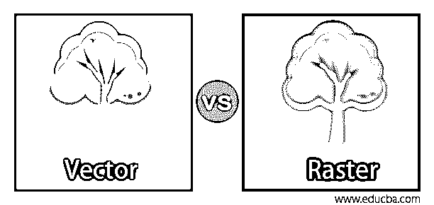

# 光栅与矢量

> 原文：<https://www.educba.com/raster-vs-vector/>

## 栅格与矢量的区别

这篇关于光栅与矢量的文章将会是一篇有趣的文章。你们有没有想过为什么有些图像在调整大小时会出现锯齿，而有些却没有？是的，主要区别是因为光栅图像和矢量图像。这些数字图像分为位图文件和矢量图形。光栅与矢量将包括光栅的主要区别，也称为位图图像和矢量图像。我们将包括比较光栅和矢量的点。光栅图像是用照相机捕获的基于像素的程序。矢量图形是用 CAD 等矢量软件创建的。

在我们开始讨论栅格和矢量的主要特征之前，我们需要知道像素是什么意思？

<small>Hadoop、数据科学、统计学&其他</small>

像素是显示屏上的微小照度；它是图像中的一个物理点。在显示屏上看到的大多数图片是光栅图像/位图图像。这些图像由称为位图的像素组成。

### 光栅与矢量的直接比较(信息图)

以下是光栅与矢量的 17 大对比 **:**

### 栅格与矢量的主要区别

让我们从以下几点来讨论光栅与矢量之间的一些关键差异:

*   栅格和矢量都有独特的属性，适合不同的任务。
*   两者都显示在显示屏上，但焦点和构图不同
*   光栅/位图图像由像素组成，而矢量图像是通过软件和数学计算创建的
*   光栅易于使用，但不太常见，可以从位图转换为另一种格式，但不能转换为矢量。
*   矢量图像可以是可缩放的、平滑的和可用的。
*   光栅图像由网格中的像素组成；所有这些像素聚集在一起，在显示屏上形成图像。
*   矢量图像是使用矢量工具创建的专用文件，以较少的格式出现。
*   矢量图像由单独的、可缩放的对象组成。
*   矢量图像是高质量的图像，因为它们与设备无关。
*   光栅图像是分辨率相关的，即当我们试图通过调整大小选项来减小光栅图像的尺寸时，像素将被丢弃。
*   在增加光栅图像的尺寸时，软件通过基于周围像素估计新像素的颜色值来创建新像素。这种方法被称为插值。
*   数学方程式创建矢量图像；其中之一是贝塞尔曲线而不是像素。
*   矢量图像可以增加或减少到任何程度；线条会很清晰。
*   当矢量图像转换为位图图像时，将保存矢量图像的副本；否则，在转换为栅格后，图像将失去其矢量属性。
*   这种转换对于 web 应用程序非常有用。

### 光栅与矢量对照表

下表总结了光栅与矢量 **:** 之间的比较

| **光栅** | **矢量** |
| 光栅图像也称为位图图像，由称为像素的小点组成。 | 矢量图像由线条、填充和曲线组成。 |
| 在光栅中，相同颜色或不同颜色的像素彼此靠近放置，以便人眼将它们视为图片而不是点。 | 矢量图像是线条、矩形、圆形和正方形等元素的集合。每个矢量元素都有自己的坐标，并且可以调整大小。 |
| 光栅图像知道每个像素的颜色。 | 向量由放置其分量的指令组成。 |
| 光栅只有两种颜色，黑色或白色。随着复杂度的增加，它可以包含更多的颜色。 | 向量使用数学公式来描述颜色、形状和位置。 |
| 图形光栅格式包括 JPEG、GIF、PNG、XBM、TIFF、PCX 和位图字体。 | 矢量格式包括 EPS，PICT，WMF，PostScript，TrueType。后两者是由 CAD 和 GIS 应用程序创建的。 |
| 光栅具有简单的输出，只要 RIP 或打印机具有所需的内存。 | 向量是包含构成绘图的贝塞尔曲线信息的小文件。 |
| 光栅图像的颜色渐变范围很广，比矢量图像的可缩放性差。 | 矢量图像比光栅图像更容易缩放。 |
| 当用户绘制光栅图像时，它看起来类似于用画笔蘸颜料来绘制图像。 | 当用户绘制矢量图像时，只绘制形状的轮廓。类似于创建具有不同形状和大小的不同拼贴的图像。 |
| 在不改变像素数的情况下放大光栅图像时，图像看起来很模糊。随着像素数的增加而放大文件，这可能会产生更好的效果。 | 在放大矢量图像时，数学公式保持不变，可以缩放到任何大小。 |
| 光栅程序最适合照片编辑，创建一个连续色调柔和的图像。 | 向量最适合绘图，创建标志，插图和技术图纸 |
| 巨大的尺寸和相当详细的图像产生大尺寸的图像。 | 矢量依赖于分辨率，可以以任何尺寸或分辨率打印。 |
| 难以使用有限的专色打印光栅图像。 | 在矢量印刷中，颜色的数量可以增加或减少。 |
| 栅格到矢量的转换非常耗时，并且非常复杂。 | 矢量图像可以很容易地转换成位图图像。 |
| 一些光栅程序包括照片编辑，Photoshop，GIMP，paint shop。 | 矢量程序包括 Illustrator，Inkscape，CorelDraw。 |
| 光栅具有很高的处理速度，用于从徽章到海报。 | 在 vector 中，数据量取决于对象的实际值。 |
| 一种光栅文件可以很容易地转换成另一种。 | 如果未在理解 vector 的程序中打开，则很难修改或显示 vector。 |
| File formats extension for raster:.蒂芙。tiff:标记图像文件格式

.jpg。jpeg:联合图像专家组

.psd: Photoshop 文档

.gif:图形交换格式

.png:便携式网络图形

 | File format extension for Vector:.eps:封装的 PostScript

.ai: Adobe Illustrator 作品

.cdr: CorelDraw

.svg:可缩放矢量图形

.pdf:可移植文档格式

 |

### 结论

矢量图像是有利的，但是不适合产生真实的图像。因此，向量具有卡通般的外观。光栅图像比矢量图形大得多。相比较而言，这两种图形各有优缺点。基于目的可以选择哪些图像取决于用户。

### 推荐文章

这是光栅和矢量之间最大区别的指南。在这里，我们还将通过信息图和比较表来讨论栅格键和矢量键的区别。您也可以看看以下文章，了解更多信息–

1.  [什么是 GIS？|五大特色](https://www.educba.com/what-is-gis/)
2.  [地理信息系统的 8 个最佳应用](https://www.educba.com/applications-of-gis/)
3.  [GIS 组件|前五名](https://www.educba.com/gis-components/)
4.  [数据分析与数据分析–主要差异](https://www.educba.com/data-analytics-vs-data-analysis/)