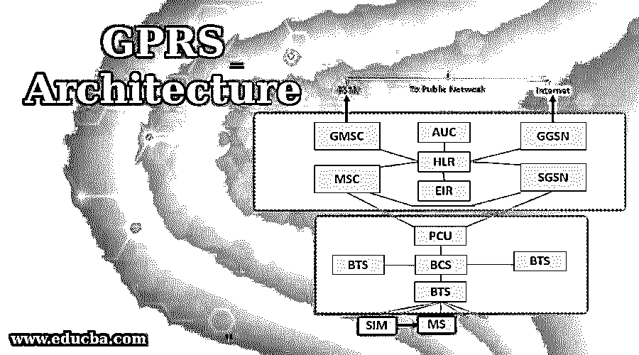
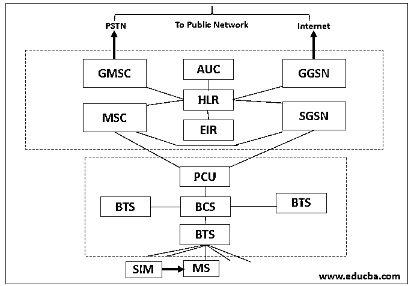

# GPRS 架构

> 原文：<https://www.educba.com/gprs-architecture/>

## GPRS 架构介绍

作为网络工作以允许数据通过的架构被称为 GPRS 架构。它具有以 171 kbps 的更快速率传输分组数据的设置。多个用户可以进入网络并明智地使用资源。通用分组无线业务从 GPS 开始，提供 2G 或 3G 移动数据业务中的分组业务。短分组通过适当的基础设施在短时间内被访问，这提供了到 GSM 基础设施的连接。当向 2G 提供数据时，同样需要额外的实体。他们是 GGSN 和 SGSN。为架构提供了额外的规定来改进自身。

### 什么是 GPRS 架构？

**1。**除了架构中的新实体之外，大多数情况下还会使用 GSM 网元。节点被支持用于数据分组的路由和适当增强。这些节点是服务 GPRS 支持节点(SGSN)和网关 GPRS 支持节点(GGSN)。此外，GPRS 寄存器存储有关路由的信息，并将其映射到正确的地址。

<small>Hadoop、数据科学、统计学&其他</small>

**2。** SGSN 帮助提供网络内的服务，而 GGSN 帮助提供网络外的网关。此外，网络中的数据包控制单元或 PCU 有助于确定数据应该路由到哪里。它或者提供给系统中的分组交换网络，或者提供给电路交换网络。

**3。**SGSN 和 GGSN 之间使用一种协议，对于网络的外部用户来说，这种协议看起来很常见。这有助于系统通过 IP 进行通信，并且不会面临来自系统网络主干的任何问题。

**4。**在网络中使用逻辑链路控制，使得当移动设备移动到新的区域时，旧的链路被移除，并且新的链路被添加到新的 SGSN 下。这有助于使网络在系统下工作，并管理它们来承载所有的数据包。

### GPRS 架构的组件

以下是 GPRS 架构的组成部分:

*   大多数 GSM 元件在系统中被修改，以使它们按照 GPRS 架构工作。让我们看看这些要素。
*   GPRS 支持节点或 GSN 有助于网络中 GGSN 和 SGSN 的正常工作。GSN 应该安装在系统中，以便在我们需要时随时部署。
*   GPRS 中的移动台帮助接入网络中的服务，以便它们被数据分组按时使用。这些站有助于与服务进行前后竞争，并管理网络内的 GSM 呼叫。这个服务在做向后兼容服务的时候提供了很大的帮助。
*   基站收发信台或 BTS 接收来自网络的所有消息，并管理它们以使用系统。这使得该站将数据有效地管理到所需的移动数据包。
*   此外，基站控制器或 BSC 通过管理数据流量并将其导向必要的基站，使 PCU 的安装物有所值。系统中需要一个单独的硬件元件，或者它将所有元件安装在自己内部。请升级到系统是必要的，使他们正常工作，并使用他们的全部核心。
*   GPRS 中的路由区与 GSM 中的定位区工作方式类似，向该区域中的整个网络广播相同的消息。此外，它非常小心地处理数据，以便在传输相同消息时不会出现数据泄漏。
*   GPRS 网络中的数据库帮助处理数据并将其存储在同一网络中。因此，在系统中需要时，很容易检索信息并管理它们。
*   SGSN 帮助认证移动数据、管理移动设备以及干扰系统空中接口中的信息。此外，移动电话在网络中的注册由 SGSN 负责。
*   GGSN 拥有网络中手机的所有信息，并充当路由器和外部网络之间的中介。数据包通过网络中的 IP 被传递到适当的节点，它在系统中充当服务器主干。它通过控制数据和从外部网络收集信息来充当流量过滤器。因此，它是外部攻击的屏障，保护网络。

### GPRS 架构的优势

以下是 GPRS 架构的优势:

1.  数据访问时间在架构上是简洁的，使得任何网络或任何系统下的数据都可以更快地被访问和使用。这使得网络在具有合适的数据包和路由区域以及网络主干的系统下很好地管理数据。
2.  网络中的所有资源都得到了最大限度的利用，因此电路交换、分组交换和传输模式都得到了很好的管理。在网络中描述路由区域，以便识别和使用无线资源。
3.  通过移动设备，数据传输速度比以往任何时候都快。GPRS 网络可以用于计算机，这样数据传输速率会更快，可以充分利用其容量。
4.  任何应用程序都可以在 GPRS 网络中使用，无论是系统中的普通服务，如电子邮件或广播服务，还是网络中的网页浏览。众所周知，GPRS 名义上提供服务，因为它们在系统中始终保持连接。由于 GPRS 具有较高的传输速率和较短的接入时间，许多用户更喜欢使用它。
5.  多媒体信息和广播在 GPRS 中很容易实现。如果数据传输速率较慢，则在网络中提供即时消息服务以最大限度地利用该服务。当数据速率非常快时，系统中提供无线连接。
6.  GPRS 网络在所有系统上的可用性和可访问性使其在用户中值得信赖。

一些无线服务以低于 GPRS 的速率提供服务。此外，当许多用户在同一网络下从同一地点上网时，网络速度会受到影响。

### 推荐文章

这是一个 GPRS 架构的指南。在这里，我们讨论了 GPRS 架构的介绍和组成以及它的不同优势。您也可以浏览我们推荐的文章，了解更多信息——

1.  [八大免费数据分析工具](https://www.educba.com/free-data-analysis-tools/)
2.  [数据分析技术类型介绍](https://www.educba.com/types-of-data-analysis-techniques/)
3.  [数据分析与数据分析–主要差异](https://www.educba.com/data-analytics-vs-data-analysis/)
4.  [什么是数据集成？](https://www.educba.com/what-is-data-integration/)