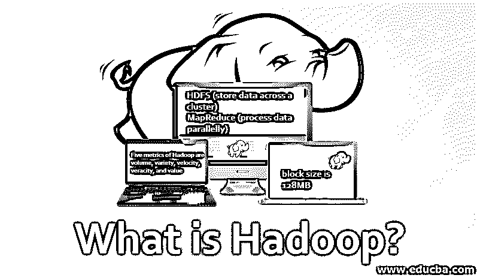
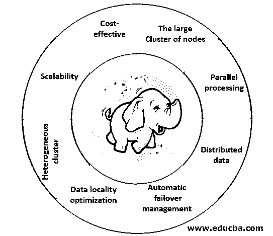

# Hadoop 是什么？

> 原文：<https://www.educba.com/what-is-hadoop/>

## Hadoop 是什么？

Hadoop 被定义为一种软件实用程序，它使用许多计算机的网络来解决涉及大量计算和数据的问题，这些数据可以是结构化的或非结构化的，因此它为收集、处理、分析和管理数据提供了更大的灵活性。它有一个开源的分布式框架，用于在可扩展的计算机服务器集群中分布式存储、管理和处理大数据应用程序。

### Hadoop 的应用

Hadoop 的应用如下:

<small>Hadoop、数据科学、统计学&其他</small>

#### 1.网站跟踪

假设你创建了一个网站，想了解访问者的详细信息。Hadoop 将捕获大量相关数据。它将提供关于访问者位置的信息，访问者首先访问了哪个页面和访问了哪个页面最多，在网站和哪个页面上花费了多少时间，访问者访问了该页面多少次，以及访问者最喜欢什么。这将提供对访问者兴趣的预测分析。网站性能将预测用户的兴趣。Hadoop 接受来自多个来源的多种格式的数据。Apache HIVE 将用于处理数百万的数据。

#### 2.地理数据

当我们从电子商务网站购买产品时，网站会跟踪用户的位置，并预测客户使用智能手机和平板电脑的购买行为。Hadoop 集群将有助于解决地理位置业务。这将有助于行业显示每个领域的业务图表(正面或负面)。

#### 3.零售业

零售商将使用以结构化和非结构化格式呈现的客户数据来理解和分析数据。这将有助于用户了解客户需求，并为他们提供更好的利益和更好的服务。

#### 4.金融行业

金融行业和金融公司将评估金融风险和市场价值，并建立模型，在投资方面为客户和行业提供更好的结果，如股票市场、金融衍生工具等。了解交易算法。Hadoop 将运行构建模型。

#### 5.医疗保健行业

Hadoop 可以存储大量数据。医疗数据以非结构化格式呈现。这将有助于医生做出更好的诊断。Hadoop 将存储一年以上的患者病史，并将分析疾病的症状。

#### 6.数字营销

我们处于 20 年代，每个人都通过数字方式联系在一起。信息通过移动电话或笔记本电脑传递给用户，人们了解新闻、产品等的每一个细节。Hadoop 将存储大量在线生成的数据，存储、分析并向数字营销公司提供结果。

### Hadoop 的特性

以下是 Hadoop 的特性:

**1。性价比:** Hadoop 不需要专门的或者有效的硬件来实现。可以在简单的硬件上实现，就是社区硬件。

**2。大型节点集群:**一个集群可以包含数百或数千个节点。拥有大型集群的好处是，它可以为客户机提供更多的计算能力和巨大的存储系统。

**3。并行处理:**可以跨所有集群同时处理数据，节省大量时间。传统系统无法完成这项任务。

**4。分布式数据:** [Hadoop 框架负责在集群内的所有节点上拆分和分发数据](https://www.educba.com/hadoop-framework/)。它在所有集群上复制数据。复制因子是 3。

**5。自动故障转移管理:如果任何一个集群节点出现故障，Hadoop 框架会用一台新的机器替换故障机器**。旧机器的复制设置会自动转移到新机器。管理员不需要担心。

**6。数据局部性优化:**假设程序员需要来自位于不同位置的数据库的节点数据。程序员将向数据库发送一个字节的代码。这将节省带宽和时间。

**7。异构集群:**它有不同的节点，支持不同版本的不同机器。例如，一台 IBM 机器支持 Red hat Linux。

**8。可伸缩性:**在集群中添加或删除节点，添加或删除硬件组件。我们可以在不干扰集群操作的情况下执行这项任务。例如，可以在集群中添加或删除 RAM 或硬盘。

### Hadoop 的优势

下面是提到的优点:

*   Hadoop 可以处理大量数据，并根据需求扩展数据。现在，一天的数据以 1 到 100 万亿字节呈现。
*   它可以轻松扩展海量数据。让我们以脸书为例——数百万人相互联系、分享想法、评论等。此外，它可以顺利处理软件和硬件故障。
*   如果一个系统出现故障，数据不会丢失，或者不会丢失信息，因为复制因子是 3。数据复制三次，Hadoop 会将数据从一个系统移动到另一个系统。它可以处理各种数据类型，如结构化、非结构化或半结构化。
*   像表格一样的结构化数据(我们可以轻松地检索行或列的值)，像视频和照片这样的非结构化数据，以及像结构化和半结构化相结合的半结构化数据。
*   大数据项目实施 Hadoop 的成本很低，因为公司从云服务提供商那里购买存储和处理服务。毕竟，每字节存储的成本很低。
*   它提供了灵活性，同时从结构化和非结构化数据中产生价值。例如，我们可以从社交媒体、娱乐频道和购物网站等数据源中获取有价值的数据。
*   Hadoop 可以处理 CSV 文件、XML 文件等数据。数据在分布式环境中并行处理。因此，当数据位于群集上时，我们可以对其进行映射。服务器和数据位于同一位置，因此数据处理速度更快。
*   如果我们有一个巨大的非结构化数据集，我们可以在一分钟内处理万亿字节的数据。开发人员可以使用[不同的编程语言](https://www.educba.com/best-programming-languages/)为 Hadoop 编码，比如 python、C 和 C++。它是一种开源技术。源代码很容易在网上找到。如果数据每天都在增加，我们可以向群集中添加节点。我们不需要添加更多的集群。每个节点通过使用其资源来执行其工作。

### 结论

Hadoop 可以进行大数据计算。为了处理这一点，谷歌开发了一个 [Map-Reduce 算法](https://www.educba.com/mapreduce-algorithms/)，Hadoop 将运行该算法。这将在[统计分析](https://www.educba.com/statistical-analysis/)、商业智能和 ETL 处理中发挥重要作用。易于使用且成本较低。它可以处理万亿字节的数据，分析数据并毫无困难地提供数据价值，不会丢失任何信息。

### 推荐文章

这是一本什么是 Hadoop 的指南？这里我们讨论 Hadoop 的应用，它的特性，以及它的优势。您也可以浏览我们推荐的其他文章，了解更多信息——

1.  [聚类方法](https://www.educba.com/clustering-methods/)
2.  [物联网软件](https://www.educba.com/iot-software/)
3.  [Hadoop FS 命令列表](https://www.educba.com/hadoop-fs-command-list/)
4.  [Hadoop 的优势](https://www.educba.com/advantages-of-hadoop/)

