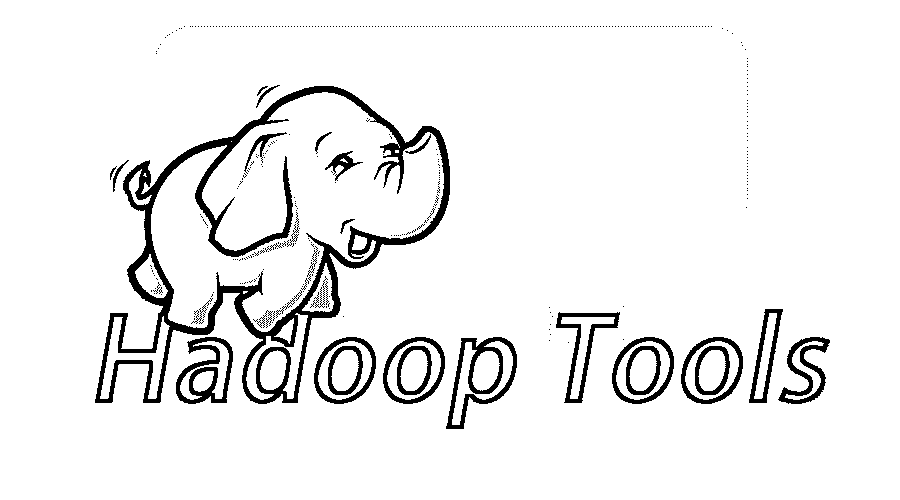

# Hadoop 工具

> 原文：<https://www.educba.com/hadoop-tools/>

## Hadoop 工具简介

Hadoop 工具被定义为处理大量以表单和集群形式分布的数据以执行分布式计算所需的框架。Hadoop 中用于处理数据的几个工具是 Hive、Pig、Sqoop、HBase、Zookeeper 和 Flume，其中 Hive 和 Pig 用于查询和分析数据，Sqoop 用于移动数据，Flume 用于将流数据接收到 HDFS。

### Hadoop 工具的特性

1.  储备
2.  猪
3.  Sqoop
4.  HBase
5.  动物园管理员
6.  水道

现在我们将看到这些功能及其简要说明。

<small>Hadoop、数据科学、统计学&其他</small>

#### 1.储备

Apache Hive 由脸书创建，后来捐赠给了 Apache 基金会，这是一个数据仓库基础设施，它有助于编写类似 SQL 的查询，称为 HQL 或 HiveQL。这些查询在内部被转换为 Map Reduce 作业，并利用 Hadoop 的分布式计算进行处理。它可以处理驻留在 S3 HDFS 的数据以及与 Hadoop 兼容的所有存储。每当我们发现在 Hive 中难以实现的东西时，我们可以通过在用户定义的函数中实现来利用 Map Reduce 提供的工具。它使用户能够注册 UDF 并在作业中使用它。

**蜂巢的特征**

*   Hive 可以处理多种类型的文件格式，如序列文件、ORC 文件、文本文件等。
*   分区、存储桶和索引可以加快执行速度。
*   压缩数据也可以加载到配置单元表中。
*   托管或内部表和外部表是 Hive 的突出特点。

#### 2.猪

Yahoo 开发了 Apache Pig，通过一种实现 Map Reduce 的特别方式，获得了一个增强 Hadoop 的额外工具。Pig 有一个名为 Pig Engine 的引擎，可以将脚本转换为 Map Reduce。Pig 是一种脚本语言，为 Pig 编写的脚本是用 PigLatin 编写的，就像 Hive 一样，我们也可以用 UDF 来增强功能。Pig 中的任务会自动优化，因此程序员无需担心。Pig 处理结构化和非结构化数据。

**猪的特征**

*   用户可以拥有自己的功能来进行特定类型的数据处理。
*   用 Pig 编写代码比较容易，代码长度也比较短。
*   系统可以自动优化执行。

#### 3.Sqoop

Sqoop 用于在 HDFS 和 RDBMS 之间传输数据，反之亦然。我们可以从 RDBMS、Hive 等中提取数据到 HDFS。，我们可以处理它并将其导出回 RDBMS。我们可以在一个表格中多次追加数据。此外，我们可以创建一个 Sqoop 作业，并执行 n 次。

**sq OOP 的特性**

*   Sqoop 可以一次将所有的表导入 HDFS。
*   我们可以嵌入 SQL 查询以及数据导入条件。
*   如果从 HDFS 得到一个表[，我们可以将数据导入 hive。](https://www.educba.com/what-is-hdfs/)
*   可以控制映射器的数量，即可以通过指定映射器的数量来控制并行执行。

#### 4.HBase

在 HDFS 之上的数据库管理系统叫做 HBase。HBase 是一个 [NoSQL 数据库](https://www.educba.com/what-is-nosql-database/)，它是在 HDFS 之上开发的。HBase 不是关系数据库；它不支持结构化查询语言。HBase 利用 HDFS 的分布式处理。它可以有包含数百万条记录的大表。

**h base 的特性**

*   HBase 提供线性和模块化的可扩展性。
*   JAVA 中的 API 可用于客户端访问。
*   HBase 为执行查询提供了一个 shell。

#### 5.动物园管理员

Apache Zookeeper 是一个集中的配置维护服务；它记录信息、命名，还提供分布式同步和群组服务。Zookeeper 是一个集中式存储库，分布式应用程序利用它来存放和获取数据。它还有助于管理节点，即加入或离开集群中的节点。当一些节点关闭时，它提供了高度可靠的数据注册。

**动物园管理员的特点**

*   可以通过分配任务来提高性能，这些任务是通过添加更多的机器来实现的。
*   它隐藏了发行版的复杂性，并把自己描绘成一台单一的机器。
*   少数系统的故障不会影响整个系统，但缺点是可能会导致部分数据丢失。
*   它提供了原子性，即事务要么成功，要么失败，但不处于不完美状态。

#### 6.水道

Apache Flume 是一个提供数据摄取的工具，它可以从不同的来源收集、聚合和传输大量的数据到 HDFS、HBase 等。Flume 非常可靠，可以配置。它被设计为从网络服务器接收流数据或事件数据到 HDFS，例如，它可以接收 twitter 数据到 HDFS。Flume 可以将数据存储到任何集中式数据存储中，如 HBase/HDFS。如果数据产生的速度比数据写入的速度快，那么 flume 就充当了一个中介，确保数据稳定地流动。

**水槽特征**

*   它可以接收 web 服务器数据和事件数据，例如来自社交媒体的数据。
*   Flume 事务是基于通道的，即维护两个消息；一个用于发送，一个用于接收。
*   水槽中的水平缩放是可能的。
*   它是高度容错的，因为上下文路由存在于 flume 中。

### 结论

在本文中，我们了解了一些 Hadoop 工具，以及它们在数据世界中是如何有用的。我们已经看到了 Hive 和 Pig，它们用于查询和分析数据，snoop 用于移动数据，flume 用于将流数据接收到 HDFS。

### 推荐文章

这是 Hadoop 工具的指南。这里我们讨论 Hadoop 的不同工具及其特性。您也可以浏览我们推荐的其他文章，了解更多信息——

1.  [Hadoop 替代方案](https://www.educba.com/hadoop-alternatives/)
2.  [Hadoop 数据库](https://www.educba.com/hadoop-database/)
3.  [SQL 字符串函数](https://www.educba.com/sql-string-functions/)
4.  [什么是大数据](https://www.educba.com/what-is-big-data/)
5.  [Hadoop 命令|前 23 条命令](https://www.educba.com/hadoop-commands/)
6.  [Hadoop 版本综合指南](https://www.educba.com/hadoop-versions/)
7.  [如何在 SQL 中使用 LIKE 查询？](https://www.educba.com/like-query-in-sql/)

