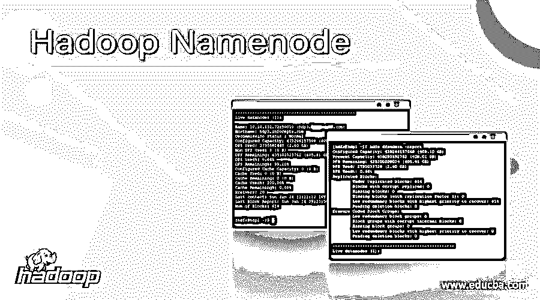
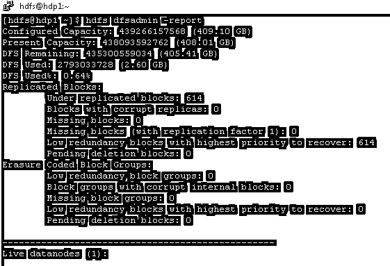
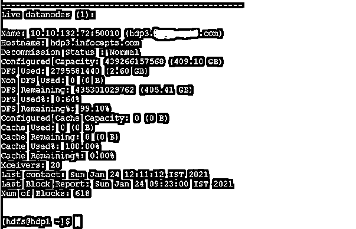
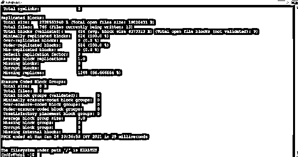
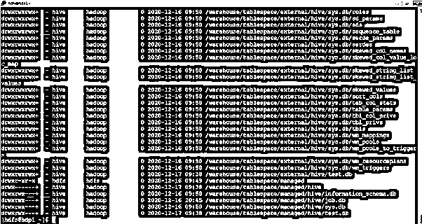

# Hadoop Namenode

> 原文：<https://www.educba.com/hadoop-namenode/>

## Hadoop Namenode 简介

在 Hadoop 堆栈中，我们有多个组件。namenode 是组件之一。它与 HDFS 服务有关联。Namenode 将保留 hdfs 元数据信息。在 namenode 的帮助下，我们正在获取 hdfs 文件的信息，这些信息位于 hdfs 级别。在 namenode 中，我们有多个组件，如 datanode、备用 namenode、journal node、NFSGATEAY 等。我们能够实现 namenode 的高可用性。在 namenode 中，我们有一个服务指标。在这里，我们将获得 hdfs 数据块级别的信息，如数据块总数、损坏的副本、缺失、复制不足、dfs 级别的磁盘利用率状态、非 DFS 级别的磁盘利用率状态等。

**语法:**

<small>Hadoop、数据科学、统计学&其他</small>

`hadoop fs/admin [ OPTION ] [ COMMAND ]`

**1) Hadoop:** 我们可以在语法或命令中使用 Hadoop 或 hdfs 关键字。它会将不同的参数作为选项和命令。最终结果是，我们能够在 Hadoop HDFS 级别上工作。

2) fs/admin: 在 Hadoop namenode 命令中，我们需要使用不同的兼容关键字，如 fs、admin 等。根据需求，我们可以使用 hdfs 命令。

**3)选项:**我们可以提供不同的标志作为与 Hadoop 命令兼容的选项。

**4)命令:**根据需求，我们需要使用其中不同的命令。

注意:在 Hadoop 环境中，没有任何东西与 namenode 命令相关或与之相关。要使用 namenode，我们只需要使用 hdfs 命令。

### Hadoop Namenode 如何工作？

正如我们已经讨论过的，在 Hadoop 环境中，我们有多个组件或服务。namenode 详细描述了存储部分。namenode 用于大数据目的。我们可以在 hdfs 上存储大量数据，比如 TB 或更多。数据将按照块级别存储。单个块的大小是 128 MB。

当任何用户或客户端想要在 hdfs 级别上读取或写入任何操作时。客户端首先会触发 Hadoop 或 hdfs 命令。它将出现在 hdfs shell 或 hue 或任何第三方应用程序上。第一个请求将发送到 namenode。(如果 namenode 不存在，则 hdfs 命令或 hdfs 请求将不起作用)。Namenode 将从其元数据中检查信息。如果块信息存在，那么它将服务于该请求。否则，它将通过一个错误消息。

### 例子

让我们讨论 Hadoop Namenode 的例子。

#### 1.Hadoop Namenode 状态

Namenode 是 Hadoop 堆栈中非常重要的服务。Hadoop 堆栈中的大多数服务都依赖于 hdfs 服务，即 namenode 扮演着非常重要的角色。我们能够获得活动的 namenode 状态。

**语法:**

`hdfs dfsadmin -report`

**说明:**

按照上面的命令，我们得到了 namenode 的完整报告。

根据下面的截图 1 (A ),我们正在获取 hdfs 块的详细信息。

根据下面的截图 1 (B ),我们已经获得了活动的 namenode 状态。dfs 数据、非 dfs 数据、已用缓存、剩余缓存、已用缓存等。

**输出:**

截图 1 (A)

截图 1 (B)

#### 2.Hadoop Namenode 备份

在 Hadoop 中，我们拥有备份 namenode 元数据的功能。强烈建议及时收回 namenode 的背面。根据需要，我们可以恢复名称的备份。

**语法:**

`hdfs dfsadmin -fetchImage backup_24_jan`

**说明:**

按照上面的命令，我们正在备份 namenode。它将只在操作系统级别保存文件。按照标准流程，我们需要在备份文件中添加日期。这将有助于根据相应的日期识别 namenode 备份文件。

**输出:**

#### 3.Hadoop Namenode 块映射信息

在 Hadoop 中，所有的数据或文件都是按照块级别存储的。我们有检查文件系统的功能。我们也在获取封锁状态的信息。这也有助于识别损坏的块。我们还可以删除损坏的数据块，使 hdfs 保持健康状态。

**语法:**

`hdfs fsck /`

**说明:**

按照上面的命令，我们能够获得 hdfs 级别的块信息。在根级别或“/”级别检查块信息不是强制性的。

**输出:**

#### 4.Hadoop Namenode:递归列出文件的数量

在 namenode 中，我们可以一次性列出所有文件。当我们需要所有的文件信息来进行分析时，这会很有帮助。我们还可以将所有文件信息保存在一个输出文件中。

**语法:**

`hdfs dfs -ls -R /`

**说明:**

按照上面的命令，我们能够以递归的方式列出文件的数量。我们还可以使用相同的命令来分析 hive 或 HBase 文件。

**输出:**

#### 5.Hadoop Namenode:检查安全模式状态

在 Hadoop 环境中，如果 namenode 不处于安全模式，大多数 namenode 命令都不会运行。我们需要更改 namenode 的安全模式的当前状态。

在安全模式中，我们有四种不同的模式，如进入、离开、获取、等待。根据要求，我们可以更改 namenode 安全模式的状态。

**语法:**

`hdfs dfsadmin -safemode get`

**说明:**

按照上面的命令，我们正在获取 namenode 的安全模式信息。

**输出:**

### 结论

我们已经看到了“Hadoop namenode”的完整概念，以及适当的示例、解释和输出。就 Hadoop 环境而言，Hadoop namenode 非常重要。大多数 Hadoop 服务依赖 hdfs 以分布式方式存储数据。namenode 没有存储 hdfs 数据。它只是拥有 hdfs 元数据信息。

### 推荐文章

这是 Hadoop Namenode 的指南。这里我们讨论一下简介，Hadoop Namenode 是如何工作的？和语法示例。您也可以看看以下文章，了解更多信息–

1.  [Hadoop 版本](https://www.educba.com/hadoop-versions/)
2.  [Hadoop 命令](https://www.educba.com/hadoop-commands/)
3.  [什么是 Hadoop？](https://www.educba.com/what-is-hadoop/)
4.  [Hadoop 管理员](https://www.educba.com/hadoop-administrator/)

