# Hadoop 堆栈

> 原文：<https://www.educba.com/hadoop-stack/>

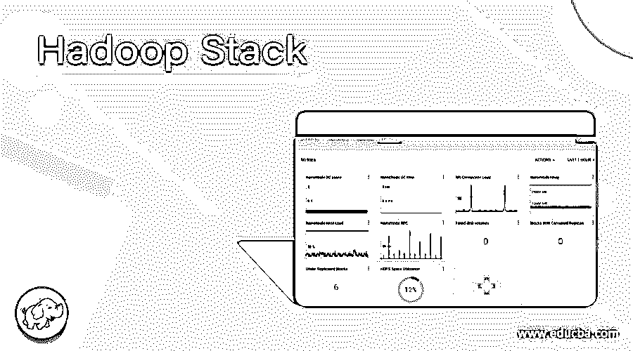

## Hadoop 堆栈简介

Hadoop 堆栈只不过是一组软件或软件库。Hadoop 堆栈是以分布式方式提供处理大量数据或数据集的功能的框架。根据需求或用例，我们需要选择不同的 Hadoop 堆栈。对于批处理，我们将使用 HDP 堆栈。对于实时数据处理，我们将使用 HDF 堆栈。正如我们所说，HDP 和 HDF 都不一样，服务也不一样。在 HDP 栈中，我们会得到 HDFS，纱，Oozie，MapReduce，Spark，Atlas，Ranger，Zeppelin，Hive，HBase 等。在 HDF 堆栈中，我们将获得 Kafka、NiFi、schema registry 等等。

**语法:**

<small>Hadoop、数据科学、统计学&其他</small>

因此，Hadoop 堆栈没有特定的语法。根据要求或需要，我们可以使用 HDP 或 HDF 环境的必要组件，并使用适当的语法。根据需求，我们需要使用单个组件的正确语法。在使用语法之前，首先请确定工作方法。因为 Hadoop 堆栈中的每个组件都是不同的。

### Hadoop 堆栈如何工作？

正如我们所讨论的，Hadoop 是一种以分布式方式处理大量数据的技术或框架。而处理来自传统数据库的大量数据将不能满足需要，而且大多数情况下需要花费大量的时间。在某些情况下，它会通过一个错误，如内存不足等。为了避免这种情况，我们采用了 Hadoop 堆栈或 Hadoop 技术。它将以 TB 或更多的单位加载大量数据，并以分布式模式处理这些数据。它根据映射器和缩减器模式进行处理。通常，映射器处理进程机制，而缩减器处理输入和输出操作。

注意:为了构建 Hadoop 集群，我们需要在资源(RAM 和 CPU)、存储等方面有一个广泛的基础设施。如果我们的资源较少，那么我们可以在群集上部署较少的服务，也就是说，根据需求，我们可以部署服务。

下面是 Hadoop 堆栈和版本信息的截图。

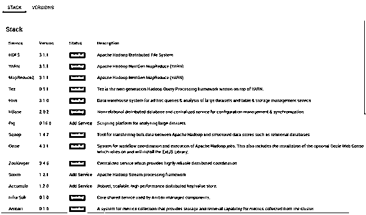

以下是属于 Hadoop 堆栈一部分的服务列表

#### 1.HDFS

正如我们所讨论的，Hadoop 堆栈分布在多个数据节点上。HDFS 文件系统是为高可伸缩性、可靠性、容错性而设计的。在 Hadoop 堆栈中，我们有复制的概念。默认情况下，数据或文件将分布在 3 个不同的节点上。在某些情况下，如果我们将在任何数据节点上面临任何问题，但我们仍然会获得数据，因为我们有数据的 3 个拷贝。

**截图:**

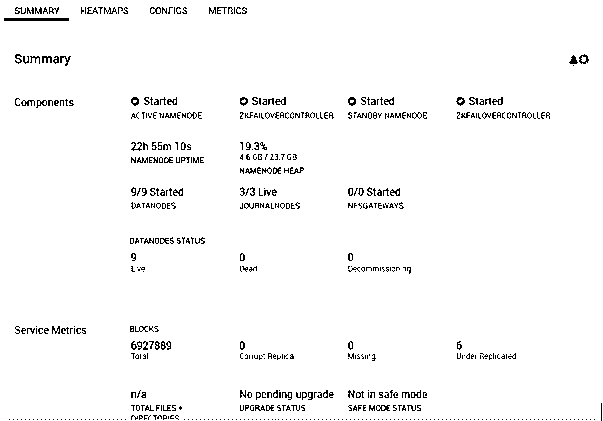

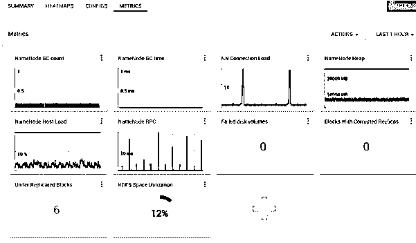

**说明**:

根据上面的截图，我们已经看到了 HDFS 服务摘要。在矩阵中，我们得到了 HDFS 服务中可用的不同组件的统计数据。

#### 2.故事

在 Hadoop 堆栈中，就资源分配而言，yarn 服务是一个非常重要的服务。在 Hadoop 环境中提交任何作业的时间。纱线负责分配资源来执行作业。节点管理器完全负责执行作业。

**截图:**

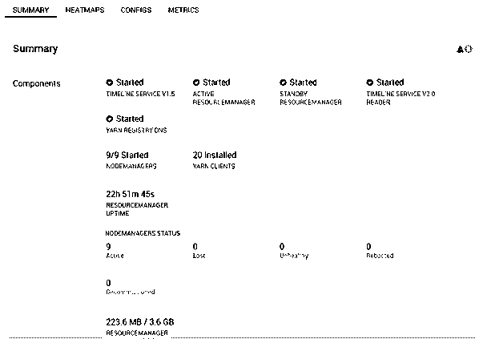

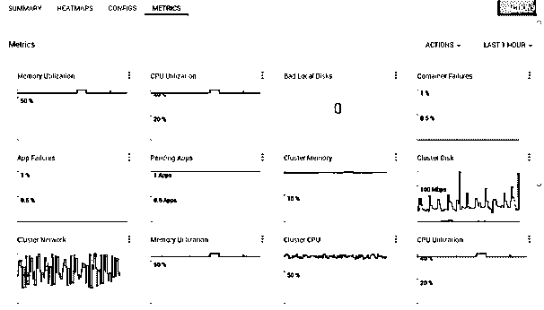

**说明:**

我们已经看到了纱线服务总结。在纱线矩阵中，我们得到了纱线服务中可用的不同组件的图示。

#### 3.驭象者

在 Hadoop 生态系统中，oozie 负责调度作业。我们可以安排任何类型的作业，如 hive、HBase、spark 等。根据要求，我们可以在特定的时间间隔安排作业。

**截图:**

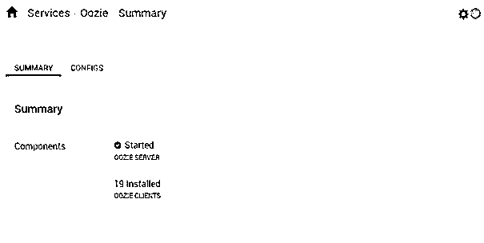

**解释**

根据上面的截图，我们已经看到了 oozie 服务摘要。

#### 4.储备

在 hive 服务的帮助下，我们能够在 HDFS 数据上运行 SQL 语句。

**截图:**

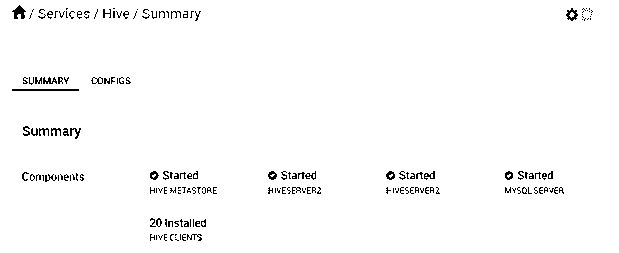

**解释**

根据上面的截图，我们已经看到了配置单元服务概要，其中包含配置单元的不同组件。根据上面的截图，我们有高可用性的 hiveserver 2。如果任何一个 hiveserver2 无法处理客户端请求或可能出现故障，则另一个 hiveserver2 将充当领导者，为客户端请求提供服务。

#### 5.HBase

HBase 服务用于以列方法存储数据。数据将以分布式模式存储。在 HBase 中，实际的数据存储信息在 HBase 区域服务器中可用。HFile 将在 HDFS 存储级别的顶部存储实际的 HBase 数据。

**截图:**

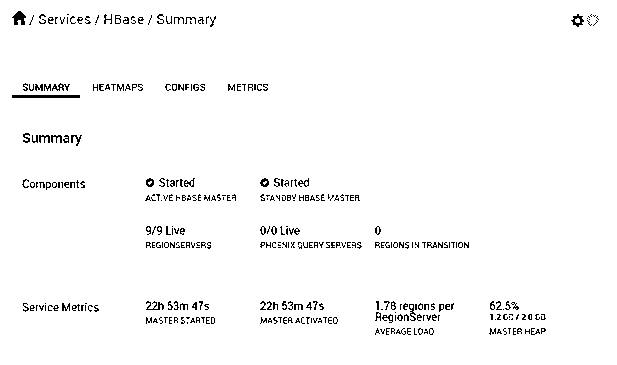

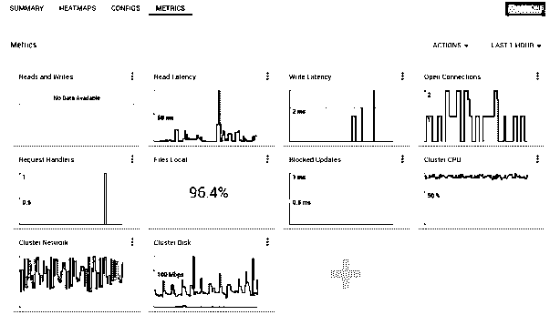

**解释**

根据上面的截图，我们已经看到了 hive 服务摘要、矩阵和 HBase 的不同组件。

#### 6.看守人

在 Hadoop 堆栈中，ranger 是一个管理 Hadoop 生态系统所有授权部分的服务。

**截图:**

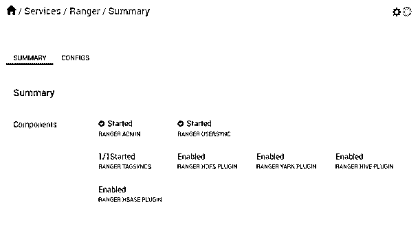

**解释**

根据上面的截图，我们已经看到了 ranger 的不同组件的 ranger 服务摘要。

#### 7.火花

spark 有自己的执行引擎。它将使用内存缓存和优化查询。这将有助于快速处理数据。

**截图:**

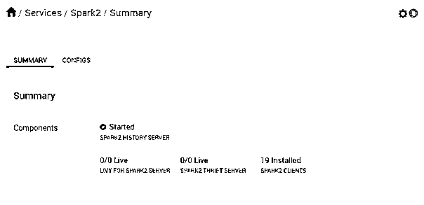

**解释**

根据上面的截图，我们已经看到了 spark 服务摘要和 spark 的不同组件。

#### 8.齐柏林

齐柏林飞艇是一种服务；它将作为客户端和 Hadoop 生态系统之间的解释器。我们可以从 zeppelin 运行许多不同类型的查询，如 hive、HBase、spark 等。

**截图:**

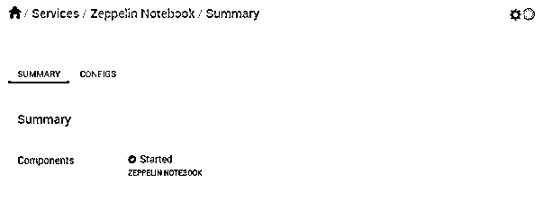

**解释**

根据上面的截图，我们看到了齐柏林飞艇服务。

### 结论

我们已经看到了“Hadoop 堆栈”的完整概念，以及适当的示例、解释和截图。Hadoop 堆栈是多种技术的结合。在同一个集群中部署整个 Hadoop 堆栈并不是强制性的。根据需求，我们可以从堆栈中选择服务并部署它。我们可以使用不同的技术来保持 Hadoop 堆栈或环境的安全，如 Kerberos、SSL、TLS、加密等。

### 推荐文章

这是 Hadoop 堆栈的指南。这里我们讨论定义、语法、服务列表，以及 Hadoop Stack 是如何工作的？分别是。您也可以看看以下文章，了解更多信息–

1.  [什么是 Hadoop？](https://www.educba.com/what-is-hadoop/)
2.  [Hadoop 版本](https://www.educba.com/hadoop-versions/)
3.  [Hadoop 命令](https://www.educba.com/hadoop-commands/)
4.  [Hadoop 管理员](https://www.educba.com/hadoop-administrator/)

