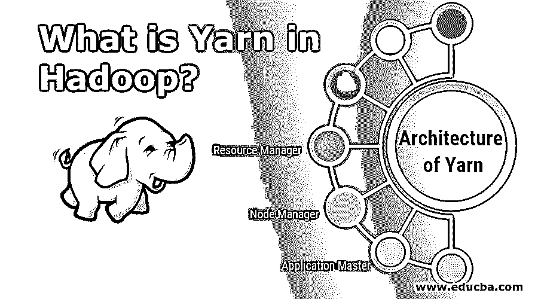
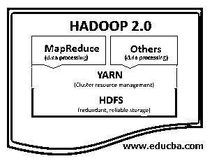
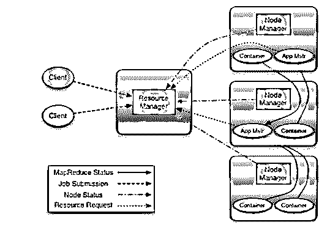
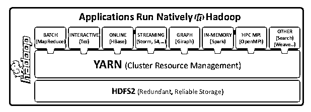

# Hadoop 中的 Yarn 是什么？

> 原文：<https://www.educba.com/what-is-yarn-in-hadoop/>

## Hadoop 中的 Yarn 简介

用于作业调度和资源管理的技术以及 Hadoop 中的主要组件之一称为 Yarn。Yarn 代表另一种资源协商者，尽管它被开发人员称为 Yarn。Yarn 以前被称为 MapReduce2 和 Nextgen MapReduce。这使得 Hadoop 能够支持不同的处理类型。它运行交互式查询、流数据和实时应用程序。它还支持更广泛的不同应用。Yarn 将中央资源管理器与不同的容器结合起来。它可以将资源动态地组合到不同的应用程序中，并且操作得到很好的监控。

<small>Hadoop、数据科学、统计学&其他</small>

在 Hadoop 的早期，它的两个主要组件 HDFS 和 MapReduce 是由批处理驱动的。JobTracker 必须维护调度和资源管理任务。这通常会导致诸如资源得不到利用或工作失败等问题。由于处理是分批进行的，获得结果的等待时间通常会延长。以更快的速度和更高的精度处理实时数据的需求导致了纱线的产生。

### Hadoop 中的 Yarn 是什么？

Yarn 是 Hadoop 的主要[组件之一，它分配和管理资源，并保持所有东西正常工作。Yarn 最初被命名为 MapReduce 2，因为它通过解决 Hadoop 1.0 的缺点来增强其 MapReduce，并使 Hadoop 生态系统能够很好地应对现代挑战。Yarn 是作为分离资源管理层和处理层的一层引入的。](https://www.educba.com/hadoop-components/)

Yarn 是用于实现分布式计算集群的并行处理框架，该集群通过多个计算节点处理大量数据。Hadoop Yarn 允许将一个计算任务分割成成百上千个任务。

### 纱线的结构

除了资源管理，Yarn 还提供作业调度。纱线的概念是用独立的功能来管理并行处理。

负责所有纱线操作的主要部件如下:

*   资源管理程序
*   节点管理器
*   应用程序主机

Img Src: Cloudera

Yarn 使用主服务器和数据服务器。每个集群只有一个主服务器。它运行资源管理器守护进程。集群中有许多数据服务器，每个服务器都运行在自己的节点管理器守护进程和应用程序主管理器上。

#### 1.资源管理程序

资源管理器分配群集资源。这是通过调度所需作业的调度器和接受作业提交并执行必要的应用程序主程序的应用程序管理器实现的。资源管理器是一个单一的守护进程，但具有独特的功能，如:

*   **资源管理:**资源管理器与节点管理器交互，以保存集群范围内的资源清单，如 RAM、CPU 和网络使用情况。它管理资源的可用性和分配，从而获得管理资源的最终权限。
*   **调度管理:**只负责分配各个应用主机请求的资源。它不监视或跟踪作业的状态。
*   **应用管理:**这是资源经理最重要的职责。它确保启动和工作完成。它接受作业并将其分配给数据服务器上的应用程序主机。除此之外，它还监控应用程序主机的活动和状态，并在应用程序主机出现故障时提供重启。
*   **Hadoop 中的容器:** Hadoop v2.0 通过添加容器增强了并行处理。容器是支持数据节点上多租户的抽象概念。这是一种通过将数据服务器上的资源划分到一个容器中来定义内存、CPU 和网络分配需求的方法。这样，数据服务器可以通过托管多个容器来托管多个计算作业。
*   **资源容器:**资源管理器负责通过分配容器来调度资源。这是根据客户端提供的输入、群集容量、队列和群集上资源的整体优先级来完成的。资源管理器使用一种算法来分配容器，一般规则是在计算作业所需数据的同一节点上启动容器，以实现简单的数据局部性。

#### 2.节点管理器

节点管理器的主要目标是内存管理。节点管理器跟踪本地数据服务器上的 CPU、内存和网络等集群清单的使用情况和状态，并定期向资源管理器报告状态。每个数据服务器都分配有一个节点管理器守护进程。这保持了并行编程。

#### 3.应用程序主机

应用主机负责并行计算作业的执行。它的守护进程负责执行作业、监控作业错误以及完成计算机作业。这些守护程序由资源管理器在作业开始时启动。每个计算作业都有一个运行在其中一个数据服务器上的应用程序主机。应用程序主机从主服务器的 namenode 请求数据位置。然后，它与资源管理器中的调度器功能协商整个集群中的资源容器。

为了执行客户端请求的作业，应用程序主机将映射器容器分配给协商的数据服务器，监控容器，并且当所有映射器容器都完成了它们的任务时，应用程序主机将为缩减器启动容器。应用程序主机向资源管理器和客户机报告作业状态。

### 纱线的主要特征

*   **多租户** : Yarn 允许多个引擎访问，并满足实时系统的要求，以了解数据的位置，并管理数据在框架内的移动，以调度计算作业，在正确的位置运行正确的数据。
*   **共享资源:** Yarn 确保计算作业之间没有依赖性。每个计算作业都在自己的节点上运行，不共享分配给它的资源。每个工作负责自己分配的工作。
*   **集群利用:** Yarn 通过以动态方式利用和分配其资源来优化集群。
*   **容错:**纱线容错性强。它允许重新安排失败的计算作业，而不会对最终输出产生任何影响。
*   **可伸缩性:** Yarn 主要关注资源的调度。这为扩展数据节点和提高处理能力创造了一条途径。
*   **兼容性:**在 MapReduce v1 中工作的作业可以轻松地迁移到更高版本的 Hadoop，从而确保 Yarn 的高兼容性。

### 结论

创建 Yarn 的想法是将资源分配和作业调度从 MapReduce 引擎中分离出来。因此，yarn 在 HDFS (存储系统)和 MapReduce(处理引擎)之间形成了一个中间层[，用于集群资源的分配和管理。Yarn 的出现为 Hadoop 生态系统带来了许多可能性。yarn 成功克服了 MapReduce v1 的局限性，并为 Spark、Storm、Solr 和 Tez 等执行引擎提供了更好、更灵活、更优化和更高效的主干。](https://www.educba.com/what-is-hdfs/)

### 推荐文章

这是 Hadoop 中什么是 Yarn 的指南？在这里，我们将讨论 yarn 的简介、体系结构和主要特性。您也可以看看以下文章，了解更多信息–

1.  [Hadoop 中的 MapReduce 是什么？](https://www.educba.com/what-is-mapreduce-in-hadoop/)
2.  [Hadoop 生态系统组件](https://www.educba.com/hadoop-ecosystem-components/)
3.  [什么是大数据和 Hadoop](https://www.educba.com/what-is-big-data-and-hadoop/)
4.  [Hadoop 数据库](https://www.educba.com/hadoop-database/)
5.  [3 个版本的 Hadoop 软件](https://www.educba.com/hadoop-versions/)

