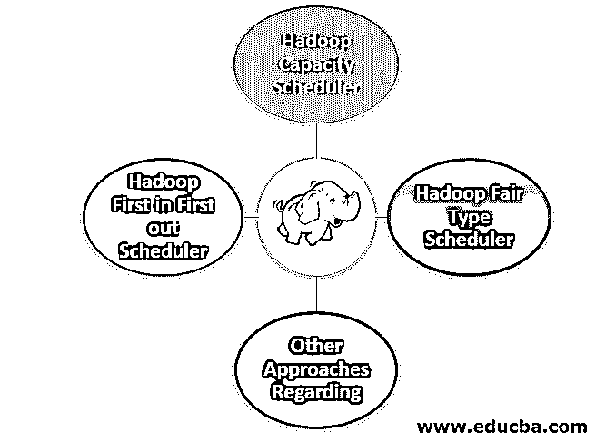

# Hadoop 调度程序

> 原文：<https://www.educba.com/hadoop-schedulers/>

## Hadoop 调度程序简介

Hadoop 调度程序是通用系统，因为它允许系统在称为 Hadoop 的分布式节点集上执行高性能的数据处理。它还有助于确保资源的最佳利用率和对未使用的容量级别的访问，Hadoop 中存在的少数 Hadoop 调度程序是 Hadoop 容量调度程序、Hadoop 先进先出(FIFO)调度程序和 Hadoop 公平类型调度程序

### 前 4 种 Hadoop 调度程序类型

我们经常使用几种类型的 Hadoop 调度程序:

<small>Hadoop、数据科学、统计学&其他</small>

#### 1.Hadoop 先进先出调度程序

*   顾名思义，这是最古老的作业调度程序之一，它的工作原理是先进先出。基本上，当我们谈论诸如 JobTracker 之类的过程时，我们谈论的是从队列(通常称为工作队列)中提取作业。
*   根据该工作队列，最老的作业，即第一个作业也将是第一个被执行的作业。
*   人们一直认为这是一种比其他调度技术简单得多的方法，因此没有太多的人想到仅仅为了寻找具有更好调度能力的新方法而放弃这种技术，因为它们本身也包含了作业大小和优先级的概念。

#### 2.Hadoop 容量调度程序

*   Hadoop 容量调度器或多或少类似于 FIFO 方法，只是它也利用了作业的优先级。当我们讨论多用户级别的调度时，这种方法略有不同。
*   众所周知，这种方法可以为每个组织或用户调度和模拟一个单独的 MapReduce 集群,这是通过 FIFO 类型的调度完成的。

#### 3.Hadoop 公平类型调度程序

*   当需要根据时间和周期提供单独且合理的集群容量时，我们会使用 Hadoop fair scheduler。这有助于获取所有集群，即使某个特定作业处于运行状态。
*   此外，集群的所有空闲槽被提供给所有作业，使得随着更多的作业变得对提交有用，每个用户获得其集群部分的标准化份额。
*   如果有一个池在相当长的一段时间内还没有接收到它们的公平份额和标准化份额，则抢占开始起作用，从而终止所有池化的任务，并以提供那些池槽的容量来运行。
*   此外，这也称为 contrib 模块，这意味着通过将基于 Hadoop 的控制和公平调度程序的目录复制到基于 lib 的目录中，并将 JAR 文件放在适当的位置，可以启用这种调度技术。唯一需要做的事情是将任务调度程序的属性设置为 mapred.FairScheduler。

#### 4.关于调度程序的其他方法

*   Hadoop 确保提供虚拟集群，这意味着可以最大限度地减少对物理实际集群的需求，这种技术被称为 HOD (Hadoop on Demand)。
*   它利用基于 Torque 的资源管理器来保持节点运行，并根据虚拟集群的需求分配节点。
*   它用于初始化负载和系统，该负载和系统基于虚拟而非物理集群内的特定节点以及分配的节点，仅在自动准备好配置文件时使用。
*   一旦初始化发生，HOD 集群也可以以相对独立的方式使用。简而言之，用于部署这些[大型 Hadoop 集群](https://www.educba.com/what-is-hadoop-cluster/)的简单模型位于[云基础设施](https://www.educba.com/cloud-infrastructure/)内，这就是所谓的 HOD。相比之下，它共享的节点数量较少，因此提供了更高的安全性。

### 使用 Hadoop 调度程序的重要性

1.  从 Hadoop 调度器的类型来看，应该很清楚使用这些 Hadoop 调度器的重要性在哪里。如果您正在运行一个大型集群，该集群具有不同的作业类型、不同的优先级和大小以及多个客户端，那么选择正确的 Hadoop 调度程序就变得非常重要。
2.  这一点很重要，因为它通过在队列中高效地对作业进行优先级排序，确保了对未使用的容量水平的有保证的访问和资源的最佳利用。尽管 Hadoop 调度程序的这一部分相对容易，因为如果在一个组织内运行的集群的数量和类型之间存在差异，使用公平调度程序通常是正确的选择。
3.  这个公平调度器仍然可以用于提供和非均匀地分配作业的池容量，并且它是以更简单和可配置的方式完成的。当我们谈到多样化作业的存在时，公平调度程序也来拯救我们，因为它可以用于为与较大种类的作业混合的相对较小的作业提供更高的响应时间，并且对这些的支持包含在模型的交互使用中。
4.  当您更关心队列而不是所创建的池的级别，以及可配置的 map 和 reduce 作业类型插槽的级别时，容量调度程序很有帮助，因为队列可以获得群集的保证容量。

### 结论

在这篇文章中，我们了解了 Hadoop 调度程序、它们的含义、简介、Hadoop 调度程序的类型、它们的功能，还了解了这些 Hadoop 调度程序的重要性。当涉及到大数据生态系统和环境时，Hadoop 调度程序是一个经常不被谈论的东西，但却具有极其重要的意义，不能放任不管。希望你喜欢我们的文章。

### 推荐文章

这是 Hadoop 调度器的指南。在这里，我们讨论 Hadoop 调度器的简介和前 4 种类型，以及使用它的重要性。你也可以看看下面的文章来了解更多-

1.  [Java 中的 Swing 组件](https://www.educba.com/swing-components-in-java/)
2.  [Java 中的 JTabbedPane](https://www.educba.com/jtabbedpane-in-java/)
3.  [Java 中受保护的关键字](https://www.educba.com/protected-keyword-in-java/)
4.  Java 中的 JTextArea
5.  [了解顶级 Hadoop 命令](https://www.educba.com/hadoop-commands/)
6.  [Hadoop 的三个版本详细介绍](https://www.educba.com/hadoop-versions/)

