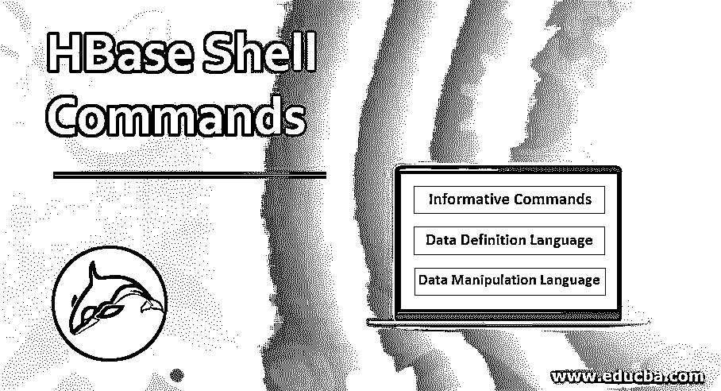
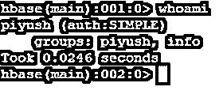
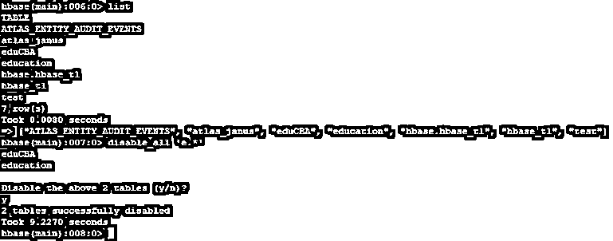
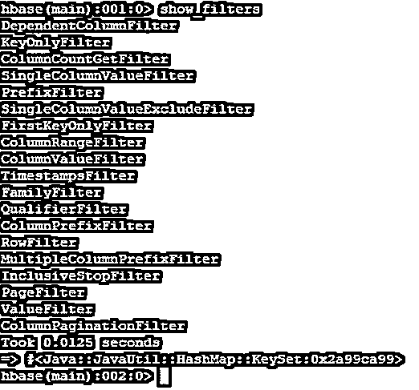
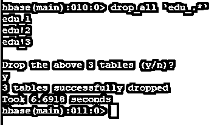
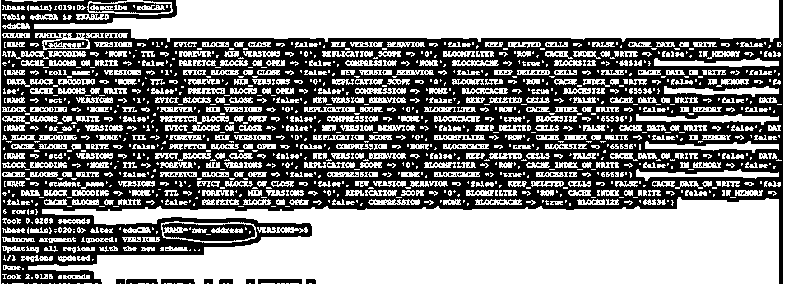
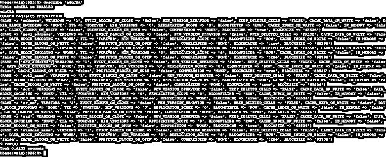
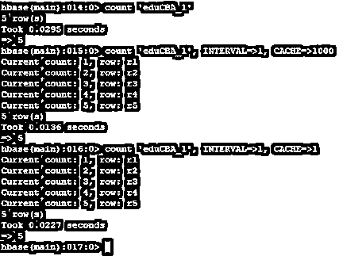
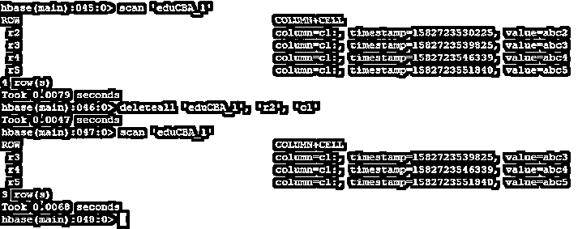
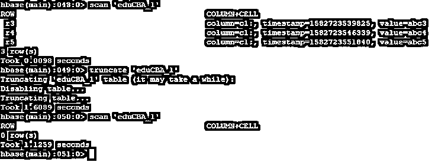

# HBase Shell 命令

> 原文：<https://www.educba.com/hbase-shell-commands/>

## HBase Shell 命令简介

在本文中，我们将了解 HBase Shell 命令。HBase Shell 是一个非常强大的与 HBase 通信的工具。外壳将在其中支持 HBase 的数据定义和数据操作语言。在 ruby 语言的帮助下，创建了外壳。在 Hadoop 生态系统上成功安装 HBase 之后。我们可以通过 HBase Shell 和 Java API 与 HBase 环境进行通信。

### 如何登录 HBase Shell？

*   打开任何远程访问客户端软件，如 putty、MobaXterm 等。
*   输入 HBase 服务器的 IP 地址以及用户 ID 和密码。
*   一旦您使用相应的用户登录。
*   输入“HBase shell”并按回车键。现在，您将能够登录 HBase Shell

**代码:**

<small>Hadoop、数据科学、统计学&其他</small>

`hbase shell`

**输出:**

### HBase Shell 命令中的不同类别

下面我们将学习 HBase Shell 命令中的三个不同类别:

*   信息命令
*   数据定义语言
*   数据操作语言

#### 1.信息命令

以下是用于提供信息的命令:

##### 形容词（adjective 的缩写）“whoami”命令

它给出的信息是，你从哪个用户登录，以及用户属于哪个组。

**代码:**

`whoami`

**输出:**

**说明:**

*   用户名:Piyush
*   组:信息

##### b.“版本”命令

该命令对于获取有关 HBase 版本可用的信息非常有用。

**代码:**

`version`

**输出:**

##### 碳（carbon 的缩写）“状态”命令

获得我们有多少 HBase 主服务器、HBase 区域服务器、HBase 服务器的详细信息是有帮助的。万一，如果任何地区的服务器可能死机+服务器上的平均负载。它也将在同一命令中更新

**代码:**

`status`

**输出:**

#### 2.数据定义语言

以下是用代码和输出定义数据语言的要点:

##### 形容词（adjective 的缩写）创建表格

create 命令对于创建表很有用。我们需要在其中提供表名和列族名。

**语法:**

`create <table_name>, <column_family_name>`

**代码:**

`create 'eduCBA','sr_no','student_name','roll_name','std','sct','address'`

**输出:**

##### b.列表表格

list 命令对于获取 HBase 中所有表的列表非常有用。

**代码:**

`list`

**输出:**

##### 碳（carbon 的缩写）描述表格

describe 命令将有助于获得表的详细信息。它将给出列族和表是否启用的信息。

**语法:**

`describe <table_name>`

**代码:**

`describe 'eduCBA'`

**输出:**

##### d.禁用表格

如果要从 HBase 环境中删除表。必须首先禁用该表。除非表不被禁用，否则表将无法从 HBase 中删除。

**语法:**

`disable <table_name>`

**代码:**

`disable 'eduCBA'`

**输出:**

##### e.禁用所有表格

借助 disable_all 命令，我们可以从 HBase 环境中禁用所有具有匹配 regex 值的表。如果我们运行 disable_all 命令，该表将无法工作，或者无法在 disable_all 模式/条件下为任何客户端请求提供服务。一旦该表被禁用，用户也可以在“disable_all”模式下删除该表。

**语法:**

`disable_all <matching_regex_value>`

**代码:**

`list`

**输出:**

**解释**:在上面的例子中，我们有一个包含‘educa’，‘eduCBA’表的列表。在' disable_all '命令中，我们添加了' matching_regex_value=e.* '。输入该命令后，它会询问我们是否需要禁用该表。如果您愿意提供“y”(是)。然后表格从“e”开始，所有表格都将被禁用。

##### 氟（fluorine 的缩写）启用表格

如果我们禁用了该表。那么桌子就不能用了。如果您想像以前一样访问表，它可以正常工作。我们需要运行“启用”命令。

**语法:**

`enable <table_name>`

**代码:**

`enable 'eduCBA'`

**输出:**

##### g.显示 _ 过滤器

显示 HBase 环境中存在的所有过滤器非常有用。

**语法:**

`show_filters`

**代码:**

`show_filters`

**输出:**

##### h.下降台

顾名思义，我们可以从 HBase 中删除表。但是在从 HBase 中删除任何表之前，我们需要首先禁用它。然后我们可以放下桌子。

**Note:** In our case, the ‘education’ table is already in disable mode.

**语法:**

`drop <table_name>`

**代码:**

`drop 'education'`

**输出:**

##### i. Drop_all 表

drop_all 表类似于 drop 表。在同一个命令中，我们需要指定' regex_value '。

**语法:**

`drop_all <matching_regex_value>`

**代码:**

`drop_all 'edu_.*'`

**输出:**

##### j.已启用

该命令对于测试表是否启用非常有用。这些值为真，则表被启用。

**语法:**

`is_enabled <table_name>`

**代码:**

`is_enabled 'eduCBA'`

**输出:**

##### k.改变表格

顾名思义，我们可以改变 HBase 表。我们可以在 HBase 表中添加一个或多个列族。

**语法:**

`alter <table_name>, NAME=><column_family_name>, VERSIONS=>5`

**代码:**

`describe 'eduCBA'`

**输出:**

#### 3.数据操作语言

以下几点解释了数据操作语言:

##### 形容词（adjective 的缩写）数数

当我们想知道 HBase 表中的行数时。然后我们使用“计数”命令。它将显示其中存在的总行数。

还有两件重要的事情

*   **间隔:**h base 中的默认间隔大小为 10000。如果要加的话。您可以根据需要添加。**例如:**假设您的表中有 1000000 行。如果您将运行默认计数，则间隔将为 10000。如果你会提到 100000 的区间值。那么“计数”命令将只在接下来的 10 个时间间隔内执行。
*   **缓存:**默认大小为 10 行，如果您想增加的话。那么 count 命令将在更短的时间内执行。它详细描述了内存参数。

**语法:**

`count <table_name>, INTERVAL=><VALUE>, CACHE=><VALUE>`

**代码:**

`count 'eduCBA_1'`

**输出:**

##### b.扫描

“扫描”命令可用于检查输入/插入的值是否正确出现在表格中。

**语法:**

`scan <table_name>`

**代码:**

`scan 'eduCBA_1'`

**输出:**

##### 碳（carbon 的缩写）放

这将有助于在特定的表中添加/放置/插入数据。它还可以选择与时间戳进行协调。

**语法:**

`put <table_name>, <row>, <col>, <data>`

**代码:**

`put 'eduCBA_1' , 'r1', 'c1', 'abc1'`

**输出:**

##### d.得到

在' get '命令的帮助下，我们能够获取或看到特定表格的内容。根据需要，我们还可以添加时间戳，时间范围，版本，过滤器。

**语法:**

`get <table_name>, <row>, <col>`

**代码:**

`get 'eduCBA_1' , 'r1', 'c1'`

**输出:**

##### e.删除

我们可以从 HBase 表中删除实际数据。在删除命令中，我们需要指定具体的行和列。

**语法:**

`delete <table_name> <row> <col>`
**代号:**

`delete 'eduCBA_1' , 'r1', 'c1'`

**输出:**

##### 氟（fluorine 的缩写）全部删除

我们可以从 HBase 表中删除所有单元格。我们可以选择在其中显示列名。

**语法:**

`deleteall <table_name> <row> <col>`

**代码**

`deleteall 'eduCBA_1' , 'r2', 'c1'`

**输出:**

##### g.缩短

truncate 命令将保留表的模式。但是记录不存在。

**语法:**

`truncate <table_name>`

**代码:**

`truncate 'eduCBA_1'`

**输出:**

### 推荐文章

这是 HBase Shell 命令的指南。在这里，我们详细讨论一个简介和前三个类别及其代码和输出。您也可以浏览我们的其他相关文章，了解更多信息——

1.  [什么是 HBase？](https://www.educba.com/what-is-hbase/)
2.  [HBase 架构](https://www.educba.com/hbase-architecture/)
3.  [HBase 命令](https://www.educba.com/hbase-commands/)
4.  Apache hbase

