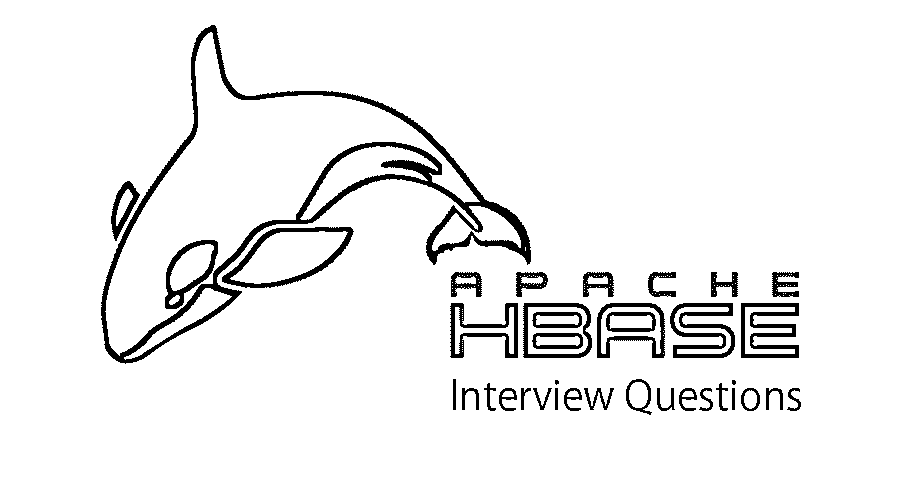

# h 基本面试问题

> 原文：<https://www.educba.com/hbase-interview-questions/>

## Hbase 面试问答介绍

HBase 是一个流行的面向列的 NoSQL 数据库管理系统，运行在 Hadoop 分布式文件系统(HDFS)之上。它非常适合稀疏数据集，这在许多大数据用例中很常见。

Here are the top 10 most asked 2022 HBase Interview Questions And Answers :So you have finally found your dream job in HBase but are wondering how to crack the Hbase interview and what could be the probable 2022 Hbase Interview Questions. Every interview is different, and the scope of a job is different too. Keeping this in mind, we have designed the most common Hbase Interview Questions and Answers to help you get success in your interview. These questions are divided into two parts are as follows:

### 第 1 部分-基本面试问题(基本)

第一部分包括基本的 HBase 面试问题和答案。

<small>Hadoop、数据科学、统计学&其他</small>

#### 1.什么时候应该使用 HBase？

**答案:**
Hbase 并不适合所有用例。可以通过以下检查来确定最合适的场景—
**I .数据量:**应该有数 Pb 的数据要在分布式环境中处理。
**二世。应用:** HBase 不[适合需要复杂多语句事务的 OLTP](https://www.educba.com/what-is-oltp/) (在线事务处理)系统。它还缺乏复杂的 SQL 支持，而这是关系分析所必需的。当您有大量模式稍有不同的数据时，这是首选。
**三世。集群硬件:** HBase 运行在 HDFS 之上。HDFS 可以高效地处理大量节点(最少 5 个)。所以 HBase 只有在良好的硬件支持下才能成为一个不错的选择。
**四世。不是传统的 RDBMS:** Hbase 不能支持任何需要传统特性的用例，如连接多个表、具有嵌套或窗口函数的复杂 SQL 等。
**五、快速随机访问数据:**如果你需要随机实时访问你的数据，那么 HBase 就是一个合适的人选。它也非常适合存储具有多结构数据的大型表。

#### 2.Cassandra 和 HBase 有什么区别？

**回答:**
[h base 和 Cassandra](https://www.educba.com/hbase-vs-cassandra/) 都有[分布式 NoSQL 数据库](https://www.educba.com/what-is-nosql-database/)用于来自[Hadoop 生态系统](https://www.educba.com/hadoop-ecosystem/)的大数据。两者都是为不同的用例而构建的。HBase 具有一种主从架构，包括几个组件，如 Zookeeper、Namenode、HBase Master(Hmaster)和数据节点。Cassandra 将所有节点视为主节点，这意味着所有节点都是平等的，并且执行所有功能。
HBase 针对读取进行了优化，写入仅发生在主节点上，并且对于写入后的读取具有很强的一致性。如果选择最终一致性，Cassandra 具有出色的单行读取性能。
Hbase 本身不支持二级索引，Cassandra 支持列名已知的列族上的二级索引。最初，Hbase 是在 Google 中创建的，他们将其命名为 BigTable。即使是现在，Bigtable 和 HBase 的 API 也是兼容的。Cassandra 的起源是来自 DynamoDB 的一篇论文，dynamo db 是 AWS 的一个 NoSQL 数据库。

让我们进入下一个基本面试问题。

#### 3.Hbase 的主要组件是什么？

**回答:**
HBase 有三个重要的组件——h master、Region Server、ZooKeeper。
**一、HBase 主:** HBase 表分区域。同时，启动主机决定将哪个区域分配给哪个区域服务器(区域服务器将是集群中的一个节点)。它还处理表元数据操作，如创建或更改模式。这个组件在故障恢复
**ii 中也起着重要的作用。区域服务器:**如上所述，这是实际数据读写发生的地方。这些是实际的集群节点。这将有许多表的区域，这是由开始和结束行键决定的。一个典型的区域服务器可以服务多达一千个区域。ZooKeeper: ZooKeeper 是 Hadoop 生态系统中广泛使用的集群协调框架。Zookeeper 跟踪集群中的所有服务器(主服务器和区域服务器),主服务器联系 ZooKeeper，并在出现错误时发出通知。

#### 4.什么是 HBase Bloom Filter？

**答案:**
这是面试中常见的 HBase 面试问题。HBase Bloom Filter 是一种有效的机制，用于测试存储文件(当某些内容写入 HBase 时，它首先被写入内存存储，一旦该内存存储达到一定大小，它就被刷新到磁盘的存储文件中)是否包含特定的行或行-列单元。通常，确定存储文件中是否存在行键的唯一方法是检查文件的块索引，该索引包含存储文件中每个块的起始行键。Bloom filters 充当内存中的数据结构，将磁盘读取减少到可能包含该行的文件，而不是所有存储文件。因此，它的作用类似于内存中的索引，指示在特定存储文件中找到一行的概率。

#### 5.什么是压实？解释它的不同类型。

**答案:**
HBase 将接收到的所有操作存储到其 memstore 存储区。当内存缓冲区满时，它会被刷新到磁盘。因为这可以在 HDFS 创建许多小文件，HBase 可以不时地选择文件压缩到一个更大的文件中。当 HBase 只选择压缩某些 HFiles 而不是所有 HFiles 时，压缩称为次要压缩。在主要压缩中，所有文件被选择压缩在一起。主要压缩的工作方式类似于次要压缩，只是删除标记可以在应用于所有相关单元格后移除，并且同一单元格的所有额外版本也将被删除。

### 第 2 部分–基本面试问题(高级)

现在让我们来看看高级 HBase 面试问题。

#### 6.HBase 版本数据如何？

**答:**
当插入/更新/删除一条数据时，HBase 会为该列创建一个新版本。实际删除仅在压缩期间发生。如果某个单元格超出了允许的版本数，那么在压缩过程中将会删除多余的版本。

#### 7.get 和 Scan 有什么区别？

**答:**
Get 将根据给定的行键从 Hbase 表中返回唯一的一行。扫描命令根据给定的搜索条件返回一组行。通常 get 比 scan 快。所以如果可能的话，我更愿意使用它。

让我们进入下一个基本面试问题。

#### 8.删除一行会发生什么？

**答案:**
在删除的时候，命令数据并没有从文件系统中物理删除，而是通过设置一个标记使其不可见。压缩过程中会发生物理删除。
列、版本和族删除标记是三种不同的标记，分别标记列、列版本和列族的删除。

#### 9.解释 HBase 和 Hive 的区别。

**答案:**
这是一次面试中问到的高级 HBase 面试问题。HBase 和 Hive 都是完全不同的基于 Hadoop 的数据处理技术。Hive 是一个类似关系的 SQL 兼容的分布式存储框架，而 HBase 是一个 NoSQL 键值存储。Hive 作为 Hadoop 之上的一个抽象层，提供 SQL 支持。HBase 数据访问模式非常有限，只有两个主要操作——get 和 scan。HBase 是实时数据处理的理想选择，而 Hive 是批量数据处理的理想选择。

#### 10.Hlog 和 HFile 是什么？

**答案:**
HLog 是预写日志文件，也叫 WAL，HFile 是真正的数据存储文件。数据首先写入预写日志文件，然后写入 MemStore。一旦 MemStore 满了，MemStore 的内容就被刷新到磁盘的 HFiles 中。

### 推荐文章

这是一个基本面试问题和答案列表的指南。在这里，我们涵盖了一些常见的面试问题及其详细的答案，以帮助候选人轻松应对面试。您也可以阅读以下文章，了解更多信息——

1.  [有用的小组面试问题](https://www.educba.com/group-interview/)
2.  [重要的基本面试技巧](https://www.educba.com/basic-interview-question/)
3.  [面试准备的基本步骤](https://www.educba.com/job-interview-preparation/)
4.  [向金融求职者提问的面试问题](https://www.educba.com/finance-interview-question/)

