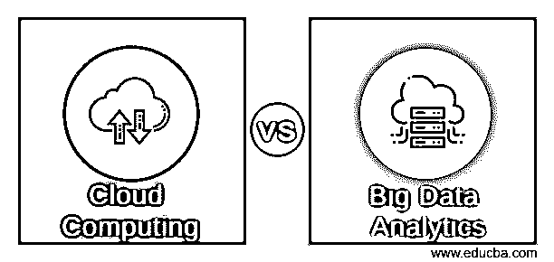

# 云计算与大数据分析

> 原文：<https://www.educba.com/cloud-computing-vs-big-data-analytics/>

## 云计算和大数据分析的区别

自从《纽约时报》发表了一篇关于沃尔玛如何利用大数据分析来实现销售额最大化的文章后，人们对大数据陷入了狂热。该零售商发现流行糖果品牌 Pop-Tarts 的销量在飓风期间激增，并利用这一知识来增加利润。

无论是保存数据以备移动访问的个人，还是削减前期成本同时维持防灾难 it 运营的企业，如今每个人都在仰望天空。进入云计算，一种现代的计算方法，因为它所有的事情和每个人都在九霄云外。

<small>Hadoop、数据科学、统计学&其他</small>

互联网泡沫破灭后，信息技术领域正获得令人难以置信的势头。从这一势头中涌现出云计算和大数据分析，这两个最热门的趋势对人类生活的各个层面产生了前所未有的影响。在这篇文章中，我们将探讨当今技术生态系统的这些趋势，并尝试对云计算和大数据分析进行比较。

### 云计算和大数据分析之间的直接比较

以下是云计算与大数据分析的 11 大对比

### 云计算和大数据分析的主要区别

*   云计算是指通过网络提供计算机资源和/或服务，而大数据是指在涉及大量数据且传统方法变得不可行时解决所面临的问题。
*   大数据的工作原理是将庞大的数据集分成可管理的“块”，并将这些块分布在不同的计算机系统中。在云计算中，信息存储在由服务提供商维护和控制的物理服务器上。用户可以通过互联网访问这些资源。
*   可以通过 PaaS 或 SaaS 服务在云上部署大数据解决方案。在 PaaS 中，Hadoop 平台提供给消费者，而在 SaaS，运行在 Hadoop 上的各种组件或应用程序是可访问的。事实上，大数据和云计算的结合变得如此流行，以至于我们有了一个新的时髦词:BDaaS(大数据即服务)。
*   大数据挖掘了组织以前忽略的数据，并提供了有价值的见解，可以推动其业务发展，而云计算提供了 IT 部署方面的灵活性和速度，可以简化组织的运营。

### 云计算与大数据分析对比表

云计算与大数据分析的区别:

| **比较依据** | **云计算** | **大数据** |
| **什么事？** | 计算范例 | 极大的数据集 |
| **焦点** | 提供普及服务 | 解决处理海量数据集的技术问题 |
| **最佳描述者** | 云计算是通过网络提供服务，主要是互联网。服务可以是软件、平台或 IT 基础设施。 | 3 个 V——速度、数量和多样性
要将您的数据定性为“大数据”,您感兴趣的数据集应该用上述一个或所有 V 来表示。 |
| **什么时候搬家？** | 当您需要快速部署或扩展 IT 应用程序或基础架构，同时保持集中访问时，您可以考虑迁移到云。在本地维护 IT 运营需要从您的业务中分离出来，使用云计算，您的重点仍然是您的业务。 | 当传统方法和框架在处理海量数据时无效时，大数据工程就开始发挥作用。当我们分析 Pb 级的数据时，需要一个分布式框架和并行计算。 |
| **什么时候不动？** | 相反，在某些情况下，您可能不想迁移到云。如果您的应用程序处理高度敏感的数据，并且要求严格的合规性，或者您的应用程序不符合云架构，那么您应该让这些东西远离云。此外，迁移到云相当于失去对硬件的控制。 | 大数据解决方案解决与庞大数据集相关的非常具体的问题陈述，而大多数大数据解决方案并不打算处理小数据。大数据不是关系数据库系统的替代品。 |
| **好处** | 低维护成本、灾难安全实施、集中式平台、零前期成本 | 高可扩展性(永远横向扩展)、经济高效、并行、强大的生态系统 |
| **由**推广 | 2006 年亚马逊发布 EC2(弹性计算云)产品时,“云计算”一词开始流行。 | 2005 年，当 Mike Cafarella 和 Doug Cutting 在雅虎发布“Hadoop”项目时，“大数据”开始成为主流。 |
| **常见角色** | **1。云资源管理员** :
管理云的人或组织。
**2。云服务提供商:**
以应用、资源或基础设施的形式提供服务的云平台所有者。
**3。云消费者:**
云的“用户”，他们可以是开发人员，也可以是组织中的上班族。
**4。云服务中介:**
消费者和服务商之间的中间方。他们提供中间服务。
**5。云审计员:**
就安全或潜在漏洞向消费者提供咨询的人 | **1。大数据开发者:**
他们编写程序来摄取、处理或清洗数据。他们还建立了调度和增量捕获机制。
**2。大数据管理员:**
他们设置服务器，安装软件，管理物理或逻辑资源。
**3。大数据分析师:**
他们负责分析数据，发现有趣的见解和未来可能的趋势。
**4。数据科学家:**
基本上就是具备编码技能和统计能力的分析师。此人参与大数据系统中数据的挖掘、预测建模和可视化。
**5。大数据架构师:**
负责端到端解决方案部署的人。 |
| **流行语** | **IaaS** :当服务提供商向消费者提供物理资源(如内存、磁盘、服务器和网络)时，基础架构即服务便应运而生。客户可以按照自己的意愿使用这些服务，并在其上安装应用程序。
**PaaS:** 平台可以是操作系统、RDBMS 系统、服务器或者编程环境。所有这些平台都是以平台即服务的形式提供的。
**SaaS:** 在软件即服务范式中，消费者直接利用应用程序或软件，而不必担心底层平台或基础设施。 | **Hadoop:** Hadoop 本身就是一个时髦词。它是一个由各种组件组成的生态系统，这些组件执行特定的任务，并集成在一起以实施大数据解决方案。Doug Cutting 以他儿子的玩具大象命名他的项目为“Hadoop”。
**HDFS** (Hadoop 分布式文件系统):提供高吞吐量访问的文件系统。它是一个基于 Java 的文件系统，分布在多台机器上。MapReduce: 用于编写大规模并行应用程序的框架，这些应用程序处理存储在 HDFS 的大量数据。在最基本的层面上，MapReduce 执行两个操作，将数据转换为键值对的 Map 和聚合数据的 Reduce。 |
| **供应商/解决方案提供商** | 谷歌、亚马逊、微软、IBM、戴尔、苹果 | Cloudera、MapR、HortonWorks、Apache |
| **流行的解决方案/示例** | **IaaS** :谷歌计算引擎，亚马逊网络服务，微软 Azure。
**PaaS** : Windows Azure、AWS Elastic Beanstalk、Google App Engine、Apache Stratos。
**SaaS** :谷歌文档，微软 Office 365 | Hadoop 是最受欢迎的大数据解决方案，其灵感来自 Google 文件系统(GFS)和 MapReduce 论文。Hadoop 生态系统通常由多个组件组成，例如用于集群管理的 **Ambari** 、用于数据提取的 **Sqoop** 、用于数据仓库的 **Hive** 以及用于调度的 **Oozie** 。 |

### 结论

云计算和大数据分析真正影响了组织运作和人类运营的方式。云计算提供的好处适用于各种规模的企业和各类个人。数据被视为一种资源，组织争相实施 Hadoop 来利用这种资源。有趣的是，尽管这些技术已经成为主流，但公司仍在研发方面投入大量资金。我们可以预计云计算和大数据分析在未来几年将会有更大的增长。

### 推荐文章

这是云计算与大数据分析的指南。在这里，我们讨论直接比较、关键差异、比较表和信息图。您也可以阅读以下文章，了解更多信息——

1.  【Azure Paas 与 Iaas 的 5 大优势
2.  [兴奋地想知道——什么是云计算&它是如何工作的？](https://www.educba.com/cloud-computing-features/)
3.  [5 个最重要的大数据分析解决方案](https://www.educba.com/challenges-of-big-data-analytics/)
4.  [了解云计算与数据分析的 5 个最有用的区别](https://www.educba.com/cloud-computing-vs-data-analytics/)
5.  [大数据分析在酒店业的重要性(Fast)](https://www.educba.com/big-data-analytics-techniques/)

