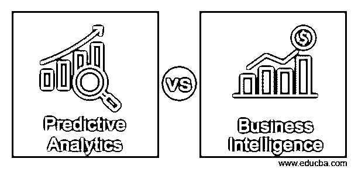
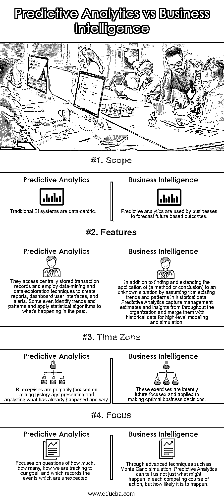

# 预测分析与商业智能

> 原文：<https://www.educba.com/predictive-analytics-vs-business-intelligence/>

## 预测分析与商业智能的区别

这是预测分析与商业智能的概要。术语“商业智能”和“预测分析”有时作为同义词使用，指的是使用数据做出合理判断的技术和工具。此外，在这个数字时代使用如此多的工具和方法可能会令人困惑。

#### 商业分析

*   企业的各个方面都在收集数据，并为数据收集做好准备。
*   数据的广泛可用性导致人们对从数据科学中提取有用信息的方法越来越感兴趣。
*   几乎每个行业的组织都注重利用数据来获得竞争优势。

**一个企业需要做出几个决策，例如:**

<small>Hadoop、数据科学、统计学&其他</small>

*   顾客购买产品 P 的可能性有多大？
*   下一个推荐的产品应该是哪一款？
*   作为客户，对机会的“现实”看法是什么？
*   是否有任何账户存在大量未利用的收入？
*   哪些卖家可能会错过目标订单？
*   您如何将销售人员与客户机会联系起来，以实现最大的收入影响？
*   哪些因素会影响其产品在市场上的表现？
*   这是一个将数据转化为洞察力的科学过程
*   它用于基于事实或数据驱动的决策制定
*   使用报告和图表(简单)、优化、数据挖掘和模拟(复杂等工具

#### 预测分析

预测分析包括使用根据过去数据创建的模型来预测未来或确定一个变量对另一个变量的影响的技术。下面举几个例子:

**例 1**

公司可以利用过去的产品销售数据创建一个预测未来销售的数学模型。

**例 2**

一家食品制造公司可以使用零售店的销售点扫描仪数据来估计单位销售额的测量值和数量。

**例 3**

公司可以利用调查数据和过去的购买行为来预测新产品的市场份额。

**其他例子**

公司还使用其他一些预测分析技术，如时间序列分析、线性回归、数据挖掘技术和模拟(风险分析)。

**什么是商业智能？T3】**

*   指报告和分析工具；传统上用于确定历史数据趋势。
*   包括一套使用信息管理流程输出的流程、方法、技术和架构
*   支持用户通过询问数据相关问题获得结果的查询
*   包括旨在以可理解的格式呈现分析结果的工具

简短的回答是肯定的。预测分析增加了决策分析的层次，虽然由 BI(商业智能)数据挖掘技术支持，但提供的战略价值远远超过 BI。

### 预测分析与商业智能的直接对比

以下是预测分析与商业智能的主要对比:

 

### 预测分析与商业智能的主要区别

预测分析与商业智能的区别如下。让我们以一家商店为例，进一步区分预测分析和商业智能。

*   BI 可以提供每位客户的详细信息，例如家庭住址、活动历史、年龄、通信偏好、收入等级等等。
*   从更全面的角度来看，BI 还可以告诉我们商店的平均购物者人口统计数据，或者连锁商店中的哪些商店迎合了购物者人口统计数据的哪些子集。
*   以上信息在确定销售的产品、销售地点和销售对象、哪些促销活动有效、哪些没有达到预期等方面提供了很好的价值。

相比之下，当我们通过预测分析的视角来看待这一有价值的历史时，

*   我们还可以确定下个月将购买哪些产品的客户，以及哪些产品将出售。由此，我们可以确定哪些产品有库存，需要资助哪些促销活动，扩展哪些位置，以及投资于哪些客户体验。
*   我们还可以比较和对比这些和其他竞争行为的价值和结果的可能性。

我们也可以根据无数或非常大的数字来分析结果。T3】

这可以告诉我们，鉴于一年中的特定时间、极端天气的可能性或其他需求驱动事件，下个月哪些促销活动会更好。我们可以根据已知的竞争对手行为、新产品介绍或许多内部和市场场景，确定哪些产品要库存、哪些要保留、哪些要暂停或放弃。

### 预测分析与商业智能对比表

预测分析和商业智能平台同等重要，甚至是当今竞争激烈的世界中必不可少的工具。这并不意味着它们应该被同等重视。让我们从定义每个流程开始。

| **比较的基础** | **商业智能** | **预测分析** |
| **范围** | 传统的 BI 系统是以数据为中心的。 | 企业使用预测分析来预测基于未来的结果。 |
| **特性** | 他们访问集中存储的交易记录，并采用数据挖掘和数据探索技术来创建报告、仪表板用户界面和警报。有些人甚至识别趋势和模式，并将统计算法应用于过去发生的事情。 | 除了通过假设历史数据中的现有趋势和模式来发现并扩展(方法或结论)对未知情况的应用之外，预测分析还从整个组织中捕获管理估计和见解，并将它们与历史数据合并以进行高级建模和模拟 |
| **时区** | BI 练习主要集中在挖掘历史，展示和分析已经发生的事情及其原因 | 这些练习专注于未来，并应用于制定最佳商业决策。 |
| **焦点** | 关注于多少、多少、我们如何跟踪我们的目标，以及哪些记录了意外事件 | 通过蒙特卡洛模拟等先进技术，预测分析不仅可以告诉我们在每个竞争行动过程中可能会发生什么，还可以告诉我们发生的可能性有多大。 |

### 结论

未来，商业的每个角落都基于预测分析的使用。出于报告和制作仪表板的目的，使用了商业智能。

### 推荐文章

这是预测分析与商业智能的指南。在这里，我们讨论的意义，主要差异，并与信息图表比较表。您也可以阅读以下文章，了解更多信息——

1.  [商业智能仪表盘](https://www.educba.com/business-intelligence-dashboard/)
2.  [机器学习与预测分析](https://www.educba.com/machine-learning-vs-predictive-analytics/)
3.  [数据可视化与商业智能](https://www.educba.com/data-visualization-vs-business-intelligence/)
4.  [商业智能与商业分析](https://www.educba.com/business-intelligence-vs-business-analytics/)

