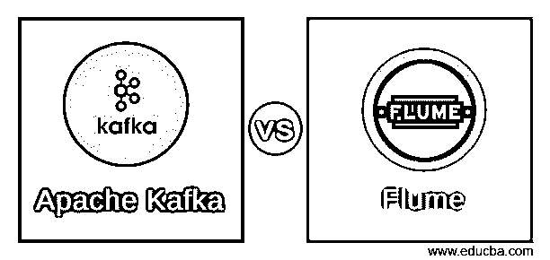

# 阿帕奇卡夫卡 vs 水槽

> 原文：<https://www.educba.com/apache-kafka-vs-flume/>

## 阿帕奇卡夫卡和水槽的区别

[Apache Kafka 是一个开放的](https://www.educba.com/what-is-kafka/)源系统，用于在[实时](https://www.educba.com/real-time-analytics/)处理摄取数据。Kafka 是持久的、可扩展的和容错的公共订阅消息系统。发布-订阅架构最初是由 LinkedIn 开发的，旨在克服批量处理大数据的限制，并解决数据丢失问题。[卡夫卡的架构将信息提供者和信息消费者分离开来。因此，对于发送和接收的数据，发送应用程序和接收应用程序不知道彼此的任何情况。](https://www.educba.com/install-kafka/)

Apache Kafka 将处理传入的数据流，而不管其来源和目的地。它是一个分布式流平台，其功能类似于企业消息传递系统，但具有高度复杂性的独特功能。有了 Kafka，用户可以随时发布和订阅信息。它允许用户以容错方式存储数据流。无论应用或用例如何，Kafka 都可以轻松地在企业 Apache Hadoop 中分解大量数据流进行分析。Kafka 还可以通过 Apache HBase、 [Apache Storm](https://www.educba.com/apache-storm-vs-kafka/) 和 [Apache Spark](https://www.educba.com/apache-spark/) 系统的组合来呈现流数据，并且可以用于各种应用领域。

<small>Hadoop，数据科学，统计学&其他</small>

简单来说，Kafka 的发布-订阅系统由出版商、Kafka 集群和消费者/订阅者组成。发布者发布的数据存储为日志。订阅者也可以充当发布者，反之亦然。订户请求订阅，Kafka 将数据转发给被请求的订户。通常，在 Kafka 集群上可以有许多不同主题的发布者和订阅者。同样，应用程序可以同时充当发布者和订阅者。为某个主题发布的消息可以有多个感兴趣的订阅者；系统为每个感兴趣的用户处理数据。卡夫卡被广泛使用的一些用例是:

*   跟踪网站上的活动
*   流处理
*   收集和监控指标
*   日志聚合

Apache Flume 是一个工具，用于收集、聚合和传输来自不同来源的数据流到一个集中的数据存储，如 HDFS (Hadoop 分布式文件系统)。Flume 是高度可靠、可配置和可管理的分布式数据收集服务，旨在从不同的 web 服务器向 HDFS 收集流数据。它也是一个开源的数据收集服务。

Apache Flume 基于流式数据流，具有灵活的体系结构。Flume 为故障转移和恢复提供了高度容错、健壮和可靠的机制，能够以批处理和流模式收集数据。企业利用 Flume 的[功能来管理在 HDFS 登陆的大量数据流。例如，数据流包括应用程序日志、传感器和机器数据以及社交媒体等。这些数据在 Hadoop 中登陆后，可以通过在](https://www.educba.com/leveraged-vs-unleveraged/) [Apache Hive](https://www.educba.com/apache-interview-questions/) 中运行交互式查询进行分析，或者作为 Apache HBase 中业务仪表盘的实时数据。一些特征包括，

*   从多个来源收集数据，并高效地接收到 HDFS
*   支持各种源和目标类型
*   Flume 可以方便地定制，可靠，可扩展和容错
*   可以将数据存储在任何集中式存储中(例如，HDFS、HBase)

### 阿帕奇卡夫卡和 Flume 的面对面比较(资料图)

以下是阿帕奇卡夫卡和 Flume 的五大对比:

### 阿帕奇卡夫卡和 Flume 的主要区别

阿帕奇卡夫卡和水槽之间的差异在这里探讨，

*   Apache Kafka 和 Flume 系统都为轻松处理大量数据提供了可靠、可伸缩和高性能。然而， [Kafka 是一个更通用的系统](https://www.educba.com/what-is-kafka/)，其中多个出版商和订户可以共享多个主题。相反，Flume 是一个将数据发送到 HDFS 的专用工具。
*   Kafka 可以支持多个应用的数据流，而 Flume 是针对 Hadoop 和[大数据分析](https://www.educba.com/big-data-analytics-techniques/)的。
*   Kafka 可以在分布式系统中处理和监控数据，而 Flume 可以从分布式系统收集数据，并将数据存储在一个集中的数据存储中。
*   当配置正确时，Apache Kafka 和 Flume 都是高度可靠的，保证零数据丢失。Kafka 复制集群中的数据，而 Flume 不复制事件。因此，当 Flume 代理崩溃时，在磁盘恢复之前，无法访问通道中的事件，另一方面，Kafka 即使在单点故障的情况下也可以使用数据。
*   [Kafka 支持](https://www.educba.com/kafka-applications/)大量发布者和订阅者以及多种应用程序。另一方面，Flume 支持大量的源和目的地类型来将数据放在 Hadoop 上。

### 阿帕奇卡夫卡与水槽对比表

下面提到阿帕奇卡夫卡和弗勒姆的对比表。

| **比较依据** | 阿帕奇卡夫卡 | **水槽** |
| **意为** | 

*   Kafka operates as a cluster and processes incoming high-capacity data streams in real time.
*   Kafka has three main components, publisher, Kafka cluster/manager and subscriber.
*   Kafka stores a string of records in different categories or topics.
*   Each record in Kafka will be stored as a log entry, and the receiver (subscriber) or the sender (publisher) will not be aware of each other.

 | 

*   Flume 是一个从分布式 web 服务器收集日志数据的工具。收集到的数据将会降落到 [HDFS](https://www.educba.com/what-is-hdfs/) 进行进一步分析
*   Flume 是一个高度可靠和可配置的工具。
*   无论是批处理还是实时处理，Flume 在处理日志文件方面都是高效和健壮的。

 |
| **概念** | 

*   Kafka regards each topic partition as an ordered set of messages based on publish-subscribe architecture.
*   , does not track the messages read by subscribers and who is the publisher.
*   Kafka keeps all messages or data as logs, and subscribers are responsible for tracking the location in each log.
*   Kafka can support a large number of publishers and subscribers and store a large amount of data.

 | 

*   Flume can receive streaming data from multiple sources for storage and analysis in HBase or Hadoop.
*   Ensure guaranteed data delivery, because both the receiver and sender agents call transactions to ensure guaranteed semantics.
*   It can scale horizontally.

 |
| **形成的基础** | 

*   An efficient, fault-tolerant and extensible message system

 | 

*   Flume is a system that gathers data into Hadoop.

中的服务或工具 |
| **应用领域** | 

*   Monitoring data from distributed applications
*   Provide data to multiple users according to their interests.
*   Log aggregation service

 | 

*   Handle transaction logs in application servers, web servers, etc. For example, e-commerce, online retail portal, [, social media](https://www.educba.com/career-in-social-media/) , etc.

 |
| **接近** | 

*   [Kafka](https://www.educba.com/what-is-kafka/) is required to efficiently process real-time data streams without losing data.
*   Even when the machine fails, it needs to ensure data transmission, so it is a fault-tolerant system.

 | 

*   Big data needs to be collected from different sources in streaming or batch mode.
*   It is more efficient to process logs.

 |

### 结论

总之，Apache Kafka vs Flume 提供了可靠、分布式和容错的系统，用于聚合和收集来自多个流和大数据应用程序的大量数据。Apache Kafka 和 Flume 系统都可以扩展和配置，以适应不同的计算需求。Kafka 的架构提供了容错功能，但是 Flume 可以被调整以确保故障安全操作。计划实现这些系统的用户必须首先理解用例并适当地实现，以确保高性能并实现全部好处。

### 推荐文章

这是阿帕奇卡夫卡 vs Flume 的指南。在这里，我们已经讨论了阿帕奇卡夫卡与 Flume 头对头比较，关键差异以及信息图表和比较表。您也可以阅读以下文章，了解更多信息——

1.  [阿帕奇风暴 vs 卡夫卡——你必须知道的 9 个最佳区别](https://www.educba.com/apache-storm-vs-kafka/)
2.  [SASS 面试问题:有哪些有帮助的问题](https://www.educba.com/sass-interview-questions/)
3.  [Kafka vs Kinesis |用信息图表学习的五大差异](https://www.educba.com/kafka-vs-kinesis/)

