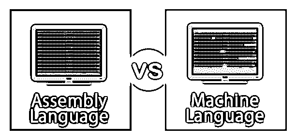
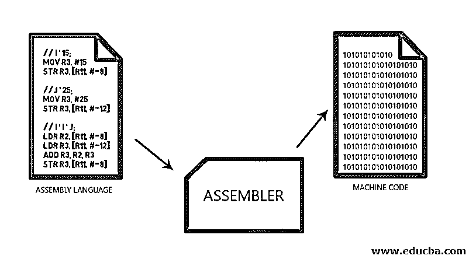
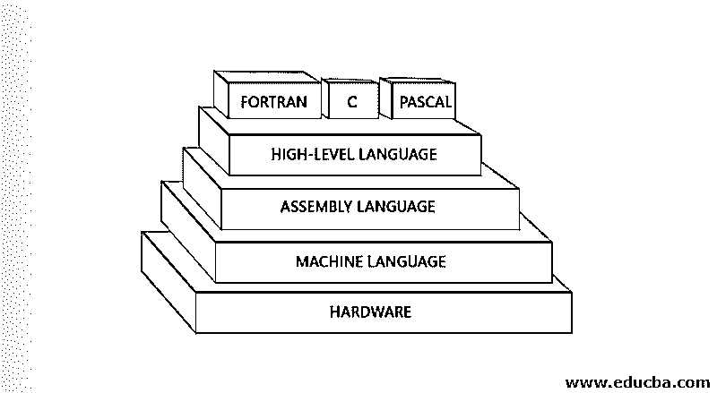

# 汇编语言 vs 机器语言

> 原文：<https://www.educba.com/assembly-language-vs-machine-language/>

## 汇编语言和机器语言的区别

在本文中，我们将详细讨论汇编语言与机器语言。机器语言是一种二进制形式的语言。它可以由计算机直接执行。而汇编语言是一种低级编程语言，需要称为汇编程序的软件将其转换成机器代码。

编程语言是一组指令，目的是让计算机理解以执行特定任务或创建算法。现在有大量不同的编程语言可用，如 C、C++、COBOL、Java、Python、Fortran、Ada 和 Pascal。

<small>Hadoop、数据科学、统计学&其他</small>

所有的编程语言都有一些被称为语法的基本构件。这些语言的语法是文本的。程序员将原语组合起来，组成新的程序。

编程语言大致分为三类:

1.  高级编程语言
2.  汇编语言
3.  机器语言

对于程序员来说，高级语言既容易写又容易理解。这里的程序员使用简单易用的语法来处理特定的任务。例子:Python，C，C++等。这些语法 CPU 看不懂；因此，它在内部被转换成 CPU 可以通过编译器和解释器理解的二进制。

汇编语言介于高级编程语言和机器语言之间。它的语法类似于英语，但比高级编程语言更难。要用汇编语言编程，你应该了解硬件水平，如计算机体系结构、寄存器等。这种编程主要出现在嵌入式系统中。

下面给出一个例子，

添加 R2 R1

机器语言是计算机容易理解的二进制语言。因此，它可以直接由 CPU 执行，完全不需要编译器和解释器。

**

** 

上图代表机器语言，汇编语言和高级语言是清晰的形式。

例如:001010001110

表示 12 位机器语言指令。这条指令分为两部分:一个操作码(或 op 码)和一个操作数。

操作码是 001，操作数是 010001110。

除了记住操作的几十个代码外，程序员还必须跟踪所有数据项的地址。因此，机器语言被认为具有挑战性并且容易出错。

### 汇编语言和机器语言的直接比较(信息图表)

下面是汇编语言和机器语言的 7 大区别。

### 汇编语言和机器语言的主要区别

让我们讨论一下汇编语言和机器语言之间的一些主要区别:

1.  机器语言是由计算机直接执行的一系列位模式(即二进制形式)，而汇编语言是一种低级语言，需要编译器和解释器将该语言转换为机器语言。然后它可以被计算机理解。
2.  机器语言是平台相关的，而汇编语言是平台无关的。这里的平台指的是像 Windows、Linux 等操作系统。
3.  机器语言不是人类可读的；但是，你可以用手通过数字来解读。每一条被称为“操作码”的指令都是一个数字，它可能在内存中跟随着“操作数”
    汇编语言是一组能被人类阅读和理解的指令。这里，为了记住操作码，使用了“助记符”。然而，它的可读性不如高级语言。
4.  机器语言可能非常耗时、乏味且容易出错。然而，汇编语言不是这样，因为这里有助记符名称和符号。与二进制机器码相比，它要简单得多，也不容易出错。这两种语言的问题是，为一种 CPU 架构编写的程序不能为另一种 CPU 架构工作。每一个新的 CPU 体系结构都将有一套新的指令，因此要为其他 CPU 运行相同的程序，如果使用机器语言，就必须从头开始编写程序。如果它的汇编语言，访问内存指令将改变，因此重大修改将是一个要求。

### 汇编语言与机器语言对照表

让我们来看看汇编语言和机器语言之间最顶层的比较。

| **汇编语言** | **机器语言** |
| 汇编语言是介于高级编程语言和机器语言之间的中间编程语言 | 机器语言是一种低级语言。 |
| 汇编语言是英语语法，由解释器和编译器将其转换成低级语言后，由 CPU 理解。 | 机器语言是 0 和 1 的形式(二进制格式)。一个表示真/开状态，而零表示假/关状态。 |
| 程序员能理解汇编语言，然而，CPU 不能。 | CPU 可以直接理解机器语言。不需要编译器或汇编程序。 |
| 汇编语言是一组与平台无关的相同指令。 | 机器代码因平台而异。 |
| 汇编语言的代码和指令可以记忆。 | 这里的二进制码是记不住的。 |
| 在这里修改并不困难。 | 不可能进行修改。它必须为特定类型的 CPU 从头开始编写。 |
| 这里的应用程序是设备驱动程序、低级嵌入式系统和实时系统 | CD、[DVD 和蓝光](https://www.educba.com/blu-ray-vs-dvd/)光盘代表了二进制形式的应用。 |

### 结论

总而言之，我们可以说汇编语言比二进制语言更高级。区别在于机器语言直接由 CPU 执行，而机器语言首先由编译器转换成二进制，然后由 CPU 执行。在这个时代，高级语言被程序员广泛使用，因为它们易于编码，易于理解。

### 推荐文章

这是汇编语言和机器语言之间最大区别的指南。在这里，我们还将讨论信息图和比较表的主要区别。您也可以看看以下文章，了解更多信息–

1.  [MongoDB vs 甲骨文](https://www.educba.com/mongodb-vs-oracle/)
2.  [微处理器 vs 微控制器](https://www.educba.com/microprocessor-vs-microcontroller/)
3.  [数据挖掘 vs 机器学习](https://www.educba.com/data-mining-vs-machine-learning/)
4.  [Python vs Ruby 性能](https://www.educba.com/python-vs-ruby-performance/)

