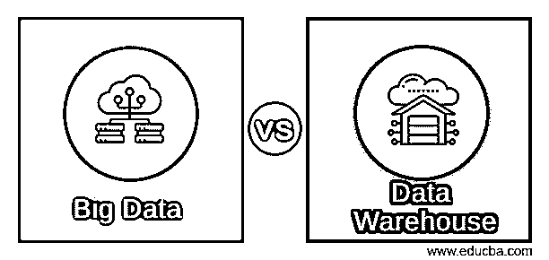

# 大数据与数据仓库

> 原文：<https://www.educba.com/big-data-vs-data-warehouse/>

## 大数据和数据仓库的区别

大数据和数据仓库都被用作商业智能的主要输入来源，例如创建分析结果和生成报告，以便提供有效的商业决策流程。大数据允许来自任何来源的未经提炼的数据，但数据仓库只允许经过处理的数据，因为它必须维护数据的可靠性和一致性。大数据系统中未处理的数据可以是任意大小，具体取决于其格式类型。由于数据仓库精细的结构化系统组织，数据仓库中几乎所有的数据都具有相同的大小。

### 大数据与数据仓库之间的直接比较

下面是大数据与数据仓库的 8 大区别

<small>Hadoop、数据科学、统计学&其他</small>

### 

### 大数据和数据仓库的主要区别

大数据与数据仓库之间的区别在以下几点进行了解释:

1.  数据仓库是数据存储或数据仓库的体系结构。而大数据是一种处理海量数据并准备存储库的技术。
2.  数据仓库接受任何类型的 DBMS 数据，而大数据接受所有类型的数据，包括跨国数据、社交媒体数据、机械数据或任何 DBMS 数据。
3.  数据仓库只处理结构化数据(关系型或非关系型)，大数据可以处理结构化、非结构化、半结构化数据。
4.  大数据通常使用分布式文件系统以分布式方式加载大量数据，但数据仓库没有这种概念。
5.  从业务角度来看，由于大数据包含大量数据，对其进行分析将会非常有成效，并且结果将更有意义，有助于组织做出正确的决策。而数据仓库主要是帮助分析有根据的信息。
6.  数据仓库意味着关系数据库，因此存储、提取数据与普通的 SQL 查询相似。大数据没有遵循正确的数据库结构，我们需要使用 hive 或 spark SQL，通过使用 hive 特定的查询来查看数据。
7.  加载到数据仓库的数据 100%用于分析报告。但是不管 Hadoop 加载了什么数据，到目前为止最多只有 0.5%用于分析报告。其他数据已加载到系统中，但处于未使用状态。
8.  数据仓库永远无法处理海量数据(完全非结构化的数据)。大数据(Apache Hadoop)是处理海量数据的唯一选择。
9.  基于数据量的数据仓库同步增长取数据时机。也就是说，像 DBMS 一样，少量数据需要很短的时间，而大量数据需要很长的时间。但是在大数据的情况下，获取大数据需要一小段时间(因为它是专门为处理大数据而设计的)，但是如果我们试图通过使用 map reduce 在 HDFS 加载或获取小数据，则需要很长时间。

### 大数据与数据仓库对比表

下面是对比表

| **比较依据** | **数据仓库** | **大数据** |
| **意为** | 数据仓库主要是一种架构，而不是一种技术。它从各种基于 SQL 的数据源(主要是关系数据库)中提取数据，并帮助生成分析报告。从定义上来说，用于任何分析报告的数据仓库都是从一个过程中产生的，这个过程就是数据仓库。 | 大数据主要是一种技术，它基于数据的量、速度和多样性。卷定义了来自不同来源的数据量，速度指的是数据处理的速度，而种类指的是数据类型的数量(主要支持所有类型的数据格式)。 |
| **偏好** | 如果一个组织想要了解一些明智的决策(比如他们的公司正在发生什么，基于当年绩效数据的下一年计划等)，他们更喜欢选择数据仓库，因为对于这种报告，他们需要来自源的可靠或可信的数据。 | 如果组织需要与大量大数据进行比较，这些大数据包含有价值的信息，有助于他们做出更好的决策(如如何带来更多收入、更多利润、更多客户等)，他们显然更喜欢大数据方法。 |
| **接受的数据源** | 接受一个或多个同构(所有站点使用相同的 DBMS 产品)或异构(站点可能运行不同的 DBMS 产品)数据源。 | 接受任何类型的来源，包括商业交易、社交媒体以及来自传感器或机器特定数据的信息。它可以来自或不来自 DBMS 产品。 |
| **接受的格式类型** | 主要处理结构化数据(特别是关系数据)。 | 接受所有类型的格式。结构化数据、关系数据和非结构化数据，包括文本文档、电子邮件、视频、音频、股票数据和金融交易。 |
| **面向主题** | 数据仓库是面向主题的，因为它实际上提供了关于特定主题(如产品、客户、供应商、销售、收入等)的信息，而不是关于组织正在进行的操作的信息。它不关注正在进行的操作，它主要关注分析或显示有助于决策的数据。 | 大数据也是面向主题的，主要区别是数据源，因为大数据可以接受和处理来自所有来源的数据，包括社交媒体、传感器或机器特定数据。它还主要提供精确的数据分析，特别是针对主题的数据分析。 |
| **时变** | 数据仓库中收集的数据实际上是由特定的时间段来标识的。因为它主要保存用于分析报告的历史数据。 | 大数据有许多方法来识别已加载的数据，时间段是其中一种方法。大数据主要处理平面文件，因此带有日期和时间的归档将是识别加载数据的最佳方法。但是它可以选择处理流数据，所以它并不总是保存历史数据。 |
| **非易失性** | 当新数据添加到数据中时，以前的数据不会被擦除。这是数据仓库的主要特性之一。由于它与操作型数据库完全不同，所以对操作型数据库的任何更改都不会直接影响到数据仓库。 | 对于大数据，当新数据添加到数据中时，以前的数据也不会擦除。它存储为代表一个表的文件。但这里有时在流式的情况下直接使用 Hive 或 Spark 作为操作环境。 |
| **分布式文件系统** | 在数据仓库中处理大量数据非常耗时，有时需要一整天才能完成。 | 这是大数据的一大用途。HDFS(Hadoop Distributed File System)主要定义了使用 map reduce 程序在分布式系统中加载海量数据。 |

### 结论

根据以上解释和理解，我们可以得出以下结论:

*   大数据和数据仓库不一样，所以不可互换。
*   一个组织可以根据自己需求采用大数据和数据仓库解决方案，而不是因为它们相似。
*   组织可以根据自己的需求采用大数据和数据仓库解决方案的组合。

### 推荐文章

这是一本关于大数据与数据仓库、它们的含义、直接比较、主要差异、对照表和结论的指南。您也可以阅读以下文章，了解更多信息——

1.  [大数据与数据科学——它们有什么不同？](https://www.educba.com/big-data-vs-data-science/)
2.  [大数据与机器学习的 5 个最佳区别](https://www.educba.com/big-data-vs-machine-learning/)
3.  1 [0 流行的数据仓库工具和技术](https://www.educba.com/10-popular-data-warehouse-tools/)
4.  [关于商业智能和数据仓库，你必须知道的 5 件事](https://www.educba.com/business-intelligence-vs-data-warehouse/)

