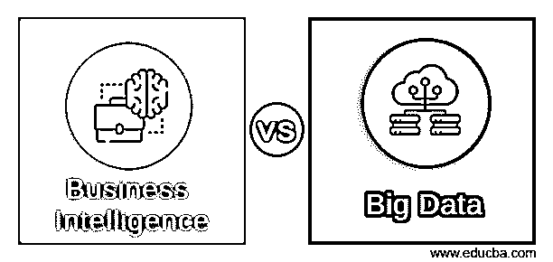

# 商业智能与大数据

> 原文：<https://www.educba.com/business-intelligence-vs-big-data/>

## 商业智能和大数据的区别

简单地说，商业智能是系统、软件和产品的集合，它们可以导入大型数据流，并使用它们来生成指向特定用例或场景的有意义的信息。

大数据是业务中最热门的词汇。大数据正在改变我们的日常商业生活。每个人都认为大数据只不过是海量数据。但实际上，它不仅仅是大量的数据，它还与数据的结构有关，处理数据的目的是为组织提供附加值。

<small>Hadoop、数据科学、统计学&其他</small>

### 商业智能和大数据之间的直接比较(信息图表)。

以下是商业智能与大数据之间的六大对比

### 商业智能和大数据的主要区别

下面是项目列表，解释商业智能和大数据之间的差异

*   BI 和大数据的目标都是通过分析庞大的数据集来帮助企业做出明智的决策，从而扩展业务并优化成本。
*   这种数据分析不仅使决策成为可能，而且还积极参与确保组织成功的策略和方法的制定。这种数据分析可以称为“商业智能”，而“大数据”是商业智能的一个相对较新的术语。
*   自商业智能时代以来，数据集的数量变得难以置信的大，我们可以考虑的最好的例子是社交媒体。因此，我们应该付出更多的努力，采取更多的策略来解决这些问题，并使它们对成功的企业有用。
*   商业智能有助于找到我们知道的商业问题的答案，而大数据有助于我们找到我们以前不知道的问题和答案。
*   虽然商业智能和大数据是用于分析数据集以帮助组织进行决策的两种技术，但它们之间存在差异。他们分析数据的方式不同。
*   商业智能的原理是将所有业务数据集合并到一个中央服务器中，在将信息保存在一个称为数据仓库的平台或环境中之后，这些数据将在离线模式下进行分析。数据集被组织在一个关系数据库中，带有附加的索引和对仓库中的表的访问形式。
*   而在大数据环境中，数据存储在分布式文件系统(例如 HDFS)上，而不是存储在中央服务器上。数据将分布在工作节点上，以便于处理。分布式文件系统更加安全和灵活。
*   BI 解决方案将数据传递给处理功能，而大数据解决方案将处理功能传递给数据集。因为分析是围绕信息(数据)进行的，所以处理大量数据更简单。
*   BI 解决方案更倾向于结构化数据，而大数据工具可以处理和分析不同格式的数据，包括结构化和非结构化数据。
*   大数据解决方案可以处理历史数据以及来自实时来源的数据，而在商业智能中，它处理历史数据集。
*   大数据技术使用并行处理概念(Map reducing 算法)，通过将作业分配到几个并行执行进程来提高分析和处理数据集的速度，最后将结果合并并显示，这使得分析大量数据变得更加容易。

### 商业智能与大数据对照表

下面是下面的对比:

| **目标对比** | **商业智能** | **大数据** |
| **目的** | 商业智能的目的是帮助企业做出更好的决策。商业智能通过直接从数据源中提取信息来帮助提供准确的报告。 | 大数据的主要目的是捕获、处理和分析结构化和非结构化数据，以改善客户成果。 |
| **生态系统/组件** | 操作系统、ERP 数据库、数据仓库、仪表板等。 | Hadoop，Spark，R Server，hive，HDFS 等。 |
| **工具** | 下面是用于商业智能的工具列表。这些工具使企业能够整理、分析和可视化数据，这些数据可用于制定更好的业务决策和提出良好的战略计划。

*   活人画
*   Qlik Sense
*   On-line analytical processing (OLAP)
*   西森斯
*   Data warehousing
*   Digital dashboard and data mining
*   微软功率 BI
*   Google Analytics, etc

 | 下面是大数据中使用的工具列表。这些工具或框架存储大量数据，并对其进行处理，以从数据中获得洞察力，从而为业务做出良好的决策。

*   Hadoop
*   火花
*   储备
*   聚碱
*   很快
*   卡桑德拉
*   Plotly
*   云时代
*   暴风雨等

 |
| **特性/属性** | 大数据可以通过一些特征来描述，如数量、多样性、可变性、速度和准确性。 | 以下是商业智能的六个功能
位置智能、执行仪表板、“假设”分析、交互式报告、元数据层和排名报告 |
| **好处** | 以下是商业智能的优势列表

*   Help make better business decisions
*   Faster and more accurate reporting and analysis
*   Improve data quality
*   cut the cost
*   increase income
*   Improve operational efficiency, etc.

 | 下面是大数据的优势列表

*   Better decision-making
*   Fraud detection
*   Data storage, mining and analysis
*   Market forecast & and forecast
*   improve the service
*   Help implement the new strategy
*   Keep up with customer trends
*   Cost savings
*   Better sales insights, which will help increase revenue, etc.

 |
| **应用领域** | 社交媒体、医疗保健、游戏行业、食品行业等 | 银行业、娱乐和社交媒体、医疗保健、零售和批发等 |

### 结论

在当今时代，数据在商业中的重要性是至关重要的；因为只有分析数据才能做出有意义的决策，而这些决策将有助于企业进一步发展。BI 和大数据都有助于分析数据以获得洞察力和查看相关数据。

商业智能和大数据需要同步，需要一起使用。它们不是一回事，但它们有许多共同的目标。商业智能和大数据之间的许多区别往往是任意的。

### 推荐文章

这是一本关于商业智能和大数据、它们的含义、直接比较、主要差异、对照表和结论的指南。您也可以阅读以下文章，了解更多信息——

1.  [需要申请更好的销售发展](https://www.educba.com/sales-development-success/)
2.  [人工智能 vs 商业智能——学习 6 个有用的对比](https://www.educba.com/artificial-intelligence-vs-business-intelligence/)
3.  [商业智能与数据分析——哪个更有用](https://www.educba.com/business-intelligence-vs-data-analytics/)
4.  [10 小数据与大数据的区别](https://www.educba.com/small-data-vs-big-data/)
5.  [大数据与预测分析的区别](https://www.educba.com/big-data-vs-predictive-analytics/)
6.  [商业智能职业介绍](https://www.educba.com/career-in-business-intelligence/)

