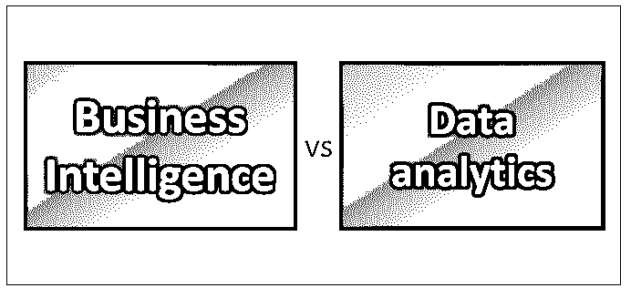

# 商业智能与数据分析

> 原文：<https://www.educba.com/business-intelligence-vs-data-analytics/>

## 商业智能和数据分析的区别

商业智能处理复杂的策略和技术，帮助最终用户分析数据并执行[决策](https://www.educba.com/right-decision/)活动以发展业务。BI 在业务[数据管理](https://www.educba.com/database-management-system/)和[绩效管理](https://www.educba.com/performance-management-vs-performance-appraisal/)中起关键作用。另一方面，实施数据分析是为了将原始或非结构化数据转换为用户可理解的有意义的数据格式。转换后的信息可用于清理、转换或建模数据，以支持决策过程、得出结论并实施[预测分析](https://www.educba.com/predictive-analytics-vs-data-science/)。

### 商业智能与数据分析的直接比较(信息图表)

以下是商业智能与数据分析的五大对比

<small>Hadoop、数据科学、统计学&其他</small>

### 商业智能与数据分析的主要区别

*   商业智能的最早用法是在理查德·米勒·德文斯于 1865 年写的《商业百科全书》中发现的。Devens 使用术语 BI(商业智能)来描述一位名叫 Henry Furness 爵士的银行家如何通过分析自己的环境来保持领先于竞争对手，从而获得利润。
*   数据分析或[业务分析](https://www.educba.com/course/business-analytics-using-r/)是一个帮助企业用户将原始或非结构化数据转换为有意义格式的过程。数据分析是一种标准或通用的流程，全球许多组织根据其业务需求在各种程序或策略下采用。
*   许多组织都实施了商业智能，以增强其决策能力、分析业务数据、执行[数据挖掘](https://www.educba.com/data-mining-vs-statistics/)、开发报告并提高运营能力。BI 仅针对存储在数据集市或[数据仓库](https://www.educba.com/business-intelligence-vs-data-warehouse/)中的历史数据实施。一些业务操作(如清理数据、建模数据、转换数据和预测数据的未来趋势)是实施数据分析的关键方面。
*   数据分析是在组织相对较新，需要对其业务模式进行重大变革的情况下实施的。数据分析有助于业务用户分析历史数据、当前数据和预测未来趋势，从而对提议的业务模型做出正确的改变。另一方面，商业智能是在组织对其当前业务模型没有任何改变的情况下实现的，并且其主要目的是满足组织的目标。BI 通过提供高效的决策场景，帮助用户识别数据管理中的漏洞并加以纠正。
*   报告是一项关键功能，可以借助[商业智能](https://www.educba.com/business-intelligence-vs-data-mining/)和[数据分析](https://www.educba.com/data-analysis-tools-for-research/)工具来实现。但是，开发的报告或[可视化](https://www.educba.com/course/data-visualization-r-shiny-basic-tutorials/)根据[业务数据](https://www.educba.com/course/business-data-analytics-beginner-lessons/)和业务场景的类型而变化。如果在业务场景中，客户需要处理当天的市场趋势并生成临时报告，那么数据分析将是正确的选择。当业务需要根据过去的数据预测数据的未来趋势时，数据分析也是首选。另外，如果客户需要处理存储在数据仓库中的数据，并通过从仓库中提取数据来生成报告，那么商业智能将是正确的选择，当企业需要跟踪目标销售交付或组织数据以提供销售智能时，商业智能也是首选。

### 商业智能与数据分析对比表

| **比较的基础** | **商业智能** | **数据分析** |
| 起源 | 商业智能这个术语是在 1865 年由一位名叫理查德·米勒·德文斯的作者所著的一本书中描述其重要性时出现的。 | 数据分析自 19 世纪以来就已经存在，但随着计算机的发明，它在 20 世纪 60 年代变得更加突出。 |
| 范围/含义 | Business Intelligence refers to the information required to enhance business decision-making activities. | 数据分析是指将原始数据修改成有意义的格式。 |
| 功能 | 商业智能的主要目的是为决策提供支持，并帮助组织发展业务。 | 数据分析的主要目的是根据业务需求对数据进行建模、清理、预测和转换。 |
| 履行 | Business Intelligence can be implemented using various BI tools available in the market. BI is implemented only on Historical data stored in data warehouses or data marts. | 可以使用市场上提供的各种数据存储工具来实施数据分析。数据分析也可以使用 BI 工具实施，但这取决于组织设计的方法或策略。 |
| 调试方法 | BI 机制只能通过提供的历史数据和最终用户的需求进行调试。 | 可以通过建议的模型调试数据分析，将数据转换成有意义的格式。 |

### 结论–商业智能与数据分析

总之，我们已经看到了商业智能和数据分析之间的起源、直接比较和一些关键差异。考虑到当今的技术市场趋势，在开发商业智能和数据分析工具方面已经有了发展。现代商业智能工具也配备了数据分析选项，这实际上取决于企业用户根据他们的业务场景做出正确的选择。根据当前的数据趋势，商业智能和数据分析在业务增长中扮演着重要角色。业务部门正在对 BI 和数据分析进行必要的研究，以帮助他们以高效的方式实现目标。

### 推荐文章

这是商业智能与数据分析、它们的含义、直接比较、主要差异、比较表和结论的指南。您也可以阅读以下文章，了解更多信息——

1.  [商业智能与数据挖掘——哪个更有用](https://www.educba.com/business-intelligence-vs-data-mining/)
2.  [数据可视化与数据分析——你需要知道的 7 件事](https://www.educba.com/data-visualisation-vs-data-analytics/)
3.  [商业智能与商业分析——哪个更好](https://www.educba.com/business-intelligence-vs-business-analytics/)
4.  [将在 2019 年占据主导地位的 8 大优秀数据分析趋势](https://www.educba.com/8-data-analytics-trends-that-will-dominate-2019/)
5.  [商业智能职业概述](https://www.educba.com/career-in-business-intelligence/)

