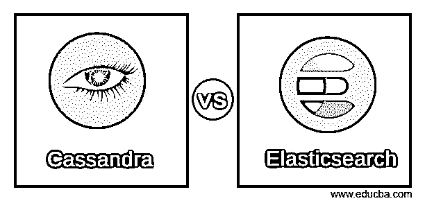

# Cassandra vs Elasticsearch

> 原文：<https://www.educba.com/cassandra-vs-elasticsearch/>

## Cassandra 和 Elasticsearch 的区别

[Apache Cassandra 是一个](https://www.educba.com/what-is-cassandra/)开源和免费分发的非 SQL [数据库管理系统](https://www.educba.com/database-management-system-advantages/)，它被开发和设计用于处理跨分布式商用服务器的大规模数据。它支持跨平台操作系统 Cassandra 数据库提供高可用性和零单点故障。在可扩展性的情况下也是赢的。Apache Elasticsearch 是一个搜索引擎，基于 Apache Lucene Elasticsearch 的 [NoSQL](https://www.educba.com/software-development/courses/sql-training-certification/) 数据库系统完全使用 [Java 编程语言](https://www.educba.com/java-programming-language-features/)编写。 [Elasticsearch](https://www.educba.com/what-is-elasticsearch/) 提供了一个分布式全文搜索引擎，使用无模式的 JSON 结构化文档。

### Cassandra 和 Elasticsearch 之间的直接比较

以下是 Cassandra 和 Elasticsearch 的十大对比:

<small>Hadoop、数据科学、统计学&其他</small>

### Cassandra 和 Elasticsearch 的主要区别

以下是要点列表，描述了 Cassandra 和 Elasticsearch 之间的主要区别:

*   Apache Cassandra 由 Apache Software Foundation 开发，最初于 2008 年发布。Apache Elasticsearch 由 Elastic 开发，并在 Apache License 2.0 下获得许可。卡桑德拉是由谢伊·巴农开发的。
*   Cassandra a No SQL 数据库的主要目标是简单的设计结构、高可用性和水平伸缩性等。与关系数据库相比，没有 SQL 数据库通过遵循 ACID(原子性、一致性、隔离性和持久性)属性来支持强大的查询和事务。
*   Elasticsearch 是一个基于 REST(表述性状态转移)架构 API 的 RESTful 搜索，它在基于文本的分析和从结构化或非结构化数据中过滤所需信息方面非常有用。
*   Apache Cassandra 具有弹性可伸缩性、快速线性性能、易于分布的架构、更快的查询和事务支持、更快的读写能力。它最初是在脸书开发的，用于搜索收件箱中的信息，后来由脸书开源。Cassandra 有一种叫做 CQL 的查询语言，而 T2 是 Cassandra 的查询语言。
*   Elasticsearch 在[数据分析](https://www.educba.com/big-data-analytics-techniques/)领域有许多应用，它可以在数据存储和索引方面与多种工具集成。通过安装和配置 Elastic search，可以在弹性搜索中创建索引和运行查询。它主要基于 REST API。
*   Apache Cassandra 有主要的核心组件，如节点、数据中心、内存表、集群、提交日志等。而 [Cassandra 查询语言用于](https://www.educba.com/cassandra-query-language/)读写操作。Elasticsearch 基于 Lucene，将拥有强大的索引搜索功能和全文搜索功能。
*   Apache Cassandra Node 在其中存储数据，其数据中心由所有节点组成，而 Elasticsearch 以 HTTP GET 方法的形式公开 Java 和 HTTP APIs，以数据检索的形式提供搜索功能。
*   Apache Cassandra 集群分布在不同的机器上处理故障，并维护副本以保持操作和事务的高可用性，而 Elasticsearch 通过使用 API(应用程序编程接口)将数据作为文档发送来进行 Restful 分布式搜索。
*   Apache Cassandra 有一个复制因子，它定义了跨不同机器的数据副本数量，以接收多个数据副本来保持容错和高可用性，而 Elasticsearch 则使用分布式文档存储来支持面向 JSON 文档平台的应用程序。
*   除了传统的基于关系的数据库系统，Apache [Cassandra 可以随时随地添加列](https://www.educba.com/install-cassandra/),而 Elasticsearch 可以通过基于 REST 的 API 以 JSON 格式的文档形式添加数据。,
*   Apache Cassandra 处理非结构化数据，有一个灵活的模式来处理数据读写操作，而 Elasticsearch 处理基于 JSON 的文档格式数据。
*   Apache Cassandra 是基于大数据技术和 Dynamo DB 数据库的宽列存储架构[，而 Elasticsearch 是基于 Apache Lucene 的分布式 Restful 现代搜索引擎。](https://www.educba.com/big-data-technologies/)
*   Apache Cassandra 在 DB 引擎的受欢迎程度和趋势排名方面得分较低，而 Elasticsearch 的排名高于 Cassandra。
*   Apache Cassandra 最初发布于 2008 年 2 月，而 Elasticsearch 最初发布于 2008 年 4 月，Cassandra 和 Elasticsearch 都是用 Java 编写的。
*   Apache Cassandra 支持 Linux、OS X、Windows、BSD 操作系统，而 Elasticsearch 支持安装了 [Java 虚拟机的所有操作系统](https://www.educba.com/java-vs-node-js/)。
*   Apache Cassandra 支持大多数流行的面向对象[编程语言](https://www.educba.com/learning-algorithms/)如 c#[c++](https://www.educba.com/c-programming-language-basics/)，Java，Go，Erlang，JavaScript，Perl，PHP，Python，Ruby，Scala 等。，而 elastic search supports.NET，Groovy，Java，JavaScript，Perl，PHP，Python。

### Cassandra 和 Elasticsearch 对照表

以下是要点列表，描述 Cassandra 与 Elasticsearch 之间的差异。

| **Basis of**

**比较**

 | 卡桑德拉 | **弹性搜索** |
| **执照** | 开源没有由 Apache 开源项目开发的 SQL 数据库 | 开源搜索引擎，没有 SQL 数据库，由脸书开发并开源 |
| **环境** | 由 Apache 项目提供，对分布式环境很有用 | 跨平台支持，用于分布式环境。 |
| **性能** | 提供高度可扩展的线性性能 | 高可用性和基于索引的快速搜索能力。 |
| **可扩展性** | 高可扩展性 | 更快的查询运行时间和高可伸缩性。 |
| **定价** | 开源并依赖于实现 | 开源，并且依赖于算法实现的效率。 |
| **速度** | 对于较小脚本的查询更快 | 由于高效的索引搜索和存储，速度更快。 |
| **查询速度** | 多查询执行能力。 | 加快查询和交易能力。 |
| **数据整合** | 快速灵活地使用不同工具。 | 支持跨分布式网络的多个第三方工具。 |
| **数据格式** | 没有 SQL，SON 数据格式。 | 支持复杂的数据格式，如 JSON，NoSQL 等。 |
| **易用性** | 更容易编写脚本和查询。 | 更容易编写查询和事务，因为它是基于 REST API 的。 |

### 结论

Apache Cassandra 不是基于 SQL 的数据库系统，而 Elasticsearch 是一个搜索引擎，也不是基于 SQL 的数据库系统，其中 Elasticsearch 在最新的面向对象方面显然是赢家，或者没有 SQL 数据库是基于 Apache 开发的 Lucene，这是一个很好的基于索引的搜索引擎。就性能可伸缩性和特性而言，Apache Cassandra 可以被认为是处理大量数据的最佳数据库。

在大多数情况下，Elasticsearch 是无 SQL 数据库系统的最佳选择，因为与市场上的其他无 SQL 数据库系统相比，它增加了搜索引擎功能。

Elasticsearch 的优势在于它基于 Apache Lucene，Apache Lucene 是一个完全用 Java 开发的数据检索库，是一个功能齐全的基于文本的搜索引擎，具有高性能索引和可伸缩性。与 Cassandra 相比，这使得 Elasticsearch 更受欢迎。

### 推荐文章

这是 Cassandra 和 Elasticsearch 之间区别的指南。在这里，我们讨论了 Cassandra 与 Elasticsearch 的直接比较、关键差异以及信息图表和比较表。您也可以阅读以下文章，了解更多信息——

1.  [c#面试问答要点](https://www.educba.com/c-sharp-interview-questions-and-answers/)
2.  [h base vs Cassandra——哪个更好(资料图)](https://www.educba.com/hbase-vs-cassandra/)
3.  [Hadoop 与 elastic search——哪个更有用](https://www.educba.com/hadoop-vs-elasticsearch/)
4.  [监督学习与非监督学习——7 个最有用的比较](https://www.educba.com/supervised-learning-vs-unsupervised-learning/)
5.  [Java 与 Python——你必须了解的 9 大重要对比](https://www.educba.com/java-vs-python/)
6.  [Linux vs OS X](https://www.educba.com/os-x-vs-linux/)
7.  [Groovy 面试问题:想知道最好的问题](https://www.educba.com/groovy-interview-questions/)
8.  [Go vs Erlang | Go vs Erlang 的特点和对比](https://www.educba.com/go-vs-erlang/)

