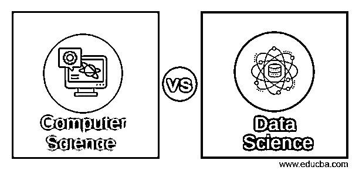

# 计算机科学 vs 数据科学

> 原文：<https://www.educba.com/computer-science-vs-data-science/>

## 计算机科学与数据科学的区别

计算机科学是研究计算机设计、体系结构及其在科学技术领域中的应用的科学，它由几个技术方面的概念组成。它包括硬件、软件、[网络](https://www.educba.com/basic-fundamental-of-networking/)和互联网，有大量的研究领域可以超越。数据科学研究各种类型的数据，如任何形式或格式的结构化、半结构化和非结构化数据，以便从中获取一些信息。数据科学由用于研究数据的不同技术组成，如数据挖掘、数据存储、数据清除、数据存档、数据转换等。，以使其高效有序。

**让我们详细研究一下计算机科学 vs 数据科学:**

<small>Hadoop、数据科学、统计学&其他</small>

*   计算机科学在计算机器或设备的架构、设计、开发和制造方面各不相同，这些机器或设备推动着[信息技术](https://www.educba.com/information-technology-benefits/)产业及其在技术领域的发展。计算机科学由不同的技术概念组成，如[编程语言](https://www.educba.com/learning-algorithms/)、[算法设计](https://www.educba.com/data-structures-and-algorithms/)、[软件工程](https://www.educba.com/data-science-vs-software-engineering/)、人机交互和计算的过程。主要领域包括[数据库系统](https://www.educba.com/database-management-system/)、网络、安全、信息学和生物信息学理论。
*   数据科学通过从用户的互联网流量和搜索历史中收集信息来研究互联网用户的行为和习惯。这是推荐广告在用户的网页浏览页面上显示的方式，无需用户输入。
*   计算机科学与数据科学在计算和数据方面有所不同，其中计算是对数据进行操作方法的领域，而数据科学是研究、维护、转换、存储和处理不同格式的大量数据的领域。
*   数据科学是一门多学科的学科，其核心要素是[数据挖掘](https://www.educba.com/data-mining-techniques/)、数据分析、机器学习、[大数据](https://www.educba.com/big-data-program-online/)、数据洞察的发现、数据产品开发。它需要数学专业知识、技术知识/技术技能和商业战略/敏锐的思维。
*   硬件方面包括计算机科学中的电气和电子学科，除信息技术外，更多地涉及计算学科和学术。

### 计算机科学和数据科学的比较(信息图表)

以下是计算机科学和数据科学之间的 8 大对比:

### 计算机科学和数据科学的主要区别

下面列出了一些要点，描述了计算机科学和数据科学之间的主要区别:

1.  [计算机科学是计算领域](https://www.educba.com/what-is-computer-science/),包括不同的学科，如数据结构、算法、计算机体系结构、编程语言等。而数据科学也包括数学概念，如统计学、代数、微积分、高级统计学和数据工程等。,
2.  计算机科学让我们了解处理器是如何构造和工作的，以及编程领域的内存管理。数据科学让我们了解如何使用数据，研究如何存储、处理和操作数据，以减少冗余，并使其对进一步使用有意义。
3.  计算机科学使我们对计算机器的使用及其应用有了详细的了解。数据科学揭示了如何从各种形式的数据中提取信息和知识。
4.  计算机科学的子领域包括计算、概率理论、推理、离散结构和数据库设计。数据科学包括模拟、建模、分析、机器学习、计算数学等。,
5.  计算机科学是主要分支，而数据科学是计算机科学的一个分支。
6.  计算机科学完全是关于高效地构建和利用计算机，而数据科学是关于安全地处理数据。
7.  计算机科学完全是计算，而数据科学是数据计算。
8.  计算机科学随着先进概念的发展而发展，更高效、更先进的设备正在出现。数据每天都在快速增长，这使得高效处理和维护数据变得更加复杂。
9.  计算机科学处理算法，而[更关注软件工程](https://www.educba.com/software-engineering-interview-questions/)和开发。数据科学是数据工程、数学和统计学三个领域的结合。
10.  计算机科学研究寻找问题解决方案的科学方法。数据科学致力于寻找一种组织和处理数据的方法。
11.  计算机科学有许多研究领域可以追求，在职业生涯中[优于](https://www.educba.com/pivot-chart-in-excel/)，而数据科学研究领域最近一直在发展和扩大，为我们提供了更多的选择。

### 计算机科学和数据科学对照表

下面是计算机科学和数据科学的对比表。

| **计算机科学与数据科学的比较基础** | **计算机科学** | **数据科学** |
| **定义** | [研究计算机](https://www.educba.com/what-is-computer-science/)及其计算技术 | [研究各种](https://www.educba.com/what-is-data-science/)形式的数据以提取一些信息 |
| **用途** | 技术增长和进步 | 管理数据 |
| **好处** | 速度和性能 | 减少数据冗余 |
| **实时使用量** | 使用先进的超高速设备，如超级计算机 | 维护和处理大量客户数据 |
| **学术界** | 从多年前就存在了 | 最近发展起来的科学技术分支 |
| **行业** | 成为计算机软件专业人员的基础科学 | 数据科学家/分析师是在这个领域学习后要成为的职业 |
| **应用程序** | 适用于所有技术行业和大型公司 | 适用于需要管理大规模敏感数据的公司 |
| **字段** | 涵盖数据科学超集的整个技术领域 | 计算机科学的一个分支，使用不同的方法和技术研究数据 |

### 结论

最后得出结论，计算机科学与数据科学是两个不同的领域，但在让它们申请使用技术时，它们属于同一个领域。计算机科学为我们提供了使用技术计算数据的视角，而数据科学则让我们对现有数据进行操作，使其可用于有用的目的。

在计算机科学和数据科学中有很多机会，在学术水平上甚至有几个学士、硕士和博士学位。

如今，计算机科学和数据科学这两个领域在所有技术方面都很重要，它们正在推进和创造新的机会，以及具有复杂过程的技术，以缓解人类的生活。

就概念问题、科学和技术领域的增长和发展而言，每一个领域都有自己的优势，不断发展的技术世界需要更多的这些领域，以便进一步发展和创造一些非凡的发明，这些发明不仅可以缓解人类的生活，还可以拯救我们的大气环境，让后代过上平稳幸福的生活。

### 推荐文章

这是计算机科学和数据科学之间最大差异的指南。在这里，我们讨论了计算机科学和数据科学的直接比较、关键差异以及信息图和比较表。您也可以看看以下文章——

1.  [大数据 vs 数据科学](https://www.educba.com/big-data-vs-data-science/)
2.  [数据科学及其日益增长的重要性](https://www.educba.com/data-science-and-its-growing-importance/)
3.  [数据科学与机器学习的区别](https://www.educba.com/data-science-vs-machine-learning/)
4.  [数据科学及其日益增长的重要性](https://www.educba.com/data-science-and-its-growing-importance/)

