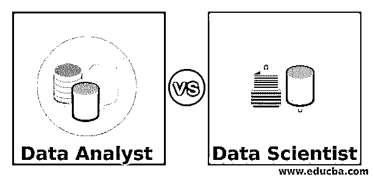
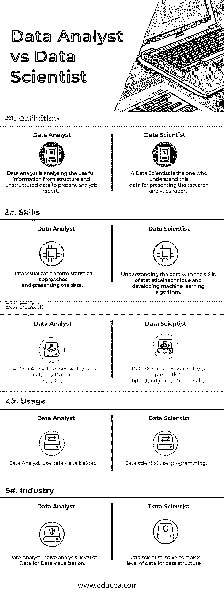

# 数据分析师 vs 数据科学家

> 原文：<https://www.educba.com/data-analyst-vs-data-scientist/>

## 数据分析师和数据科学家的区别

数据分析师与数据科学家是分析行业中一个重要的工作角色对比。数据分析师主要从事数据准备和探索性数据分析，而数据科学家更专注于统计模型和机器学习算法。数据分析师专业人员通常与分析商业智能或 BI 实施的定量业务数据相关联。数据科学家的角色是应用一种或多种机器学习算法来开发优化的模型，这些模型有助于推导出说明性和预测性的分析。数据分析师和数据科学家的工作角色和职责因组织而异，具体取决于行业的规模和类型。

### 数据分析师

*   [数据分析师考试活动](https://www.educba.com/what-is-data-analyst/)可以帮助组织扩大收入、提高运营效率、推进展示工作和客户利益努力、更快地对发展中的业务部门模式做出反应，并获得超越对手的积极优势——所有这些都有一个明确的目标，即提高业务执行力。视具体应用而定，被调查的信息可以包括真实的记录或为正在进行的检查工作而处理的新数据。此外，它可能源自内部框架和外部信息源的混合。
*   数据分析师调查同样可以分为定量信息检查和主观信息调查。前者包括对带有可量化因素的数字信息的调查，这些因素可以观察或可测量地估计。主观方法更具解释性——它以理解非数字信息的实质为中心，如内容、图片、声音和视频，包括正则表达式、主题和视角。
*   在应用程序级别，BI 和 detailing 为业务管理员和其他公司员工提供了关于关键执行标记、业务任务、客户和天空的重要数据。以前，信息问题和报告通常是由在 IT 部门工作的 BI 设计师或为一个合并的 BI 团队为最终客户制作的；现在，各种协会越来越多地利用自利的 BI 设备，让高管、业务调查人员和运营专家自己进行即兴调查，并自己编造报告。

### 数据科学家

*   数据科学家利用现代调查程序、机器学习统计数据和可测量的策略来获取准备好的信息，以便在有预见性和规范性的显示中使用，彻底清除和删减信息，以处理不重要的数据调查和查看来自各种点的信息，以确定隐藏的缺点、模式或潜在的漏洞。为最紧迫的挑战设计信息驱动的解决方案设计新的计算方法来解决问题并制造新的工具来使工作计算机化通过令人信服的信息表示和报告向管理部门和 IT 部门传达期望和发现对现有的方法和系统提出实际的改变。
*   每个组织对雇佣状态都有不同的解释。一些人认为他们的数据科学家是著名的信息调查员，或者把他们的义务与信息工程师联系在一起；其他人需要在严肃的机器学习和信息表示方面有天赋的顶级考试专家。随着信息研究人员完成新层次的参与或改变职业，他们的义务不断变化。例如，一个在中等规模的组织中独自工作的人可能会花相当多的时间来清理和合并信息。在提供基于信息的管理的企业中，一个不正常的国家工作人员可能被要求构建扩展或制造新项目的大量信息。

### 数据分析师和数据科学家之间的面对面比较(信息图表)

以下是数据分析师和数据科学家之间的五大对比:

<small>Hadoop、数据科学、统计学&其他</small>

### 数据分析师和数据科学家之间的主要区别

让我们讨论一些主要差异:

1.  数据分析师是参与分析数据以获得更好报告的专业人士，而数据科学家是理解数据以获得更好数据结构的研究分析师。
2.  数据分析师技能，如数据可视化和统计学，而[数据科学家技能](https://www.educba.com/data-scientist-skills/)，如 Python 编程、R 编程和[其他数据科学语言](https://www.educba.com/data-science-languages/)。
3.  数据分析师负责数据的分析和可视化，以便做出决策，而数据科学家则负责理解数据的算法和程序
4.  数据分析师使用数据可视化，而数据科学家使用编程
5.  数据分析师解决数据的分析层次，而数据科学家解决复杂层次的数据

### 数据分析师与数据科学家对比表

以下是描述数据分析师和数据科学家之间差异的要点列表:

| **比较的基础** | **数据分析师** | **数据科学家** |
| **定义** | 数据分析师正在分析来自结构化和非结构化数据的完整信息的使用情况，以提交分析报告。 | 数据科学家是理解这些数据以呈现研究分析报告的人。 |
| **技能** | 数据可视化形成统计方法并呈现数据。 | 用统计技术理解数据并开发机器学习算法。 |
| **字段** | 数据分析师的职责是分析数据以做出决策。 | 数据科学家的职责是为分析师提供可理解的数据。 |
| **用途** | Data Analyst 使用数据可视化。 | 数据科学家使用编程。 |
| **行业** | Data Analyst 解决了数据可视化的数据分析级别。 | 数据科学家为数据结构解决复杂层次的数据。 |

### 结论

在数据分析处理领域，在接下来的几年里，我们将从选择性地利用选择帮助框架转变为额外利用那些为我们的利益做出选择的框架。特别是在数据分析检查领域，尽管这些安排不能在各种设置中交叉使用，但我们目前正在为特定问题创建单独的诊断答案——例如，为区分股票价值发展中的不一致而创建的答案不能用于理解图片的实质。

尽管人工智能框架将包含独立的连接部分，并随后有能力逐步处理我们今天已经能够观察到的清晰模式，但这种情况将在以后保持不变。一个处理关于证券交易的当前信息的框架，以及另外根据新闻写作或记录采取和分解政治结构的改进、从站点或人际组织的写作中提取感觉、筛选和预测适用的货币相关标记等，需要广泛的子组件的组合。

### 推荐文章

这是数据分析师和数据科学家之间最大差异的指南。在这里，我们已经介绍了数据分析师和数据科学家之间的主要区别，以及信息图表和比较表。您也可以看看以下文章——

1.  [数据科学家 vs 业务分析师](https://www.educba.com/data-scientist-vs-business-analyst/)
2.  [商业智能与数据分析](https://www.educba.com/business-intelligence-vs-data-analytics/)
3.  [计算机科学家 vs 数据科学家](https://www.educba.com/computer-scientist-vs-data-scientist/)
4.  [多态性与遗传](https://www.educba.com/polymorphism-vs-inheritance/)

