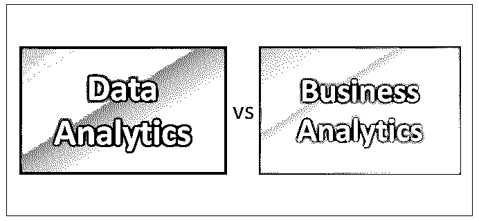
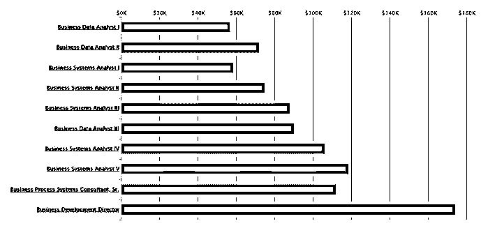

# 数据分析与业务分析

> 原文：<https://www.educba.com/data-analytics-vs-business-analytics/>

## 数据分析与业务分析的区别

就技术技能而言，数据分析比其他分析更以技术为中心，因为数据分析师会亲自动手清理数据、清除数据、寻找相关性等。数据分析师喜欢尝试任何最新的工具，并在工具上测试他/她的数据，看看他/她能从中获得什么样的见解。

[另一方面，业务分析](https://www.educba.com/what-is-business-analytics/)是一种更加面向流程/功能的角色，业务分析师将负责公司的日常运营。首席执行官/CMO 不会理解什么是相关性，或者什么变量对转换函数有真正的影响，因此他是一个业务分析师。业务分析师应该能够解释数据分析师的术语，并将其转换为可向各自的负责人展示的形式。业务分析师还会研究优化问题，并且会对公司/活动中的任何模型的升级/优化提出质疑。

<small>Hadoop、数据科学、统计学&其他</small>

以下是摘自维基百科的数据分析师定义:

“数据分析是一个对数据进行检查、清理、转换和建模的过程，其目标是发现有用的信息、提出结论和支持决策。数据分析有多个方面和方法，包括不同商业、科学和社会科学领域中各种名称下的不同技术。”

如果我们采用 IIBA(国际商业分析研究所)给出的定义，那么商业分析的定义如下:

“业务分析师是变革的代理人。业务分析是一种引入和管理组织变革的训练有素的方法，无论它们是盈利性企业、政府还是非营利组织。

业务分析用于识别和阐明组织工作方式的变化需求，并促进这种变化。作为业务分析师，我们识别和定义将最大化组织向其利益相关者交付的价值的解决方案。业务分析师在组织的所有级别上工作，并且可能参与从定义策略到创建企业架构，到通过定义计划和项目的目标和要求或支持其技术和过程的持续改进来承担领导角色的所有事情。"

### 数据分析和业务分析之间的直接比较

以下是数据分析和业务分析之间的八大对比:

### 数据分析和业务分析的主要区别

以下是要点列表，描述了数据分析和业务分析之间的主要区别

*   业务分析师的主要任务是检查需求，从操作和功能的角度评估需求，而数据分析师只会从收集、操作和分析数据的角度来分析数据。
*   业务分析师通过确定需求范围和缩小需求范围来检查所有需求，然后将任务分配给开发人员来开发代码，而数据分析师将准备仪表板、图表或各种可视化工具，这将有助于高层管理人员决定下一步应该做什么。
*   业务分析师将研究并尝试从数据中获得有价值的见解，为业务寻找最佳模型也取决于业务分析师，而数据分析师将专注于开发新算法或优化已开发的算法。
*   让我们举个例子，试着区分两者:

1.我们有一项研究，一家电信公司需要隔离他们的客户，以找到不想要的客户，或者让我们只说流失率。业务分析师会要求开发人员通过提供他们需要的所有数据来构建模型，然后尝试评估哪个模型描述得最好。

2.而数据分析师将负责清理数据、转换数据以使其足够适合模型、调整模型以获得更好的结果、构建可视化输出以使模型易于理解。

### 数据分析和业务分析对照表

以下是显示数据分析和业务分析之间的比较的要点列表

| **比较依据** | **商业分析** | **数据分析** |
| **焦点** | 业务分析师将负责制作报告、KPI(关键性能指数)矩阵、数据趋势，这些将对组织有所帮助 | 数据分析师只会摆弄数据，寻找模式、相关性，甚至建立模型，看看数据如何响应他/她的模型。 |
| **流程** | 业务分析师会对数据进行静态的比较研究。 | 数据分析师会做解释性分析，然后尝试数据挖掘过程，以便给出数据的良好可视化表示。 |
| **数据来源** | 业务分析师会预先计划他/她的数据源，确定哪些是必需的，哪些应该排除，这是一个缓慢的过程。 | 数据分析师在一些数据上发现了相关性，而这些数据不属于他之前的数据集，那么他/她会根据需要动态添加数据源。 |
| **变换** | 业务分析师将预先转换经过仔细规划的数据。 | 所有的转换都是在数据库中完成的，只要有丰富数据的需求，这些转换都是动态完成的。 |
| **数据质量** | 业务分析师总是将数据呈现为单一版本的事实 | 商业分析师会用“足够好”这个短语，或者理论上用概率 |
| **数据模型** | 业务分析师会选择加载数据模型上的模式 | 数据分析师会在查询数据模型上使用模式。 |
| **分析** | 回顾性，描述性 | 预测性、规范性 |
| **字段** | 计算机科学和管理的一个分支，通过使用不同的方法和技术来研究数据 |  Covers entire technological field  which is a superset of Data Science |

### 结论

当业务分析师在数据分析师之上工作时，这里可以看到两个配置文件的工资构成:

下表显示了商业分析师的平均工资。

而数据分析师的平均工资在 6.5 万美元到 9.7 万美元之间

总之，这取决于个人的兴趣，如果他/她擅长技术，他/她会选择数据分析，或者如果他/她精通功能/流程领域，那么他/她可能会选择业务分析部分。

就概念问题、科学和技术领域的增长和发展而言，每一个领域都有自己的优势，不断发展的技术世界需要更多的这些领域，以便进一步发展和创造一些非凡的发明，这些发明不仅可以缓解人类的生活，还可以拯救我们的大气环境，让后代过上平稳幸福的生活。

### 推荐文章

这是数据分析与业务分析之间差异的指南。在这里，我们还将讨论数据分析与业务分析的直接比较、主要差异以及信息图表和比较表。您也可以阅读以下文章，了解更多信息——

1.  [了解云计算与数据分析的 5 个最有用的区别](https://www.educba.com/cloud-computing-vs-data-analytics/)
2.  [数据科学家与业务分析师–找出 5 大不同点](https://www.educba.com/data-scientist-vs-business-analyst/)
3.  [数据科学家 vs 机器学习——哪个更好](https://www.educba.com/data-scientist-vs-machine-learning/)
4.  [数据挖掘过程的 6 个不同阶段](https://www.educba.com/data-mining-process/)

