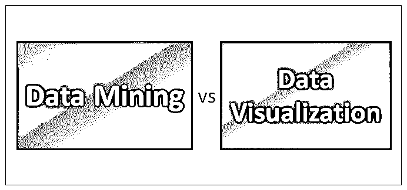

# 数据挖掘与数据可视化

> 原文：<https://www.educba.com/data-mining-vs-data-visualization/>

## 数据挖掘与数据可视化简介

[数据挖掘](https://www.educba.com/what-is-data-mining/)用于发现大型数据集中的模式、异常和相关性，以使用广泛的技术进行预测，组织使用提取的信息来增加收入、削减成本、降低风险、改善客户关系等。鉴于[数据可视化](https://www.educba.com/what-is-data-visualization/)是使用图形、图表和地图等可视化元素对从数据挖掘中提取的数据和信息进行图形化表示，数据可视化工具和技术有助于分析大量信息并在此基础上做出决策。

### 数据挖掘和数据可视化的面对面比较(信息图表)

下面是数据挖掘和数据可视化之间的 7 大比较:

<small>Hadoop、数据科学、统计学&其他</small>

### 数据挖掘和数据可视化的主要区别

以下是数据挖掘和数据可视化之间的主要区别:

1.  数据挖掘是整理出一些大型数据集并从中提取一些数据以及从提取的数据中提取模式的过程，而数据可视化是可视化或显示以不同图形或视觉格式提取的数据的过程，例如统计表示、饼图、条形图、图形图像等。
2.  数据挖掘过程包括序列分析、分类、路径分析、聚类和预测，而数据可视化包括处理、分析和交流数据等。
3.  在数据挖掘中，数据将在搜索过程中自动显示，这将由系统分析本身显示，而数据可视化给出了数据的清晰视图，并且将易于人脑记住和记忆大块数据。
4.  在数据挖掘中，有四个阶段，即数据源、数据收集或数据探索、数据建模和部署数据模型，而在数据可视化中有七个阶段，即获取过程、解析、过滤、挖掘、表示、提炼和交互。
5.  数据挖掘是从大型数据集中提取不同模式的一组不同活动，其中数据集将从不同的数据源中检索，而数据可视化是将数字数据转换为图形图像(如有意义的 3D 图片)的过程，可用于轻松分析复杂数据。
6.  数据挖掘的应用包括客户关系管理，这是一种为数据挖掘提供优势的软件应用，而数据可视化的应用包括声纳测量、卫星照片、计算机模拟和调查等。
7.  数据挖掘中可用的不同技术有分类、聚类、序列、关联等。数据可视化起源于统计学和科学，它们给人一目了然的视觉效果，这意味着一张图片给人 100 个单词的印象。
8.  在数据挖掘中，分类是识别数据规则的过程，无论它是否属于特定的数据类别，它的子过程包括建立数据模型和预测分类，而在数据可视化中，主要应用包括地理信息系统，其中重要的地理信息可以表示为尽可能简单地表示复杂信息的可视图像。
9.  数据挖掘技术还包括神经网络、统计分析、决策树、[遗传算法](https://www.educba.com/what-is-genetic-algorithm/)、[模糊逻辑](https://www.educba.com/what-is-fuzzy-logic/)、[文本挖掘](https://www.educba.com/text-mining/)、 [web 挖掘](https://www.educba.com/data-mining-vs-web-mining/)等。，而数据可视化有不同的应用，如零售、政府、医药和保健、交通、电信、保险、资本市场和资产管理。
10.  数据挖掘的局限性在于，即使它是一种新技术，但它仍然不发达，因为许多公司使用传统系统，而且现有系统也不是[数据仓库](https://www.educba.com/business-intelligence-vs-data-warehouse/)友好的数据可视化在其工具中有明显的缺点，例如它显示不同的视觉效果而不是解释，没有指导原则，不同的用户具有多种见解，并且还提供较差的安全性。
11.  数据挖掘是从数据集中识别不同模式的分析过程，可以帮助处理大量的信息，数据可视化提供了许多可视化技术，这些技术是在过去几十年中发展起来的，支持对大型数据集的探索。
12.  数据挖掘的好处是，不同数据集和变量之间的关系将被隐藏，而数据可视化通过以图形和图表的形式表示数据来定义可视化对象。

### 数据挖掘和数据可视化对照表

下面是数据挖掘和数据可视化的对照表。

| **Basis For****比较** | **数据挖掘** | **数据可视化** |
| **定义** | 从大数据块中搜索并产生合适的结果 | 给出复杂数据的简单概述 |
| **偏好** | 这有不同的应用，并首选网络搜索引擎 | 首选用于数据预测和预测 |
| **区域** | 属于数据科学 | 属于数据科学领域 |
| **平台** | 使用网络软件系统或应用程序操作 | 支持复杂的数据分析和应用，并能更好地工作 |
| **通用性** | 新技术但不发达 | 在实时数据预测中更有用 |
| **算法** | 使用数据挖掘存在许多算法 | 不需要使用任何算法 |
| **整合** | 运行在任何网络平台或任何应用程序上 | 不管是硬件还是软件，它都提供视觉信息 |

### 结论

数据挖掘是数据科学的一个领域，通过识别不同的模式，大型数据集将被彻底处理，以在搜索中提供合适的结果。

数据可视化是从现有的复杂数据中显示出视觉信息的过程，以便在不需要研究任何理论结果的情况下一眼就得出特定的结论。这些应用包括卫星数据信息、研究成果信息、科学研究数据等。

数据挖掘的应用包括网络搜索引擎、零售、金融和银行业、政府机构等。数据挖掘和数据可视化

在计算机科学领域的数据科学应用领域有很大的优势。

### 推荐文章

这是数据挖掘和数据可视化的指南。在这里，我们讨论了数据挖掘与数据可视化的直接比较、关键差异以及信息图和比较表。您也可以阅读以下文章，了解更多信息——

1.  [大数据与数据挖掘——找出最佳的 8 个差异](https://www.educba.com/big-data-vs-data-mining/)
2.  [数据挖掘与机器学习——你需要知道的 10 件事](https://www.educba.com/data-mining-vs-machine-learning/)
3.  [数据挖掘 vs Web 挖掘](https://www.educba.com/data-mining-vs-web-mining/)

