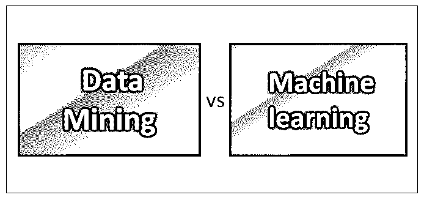

# 数据挖掘与机器学习

> 原文：<https://www.educba.com/data-mining-vs-machine-learning/>

## 数据挖掘和机器学习的区别

数据挖掘始于 1930 年，涉及从大量数据中发现潜在有用的、隐藏的和有效的模式。虽然在 1950 年左右引入的机器学习涉及来自数据的新算法以及以前的经验，以训练模型并根据模型进行预测，但两者都在拥有有用数据集的点上相交，但除此之外，它们在责任、起源、实现、性质、应用、抽象、技术和范围上有各种不同。

**让我们在本帖中详细了解数据挖掘和机器学习。**

<small>Hadoop、数据科学、统计学&其他</small>

### 数据挖掘和机器学习之间的直接比较(信息图表)

以下是数据挖掘和机器学习之间的十大对比:

### 

### 数据挖掘和机器学习的主要区别

让我们讨论一下数据挖掘和机器学习之间的一些主要区别:

1.  为了实现[数据挖掘技术](https://www.educba.com/data-mining-techniques/)，它使用了两个组件，第一个是数据库，第二个是机器学习。数据库提供数据管理技术，而机器学习提供[数据分析技术](https://www.educba.com/data-analysis-techniques/)。但是为了实现机器学习技术，它使用了算法。
2.  数据挖掘使用更多的数据来提取有用的信息，这些特定的数据将有助于预测一些未来的结果，例如在一家销售公司中，它使用去年的数据来预测这次销售，但机器学习不会太依赖数据，它使用算法，例如 OLA，UBER 机器学习技术来计算乘车的 ETA。
3.  自学习能力在数据挖掘中是不存在的，它遵循规则和预定义。它将为特定问题提供解决方案，但机器学习算法是自定义的，可以根据场景改变它们的规则，它将找到特定问题的解决方案，并以自己的方式解决它。
4.  数据挖掘和机器学习之间的主要和最重要的区别是，没有人类的参与，数据挖掘就无法工作，但在机器学习中，人类的努力只涉及算法定义的时间，在此之后，它将通过自己的方式总结一切，一旦实现，将永远使用，但这不是数据挖掘的情况。
5.  与数据挖掘相比，机器学习产生的结果将更加准确，因为机器学习是一个自动化的过程。
6.  数据挖掘使用数据库或[数据仓库](https://www.educba.com/10-popular-data-warehouse-tools/)服务器、数据挖掘引擎和模式评估技术来提取有用的信息，而机器学习使用神经网络、预测模型和自动算法来做出决策。

### 数据挖掘和机器学习对照表

下面列出了数据挖掘和机器学习的区别

| **比较依据** | **数据挖掘** | **机器学习** |
| **意为** | 从大量数据中提取知识 | 从数据和过去的经验中引入新的算法 |
| **历史** | 于 1930 年推出，最初被称为数据库中的知识发现 | 大约在 1950 年推出的第一个程序是塞缪尔的跳棋程序 |
| **责任** | 数据挖掘用于从现有数据中获取规则。 | 机器学习教会计算机学习和理解给定的规则。 |
| **原点** | 包含非结构化数据的传统数据库 | 现有的数据和算法。 |
| **实施** | 我们可以开发自己的模型，利用数据挖掘技术 | 我们可以在决策树、神经网络和其他一些人工智能领域使用机器学习算法。 |
| **性质** | 更多地涉及人工干预。 | 自动化，一旦设计自我实现，无需人工 |
| **应用** | 用于[聚类分析](https://www.educba.com/data-mining-cluster-analysis/) | 用于网络搜索、垃圾邮件过滤、信用评分、欺诈检测、计算机设计 |
| **抽象** | 数据仓库中的数据挖掘摘要 | 机器学习阅读机器 |
| **涉及的技术** | 数据挖掘更多的是使用机器学习等方法的研究 | 自学并训练系统完成智能任务。 |
| **范围** | 适用于有限的区域 | 可以在广大地区使用。 |

### 结论

现在在大多数情况下，数据挖掘被用来从历史数据中预测结果或从现有数据中找到新的解决方案。大多数组织使用这种技术来推动业务成果。因为机器学习技术克服了数据挖掘技术所存在的问题，所以它正以更快的速度发展。因为与数据挖掘相比，机器学习过程更准确，更不容易出错，并且它更有能力做出自己的决定并解决问题。但是为了继续推动业务，我们需要数据挖掘过程，因为它将定义特定业务的问题，并且我们可以使用机器学习技术来解决这样的问题。一句话，我们可以说，要推动一项业务，数据挖掘和机器学习技术必须携手合作，一种技术将定义问题，另一种技术将以更准确的方式为您提供解决方案。

### 推荐文章

这是数据挖掘与机器学习的指南。在这里，我们已经讨论了数据挖掘与机器学习的直接比较、关键差异以及信息图表和比较表。您也可以阅读以下文章，了解更多信息——

1.  [成功企业的 8 项重要数据挖掘技术](https://www.educba.com/data-mining-techniques/)
2.  [获得最佳结果的 7 种重要数据挖掘技术](https://www.educba.com/data-mining-techniques/)
3.  [大数据与机器学习的 5 个最佳区别](https://www.educba.com/big-data-vs-machine-learning/)
4.  [数据科学与机器学习的 5 个最有用的区别](https://www.educba.com/data-science-vs-machine-learning/)

