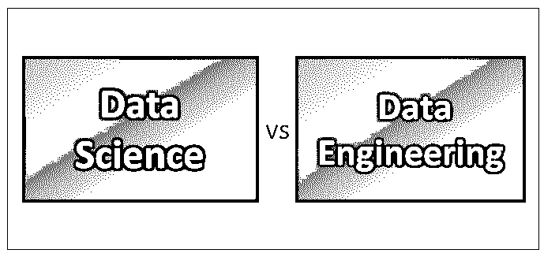

# 数据科学 vs 数据工程

> 原文：<https://www.educba.com/data-science-vs-data-engineering/>

## 数据科学与数据工程的区别

[数据科学是](https://www.educba.com/what-is-data-science/)一门跨学科的学科，它利用统计学、应用领域和计算机科学的方法和工具来处理结构化或非结构化的数据，以获得有意义的见解和知识。数据科学是从数据中提取有用的业务洞察力的过程。数据工程设计和创建用于实时收集或生成、存储、丰富和处理数据的流程堆栈。[数据工程](https://www.educba.com/what-is-data-engineering/)负责为数据从一个实例到另一个实例的无缝移动建立管道或工作流。相关工程师负责硬件和软件需求，以及 IT 和[数据安全和保护](https://www.educba.com/data-security-techniques/)方面。在本文中，我们将详细讨论数据科学与数据工程之间的区别。

### 数据科学和数据工程之间的直接比较(信息图表)

以下是数据科学和数据工程之间的 6 大对比:

<small>Hadoop、数据科学、统计学&其他</small>

### 数据科学和数据工程的主要区别

以下是数据科学和数据工程之间的区别:

数据科学和数据工程是两个不同的学科，但是在一些观点中，人们可以互换使用它们。这也取决于承担此类任务的组织或项目团队，在这种情况下，这种区别没有被特别标记。为了建立他们独特的身份，我们强调了这两个领域之间的主要差异:

1.  数据工程是一门学科，它负责开发处理、存储和检索来自不同数据源的数据的框架。另一方面，数据科学是开发模型以从底层数据中提取有意义和有用的见解的学科。
2.  数据工程负责发现最佳方法，并确定数据采集的优化解决方案和工具集。数据科学负责开发模型和程序，以便从数据中提取有用的业务洞察力。
3.  数据工程师为数据科学家开发机器学习和统计模型奠定基础或准备数据。
4.  数据工程通常使用工具和编程语言来构建用于大规模数据处理和查询优化的 API。相反，数据科学使用统计学、数学、计算机科学和商业知识来开发特定行业的分析和智能模型。
5.  虽然数据工程还负责数据处理、存储和分发的正确硬件利用，但数据科学可能不太关心硬件配置，但需要分布式计算知识。
6.  数据科学家需要从底层数据准备视觉或图形表示，数据工程师不需要做同样的研究。

### 数据科学和数据工程对照表

虽然这两个术语都与数据相关，但它们是完全不同的学科，在本节中，我们将对数据科学和数据工程进行面对面的比较。

| **比较依据** | **数据科学** | **数据工程** |
| **定义** | 数据科学从原始数据中获得洞察力，通过使用统计模型从数据中获得洞察力和价值 | 数据工程为消费不同来源的数据创建 API 和框架 |
| **专业领域** | 这个学科需要数学、统计学、计算机科学和领域的专家级知识。不需要硬件知识 | [数据工程需要](https://www.educba.com/what-is-data-engineering/)编程、中间件、硬件相关知识。机器学习和统计知识不是强制性的 |
| **工作简介** | Establishes the statistical and machine learning model for analysis and keeps improving them为数据分析构建可视化和图表 | Helps the Data Science team by applying feature transformations for machine learning models on the datasets

不需要处理[数据可视化](https://www.educba.com/what-is-data-visualization/)

 |
| **职责** | 负责优化 ML/统计模型的性能 | 负责整个数据管道的优化和性能 |
| **输出** | 数据科学的产出是数据产品 | 数据工程的输出是数据流、存储和检索系统 |
| **例题** | 数据产品的一个例子可以是推荐引擎，如 [YouTube](https://www.educba.com/a-youtube-video/) 推荐视频列表、用于识别垃圾邮件和非垃圾邮件的电子邮件过滤器。 | 数据工程的一个例子是将 Twitter 上的每日推文放入分布在多个集群上的 [hive 数据](https://www.educba.com/hive-data-types/)仓库。 |

### 结论

数据科学和数据工程是两个完全不同的学科。数据科学和数据工程都处理不同的问题领域，需要专门的技能和方法来处理日常问题。虽然数据工程可能不涉及机器学习和统计模型，但他们需要转换数据，以便数据科学家可以在此基础上开发机器学习模型。虽然数据科学家可以开发一种核心算法来分析和可视化数据，但他们完全依赖数据工程师来处理和丰富数据。这两个领域都有大量的机会和工作范围，随着数据的增加以及物联网和大数据技术的出现，几乎每个基于 IT 的组织都需要大量的数据科学家和数据工程师。对于对这些领域感兴趣的人来说，现在开始还不晚。

### 推荐文章

这是数据科学与数据工程的指南。在这里，我们讨论了数据科学与数据工程的直接比较、关键差异以及信息图和比较表。您也可以阅读以下文章，了解更多信息——

1.  [数据科学 vs 机器学习](https://www.educba.com/data-science-vs-machine-learning/)
2.  [数据科学 vs 软件工程](https://www.educba.com/data-science-vs-software-engineering/)
3.  [数据科学家 vs 数据工程师 vs 统计学家](https://www.educba.com/data-scientist-vs-data-engineer-vs-statistician/)
4.  [大数据 vs 数据科学](https://www.educba.com/big-data-vs-data-science/)

