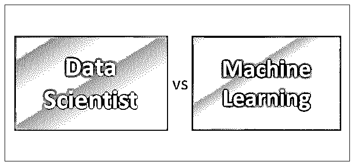

# 数据科学家 vs 机器学习

> 原文：<https://www.educba.com/data-scientist-vs-machine-learning/>

## 数据科学家与机器学习的区别

数据科学家是一名专家，负责收集、检查和解释大量数据，以识别帮助企业改善运营和获得竞争优势的方法。它采用跨学科的方法。它介于数学、统计学、软件工程、人工智能和设计思维之间。它进一步处理数据收集、清理、分析、可视化、验证模型、实验预测、设计、测试和假设。机器学习是人工智能的一个分支，数据科学利用它来实现其目标。机器学习主要关注算法、多项式结构、单词添加。它由一组算法和机器组成，使它们能够在没有明确编程的情况下学习。

### 数据科学家

该数据科学家角色是统计学角色的一个分支，包括使用分析技术高级版本，包括机器学习和预测建模，以提供统计分析之外的愿景。近年来，随着公司希望从大型企业产生的大量结构化、半结构化和非结构化数据(统称为大数据)中收集有用信息，对数据科学技能的需求大幅增长。所有步骤的目标只是从数据中获得洞察力。

<small>Hadoop、数据科学、统计学&其他</small>

标准任务:

*   分配、聚合和综合来自各种结构化和非结构化来源的数据
*   探索、开发智能学习并将其应用于真实世界的数据，基于这些数据提供重要的发现和成功的行动
*   分析并提供组织中收集的数据
*   设计和构建新的建模、数据挖掘和实施流程
*   开发原型、算法、预测模型、原型
*   执行数据分析请求，并传达他们的发现和决定

此外，根据雇主工作或项目实施的领域，还有更多具体任务。

**原始数据— >** **数据科学****—>可操作的见解**

### 机器学习

机器学习工程师岗位更有“技术含量”。ML 工程师比数据科学家与经典软件工程有更多的共同点。它帮助您学习目标函数，该函数将输入绘制成目标变量和/或自变量绘制成因变量。

ML 工程师的标准任务一般就像数据科学家。你还需要能够处理数据，尝试各种能够解决任务的机器学习算法，创建原型和现成的解决方案。

该职位所需的知识和技能也与数据科学家重叠。在这些关键的差异中，我要特别指出:

*   在一种或多种流行语言(通常是 Python 和 Java)以及数据库方面有很强的编程技能；
*   不太强调在数据分析环境下工作的能力，而是更强调机器学习算法；
*   r 和 Python 建模比 Matlab、SPSS、SAS 更可取；
*   能够为应用中的各种栈使用现成的库，例如，Mahout、Lucene for Java、NumPy/SciPy for Python；
*   能够使用 Hadoop 和其他解决方案创建分布式应用。

正如你所看到的，ML 工程师(或更狭义)的职位需要更多的软件工程知识，因此，非常适合有经验的开发人员。通常情况下，当普通的开发人员必须为他的职责解决 ML 任务时，他开始理解必要的算法和库。

### 数据科学家和机器学习之间的面对面比较(信息图表)

以下是数据科学家和机器学习之间的 5 大差异:

### 数据科学家和机器学习的主要区别

以下是要点列表，描述了数据科学家和机器学习之间的主要区别:

1.  机器学习和统计学是数据科学的一部分。机器学习中的单词 learning 是指算法依赖于一些数据，用作训练集，来微调一些模型或算法参数。这包括许多技术，如回归、朴素贝叶斯或监督聚类。但是并不是所有的技术都属于这一类。例如，无监督聚类——一种统计和数据科学技术——旨在检测聚类和聚类结构，而无需任何先验知识或训练集来帮助分类算法。需要一个人来标记发现的集群。一些技术是混合的，例如半监督分类。一些模式检测或密度估计技术属于这一类。
2.  然而，数据科学不仅仅是机器学习。在数据科学中，数据可能来自也可能不来自机器或机械过程(调查数据可能是手动收集的，临床试验涉及特定类型的少量数据)，它可能与我刚才讨论的学习无关。但主要的区别在于，数据科学涵盖了数据处理的整个领域，而不仅仅是算法或统计方面。数据科学还涵盖数据集成、分布式架构、自动化机器学习、数据可视化、仪表板和大数据工程。

### 数据科学家**和**机器学习对照表

以下是描述数据科学家和机器学习之间的比较的要点列表:

| **功能** | **数据科学家** | **机器学习** |
| **数据** | 它主要致力于提取表格或图像中的数据细节 | 它主要集中在算法，多项式结构和单词添加 |
| **复杂度** | 它处理非结构化数据，并与调度程序一起工作 | 它使用算法和数学概念、统计学和空间分析 |
| **硬件要求** | 系统是水平可扩展的，并且具有高磁盘和 RAM 存储 | 它需要图形处理器和张量处理器，这是一种非常高级的硬件 |
| **技能** | 数据分析，ETL，NoSQL，报告 | Python，R，数学，统计，SQL 模型 |
| **焦点** | 注重处理数据的能力 | 算法被用来从大量数据中获取知识 |

### 结论

机器学习帮助您学习目标函数，该函数将输入绘制为目标变量，将自变量绘制为因变量

数据科学家对数据进行大量的探索，并得出如何处理数据的广泛策略。他负责提出数据内部的问题，并从数据中找到合理的答案。特征工程属于数据科学家的领域。创造力在这里也发挥着作用，机器学习工程师知道更多的工具，可以根据数据科学家的指示，在给定一组特征和数据的情况下建立模型。数据预处理和特征提取领域属于 ML 工程师。

数据科学和考试利用机器学习进行这种原型验证和创建。需要注意的是，这个模型创建中的所有算法可能都不是来自机器学习。他们可以从许多其他领域到达。模型希望始终保持相关性。如果情况发生变化，那么我们之前创建的模型可能会变得不重要。该模型需要在不同时间检查其确定性，如果确定性降低，则需要进行调整。

数据科学是一个很大的领域。如果我们试图把它放在一个管道中，它将有数据采集，数据存储，数据预处理或数据清理，学习数据模式(通过机器学习)，使用学习进行预测。这是理解机器学习如何融入数据科学的一种方式。

### 推荐文章

这是数据科学家与机器学习之间差异的指南。在这里，我们讨论了数据科学家与机器学习的直接比较、关键差异以及信息图和比较表。您也可以阅读以下文章，了解更多信息——

1.  [数据挖掘 vs 机器学习](https://www.educba.com/data-mining-vs-machine-learning/)
2.  [机器学习与预测分析](https://www.educba.com/machine-learning-vs-predictive-analytics/)
3.  [数据科学家 vs 业务分析师](https://www.educba.com/data-scientist-vs-business-analyst/)
4.  [数据科学家 vs 数据工程师](https://www.educba.com/data-scientist-vs-data-engineer/)

