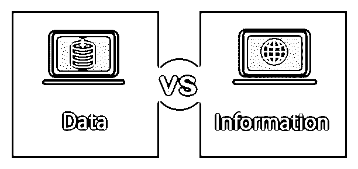

# 数据与信息

> 原文：<https://www.educba.com/data-vs-information/>

## 数据与信息的区别

简而言之，数据只代表事实和数字，它们可能包含少量信息、完整信息或根本没有信息。现在来看信息，当数据被处理、解释、组织、结构化和呈现，并且对需要信息的人有意义时，那么只有它被称为信息。信息被描述为经过处理、组织、具体化、结构化和表示的数据形式，以根据需要推断一些有意义的信息。这些信息增加了意义，提高了数据的可靠性，确保了可理解性，减少了不确定性。为了从数据中转换或提取信息，人们必须使其摆脱不必要的细节或非物质的东西，这些东西根据需要具有一定的价值。

由于需要对数据进行解释和分析以从中提取信息，因此很可能会对数据进行不正确的解释，从而导致错误的结论，因此从数据中推断出的这种信息被认为是数据具有误导性。这种情况主要是由于数据不完整或缺乏上下文。

<small>Hadoop、数据科学、统计学&其他</small>

例如，你在股票市场的投资现在很普遍。因此，在投资之前，人们必须从可用的数据中提取信息，这些信息可能是错误的，并使投资者遭受损失，这背后可能有许多原因，但在我们的主题背景下，原因可能是可用的数据不完整或缺乏背景。

我们可以再举一个例子，例如，一个日期列表可以被称为数据，如果没有我们可以根据需要从数据中提取的信息，如假期列表或周末或国定假日列表，这些数据是没有意义的。

同样，任何地方的温度读数的历史都可以简单地称为数据。如果对相同的数据进行组织和分析，然后呈现出来，根据要求找出一段时间内的最高温度和最低温度，那么我们可以称之为信息。

我们可以将数据分为以下两部分:

**1)原始数据**

*   定性数据。
*   定量数据。

**2)二手资料。**

*   内部数据。
*   外部数据。

### 数据和信息的直接比较(信息图表)

以下是数据和信息之间的 15 大差异:

### 数据和信息的主要区别

让我们讨论一下数据和信息之间的一些主要区别:

*   数据是在任何条件、事件、想法、实体或任何种类的事物中收集的原始事实，人们需要根据这些原始事实来推断任何信息。
*   我们从某一特定事件或主题中得出的结论，我们通过剔除无用的数据来过滤数据，保留形成信息的必要数据。
*   数据可以是简单的文本或数字
*   信息是经过处理和解释的数据形式。
*   数据是无组织的，随机收集的事实和数字，可以根据需要进行处理以得出结论。
*   有意义的相同数据的组织形式称为信息。
*   数据是在观察和记录的基础上收集的，这些观察和记录被储存在计算机中，或者简单地储存在文件中，或者以其他方式储存。
*   信息被认为是更可靠的，因为进行了适当的分析来将数据转换成信息。

### 数据和信息对照表

让我们讨论数据和信息之间的比较如下。

| **数据与信息对比的基础** | **数据** | **信息** |
| **描述** | 有助于形成观点或结论的原始事实和数据。 | 根据需要从数据中发现/分析有意义的信息。 |
| **格式** | 它可以是字符、字母、数字或任何形式。 | 从数据中提取的想法和推论，并进行适当的安排。 |
| **表示法** | 结构、表格数据、图像、颜色代码或任何东西。 | 根据需要配有图表的语言。 |
| **意为** | 没有任何意义。 | 它有一个恰当的含义。 |
| **相互关系** | 信息收集。 | 从数据中处理。 |
| **功能** | 数据是原始形式，没有任何意义。 | 在过滤掉有意义的无关数据后收集数据。 |
| **依赖关系** | 没有依赖性。 | 要看数据。 |
| **人** | 用比特、字节或千字节等来衡量。 | 从时间、质量等方面来衡量。 |
| **决策支持** | 它不能用于决策。 | 用于决策。 |
| **包含** | 原始数据。 | 意义信息。 |
| **知识水平** | 低能级 | 中等水平。 |
| **特性** | Some data are classified to the organization and are restricted to distribute in public.然而，一些数据也是公开的。 | 可供出售，对公众有一定的重要性。 |
| **重要性** | 数据本身没有任何意义。 | 这本身就很重要。 |
| **有用性** | 可能有用也可能没用，因为它也可能包含不相关的数据。 | 这是有用和有价值的，因为它是从数据中推断出来的。 |
| **例子** | 数据是关于特定地区的温度。 | 对数据进行分析，使信息对推断事实有价值，如一个月中某一天的最高或最低温度。 |

### 结论

因此，我们可以得出这样的结论:数据是无组织的信息，信息是我们对数据进行处理和分析后得到的。数据和信息这两个术语非常接近。就技术性而言，数据意味着输入，而输入是用来产生某种有意义的完整输出，我们称之为信息。

数据是可以从中提取信息的事实和描述。数据本身没有意义，人们必须过滤数据，从数据中获取正确的信息。要获取信息，数据只是数字、单词、符号的集合，或者可以是通过分析可以从中提取信息的任何东西。数据没有任何意义，但是从数据中提取的信息是有意义的，正如已经讨论过的。

数据也是原始的和无组织的事实和数字，需要处理使其有意义，这就是所谓的信息。

所以我们知道数据可以是任何东西，它可能包含一些有价值的信息，也可能不包含，需要分析才能从中获取信息。数据本身没有意义，但信息有意义。

信息依赖于数据，但数据没有依赖性。

### 推荐文章

这是数据与信息之间最大差异的指南。在这里，我们讨论了数据与信息的直接比较、主要差异，以及信息图和比较表。您也可以看看以下文章，了解更多信息–

1.  [大数据 vs 数据挖掘](https://www.educba.com/big-data-vs-data-mining/)
2.  [大数据与预测分析的区别](https://www.educba.com/big-data-vs-predictive-analytics/)
3.  [顶级数据挖掘面试问题](https://www.educba.com/data-mining-interview-questions/)
4.  [数据建模面试问题](https://www.educba.com/data-modeling-interview-questions/)

