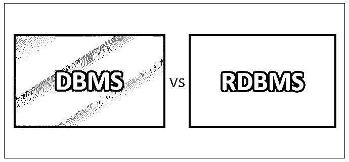
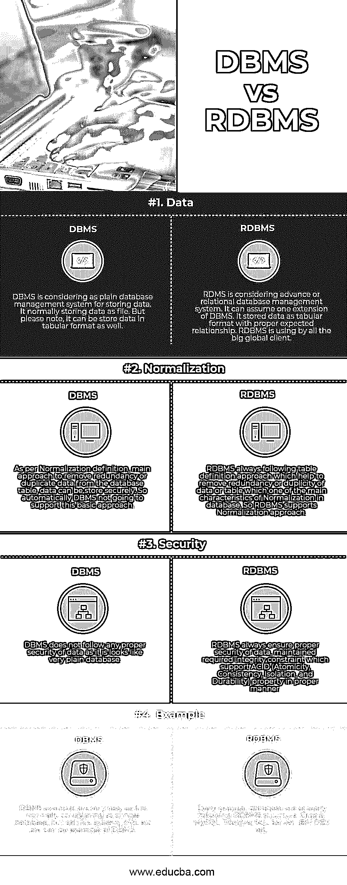

# DBMS 与 RDBMS

> 原文：<https://www.educba.com/dbms-vs-rdbms/>

## DBMS 和 RDBMS 的区别

数据作为文件存储在 DBMS 中，而数据存储在 RDBMS 的表中。即使 DBMS 中有表，它们之间也没有像 RDBMS 那样的关系。在 DBMS 中，数据以分层形式存储。所以 DBMS 中存在父子关系。此外，数据可以存储为网络模型，以便创建图表。表在 RDBMS 中将有一个主键和几个外键。几个表之间的关系也存储在另一个表中。在系统中独立且逻辑上可访问的值被更新。

### DBMS 和 RDBMS 之间的直接比较(信息图表)

以下是 DBMS 和 RDBM 之间的四大区别:

<small>Hadoop、数据科学、统计学&其他</small>

### DBMS 和 RDBMS 的主要区别

让我们讨论一下 DBMS 和 RDBMS 之间的一些主要区别:

1.  任何 DBMS 应用程序总是试图将数据存储为文件。它可以考虑用于任何类型的文件系统，用于不同的操作系统，其中所有内容都存储为 verities 方法的不同节点，或者类似于 XML 文件，其中数据已经存储为 XML。尽管任何 RDBMS 应用程序都是以表格形式存储数据的，但是无论出现什么样的数据，都可以很容易地存储在一个特定的表中，该表维护了正确的主键或外键关系。每一笔交易数据可以顺利插入表格格式，很容易避免任何重复常数。
2.  所有 DBMS 应用程序都以分层或导航形式存储数据，这有助于正确识别这些文件或数据，尤其是在任何已知操作系统中的文件系统或 XML 结构的情况下。和所有以表格格式存储数据的 RDBMS 应用程序，总是有一个特定的标识符作为主键，以限制特定表上任何时候的重复条目。数据总是用一个唯一的标识符存储，并与其他表保持适当的关系。
3.  从概念上讲，DBMS 不遵循规范化方法意味着 DBMS 可能具有数据冗余，对数据库的某些特定特征(如插入、更新或删除)没有任何适当的验证或限制，不遵循任何特定的方法来避免重复数据。而 RDBMS 总是遵循标准化的通用方法，因为它总是以表格格式存储数据，并带有唯一的标识符，如主键，这样可以自动确保避免重复的数据条目，还可以通过维护多个表之间的适当关系来非常灵活地管理数据冗余。因此，像主数据这样的同类重复数据可以存储一次，但可以根据多种需求使用。
4.  DBMS 应用程序从不保证任何特定的数据安全方法，尤其是在数据操作时。由于数据操作是任何数据库的关键任务之一，我们必须确保数据库的安全性，因为 DBMS 将数据保存为文件，所以修改数据很困难。但在 RDMS 的情况下，数据的安全性总是有保证的，因为 RDMS 总是保持适当的完整性约束，以遵循 RDBMS 的共同特征，即 ACID(原子性、一致性、隔离性和持久性)属性。
5.  任何 DBMS 应用程序都以文件形式存储数据。因此它无法维护文件的任何数据之间的任何关系。因此，在数据库应用中，数据的冗余总是在增加。而 RDBMS 数据以表的形式存储，所以很容易维护数据和表的适当关系，这有助于处理大量的数据和容易支持多个用户。

### DBMS 和 RDBMS 对照表

下面是 DBMS 和 RDBMS 之间最重要的比较。

| ****DBMS 与 RDBMS 的比较基础**** | **数据库管理系统** | **RDBMS** |
| **数据** | DBMS 被认为是存储数据的简单数据库管理系统。它通常将数据存储为文件。但是请注意，它也可以以表格格式存储数据。 | RDMS 正在考虑高级或关系数据库管理系统。它可以承担 DBMS 的一个扩展。它将数据存储为具有适当预期关系的表格格式。RDBMS 被所有大型全球客户使用。 |
| **归一化** | 根据规范化定义，这是从数据库表中删除冗余或重复数据的主要方法，可以安全地存储数据。所以 DBMS 不会自动支持这种基本方法。 | RDBMS 总是遵循表定义方法，这有助于消除数据或表的冗余或重复，这是数据库规范化的主要特征之一。所以 RDBMS 支持规范化方法。 |
| **安全** | DBMS 不遵循任何适当的数据安全性，因为它看起来像一个非常简单的数据库。 | RDBMS 总是确保数据的适当安全性，维护所需的完整性约束，以适当的方式支持 ACID(原子性、一致性、隔离性和持久性)属性。 |
| **例子** | DBMS 的例子很少，因为它通常被认为是一个简单的数据库，但文件系统，XML 等都可以是 DBMS 的例子。 | 每个流行的数据库实际上都遵循 RDBMS 结构。Oracle，MySQL，Postgre，SQL Server，IBM DB2 等。 |

### 结论

基于上面的解释，它清楚地得出结论:RDBMS 纯粹是 DBMS 的扩展。在当前流行的市场中，所有与数据库相关的软件在同一个模式中同时拥有 DBMS 和 RDBMS。因此，所有这些软件都很容易与 DBMS 和 RDBMS 兼容。因此，如果今天我们准备一个 RDBMS 应用程序，那么我们可以很容易地说它是一个 DBMS 应用程序，同样的事情我们也可以传达给 DBMS，反之亦然。对于任何类型的业务、解决方案或服务，数字数据都是当前电子媒体平台中的关键信息之一。可以用各种方式存储数据，根据从各种资源获取数据的方法来维护数据。理解适当的业务需求对于决定如何将这些数据保存在数据库中是非常迫切的。

### 推荐文章

这是 DBMS 和 RDBMS 之间最大区别的指南。在这里，我们还将讨论 DBMS 与 RDBMS 的直接比较、主要差异以及信息图表和比较表。你也可以看看下面的文章来了解更多

1.  [HADOOP 与 RDBMS|12 个有用的区别](https://www.educba.com/hadoop-vs-rdbms/)
2.  [电子商务 vs 传统商务](https://www.educba.com/e-commerce-vs-traditional-commerce/)
3.  [Hibernate vs JPA](https://www.educba.com/hibernate-vs-jpa/)
4.  [Weblogic vs Tomcat](https://www.educba.com/weblogic-vs-tomcat/)
5.  [冬眠面试问题:适当的指导](https://www.educba.com/hibernate-interview-questions/)
6.  [WebLogic vs WebSphere:有什么区别](https://www.educba.com/weblogic-and-websphere/)
7.  【RDBMS 与 NoSQL 的区别

