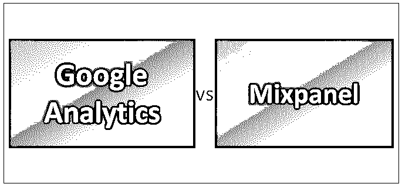

# 谷歌分析 vs Mixpanel

> 原文：<https://www.educba.com/google-analytics-vs-mixpanel/>

## 谷歌分析和 Mixpanel 的区别

如今，web 分析是衡量和分析 web 数据的关键，以便了解跨网页的用户行为。它的重点是分析 web 数据，并确定用户在网站上的活动和行为，即有多少用户访问过，哪些页面被点击，哪些项目搜索得更多等。Web analytics 提供了对数据的洞察，并且它还有助于改善网站的用户体验，因为它测量页面点击量、浏览量、点击量等。为了执行 web 分析，市场上有许多不同的工具，它们足够智能，可以实现您组织的目标。一些最好的网络分析工具是谷歌分析，雅虎网络分析，Adobe 分析，疯狂鸡蛋，Mixpanel，点击故事等。在这里，我们将看到两个最流行的工具之间的详细比较:谷歌分析与 Mixpanel。

这两个工具都有一些重叠的功能，所以让我们比较这两个工具，以选择正确的分析工具。

<small>Hadoop、数据科学、统计学&其他</small>

### Google Analytics 和 Mixpanel 的直接比较(信息图表)

以下是谷歌分析与 Mixpanel 的 9 大对比

### 谷歌分析和 Mixpanel 的主要区别

以下是要点列表，描述了主要区别

尽管这两个工具具有大多数共同的功能，但这两个 Google Analytics 与 Mixpanel 之间的主要差异可以根据它们的速度、跟踪方法、定价模型、数据处理时间和漏斗分析来描述。一些主要差异解释如下:

#### 1.跟踪方法:

谷歌分析的跟踪机制是基于页面的。它通过页面点击量来跟踪网站流量，并收集访问者信息。它使用 javascript 代码进行跟踪。另一方面，Mixpanel 跟踪机制是以事件为中心的，也就是说，它跟踪访问者的行为，而不是页面点击。事件可以是按钮点击、视频冲浪等。

#### 2.实时分析:

对于实时分析，在数据量巨大的情况下，Google Analytics 将需要很长时间来生成报告。数据处理甚至可能需要 24 小时以上。Mixpanel 将是实时跟踪的绝佳选择。它可以在几秒钟内更新全部数据。它是实时数据即时处理的理想选择。

#### 3.漏斗分析:

为了衡量一个访问者进行的一系列活动，需要进行漏斗分析。在谷歌分析的情况下，客户必须提前指定漏斗的所有步骤。这些漏斗可以在每个页面上创建，但它们并不准确。然而，Mixpanel 漏斗分析非常出色。只需几个简单的步骤，用户就可以在混合面板中创建漏斗。该机制非常灵活，数据分析准确。

#### 4.用户跟踪:

为了跟踪个人用户，谷歌分析利用浏览器 cookies。在相同用户从多个设备访问的情况下，这种机制不能很好地工作。Mixpanel 可以通过执行跨设备用户跟踪来解决这个问题。它有能力跟踪个人用户。

#### 5.保留分析:

对于一个小企业来说，Google Analytics 所做的群组分析足以进行决策，但它并不提供诸如访问者最常用的功能，新访问者的行为等分析。Mixapanel 将通过其保留分析功能为您提供所有这些问题的答案。

#### 6.细分和报告:

这两个工具在细分和报告方面都很好。唯一的区别是 Mixpanel 将通过几个简单的步骤来完成，然而，Google Analytics 需要更多的步骤。

#### 7.定价:

谷歌分析提供免费服务，如果你的网站每月点击量少于 1000 万，点击量超过 1000 万就要收费。在 Mixpanel 中，定价模型基于大量数据点。

**Google Analytics 和 Mixpanel 的利弊:**
**1。谷歌分析:**
**优点:**
1。大部分用例免费服务。
2。新功能的频繁发布。
3。学习该工具的免费培训。
4。谷歌分析的标签管理器对非技术用户很有帮助。

**缺点:**
1。缺乏支持。
2。无法执行基于单个用户的分析。
3。不是实时交通监控的好解决方案。

**2。MixPanel:**
**优点:**
1。它允许实时监控。
2。界面易于学习和适应。
3。漏斗分析的一大特色。
4。易于使用和完全支持。
5。复杂得多的 API。
6。直观的机器学习界面

**缺点:**
1。Mixpanel 主要提供付费服务。
2。困难的代码集成过程。

### 谷歌分析与 Mixpanel 对比表

以下是要点列表，描述了这些比较

| **比较的基础** | **谷歌分析** | **混合面板** |
| 历史 | 这个工具是谷歌在 2005 年 11 月推出的 | 于 2009 年在加州旧金山成立 |
| 客户类型 | 适合所有客户类型，即小型、中型以及大型组织或个人用户。 | 它还适用于所有类型的客户，因为它根据客户类别提供不同的计划。 |
| 定价模型 | Google Analytics 为小规模组织提供免费的终身包，它根据客户要求对一些高级功能收费。 | 根据功能需求，Mixpanel 为客户提供了六种不同的定价方案。这是免费的，启动以及企业计划，可以根据需要定制。 |
| 客户支持 | 谷歌分析通过电子邮件和电话向客户提供支持。他们还提供培训课程。 | Mixpanel 还提供对电子邮件和电话的支持；此外，它还提供基于票务系统的支持。 |
| 好的 | 无成本可用性 | 出色的漏斗分析 |
| A/B 测试 | 仅适用于 Web | 仅适用于手机 |
| 速度/数据处理时间 | 从数据生成报告可能需要几个小时 | 数据将在几秒钟内可用 |
| 学问 | 简单易学 | 从跟踪开始，需要一些关于流和事件的知识 |
| 跟踪方法 | 对于基于页面的跟踪 | 对于基于事件的跟踪 |

### 结论

简单来说，Google Analytics 和 Mixpanel 都有一些独特的能力。这取决于客户从其组织中选择合适工具的需求。这些工具都不会花你很多钱。但是在考虑了这两个工具之间的所有差异之后，我们可以得出结论，对于中小型组织，Google Analytics 将会很好地工作，对于需要快速和集中的实时分析和跟踪功能的组织，Mixpanel 将是首选工具。一些客户甚至使用这两种工具的组合来获得两者的优点。

### 推荐文章

这是 Google Analytics 和 Mixpanel 之间的区别，他们的意义，直接比较，关键区别，比较表和结论的指南。您也可以阅读以下文章，了解更多信息——

1.  [通用分析 vs 谷歌分析](https://www.educba.com/universal-analytics-vs-google-analytics/)
2.  [Spark SQL vs Presto](https://www.educba.com/spark-sql-vs-presto/)
3.  [Sqoop vs Flume](https://www.educba.com/sqoop-vs-flume/)
4.  [重要 Talend vs Pentaho](https://www.educba.com/talend-vs-pentaho/)

