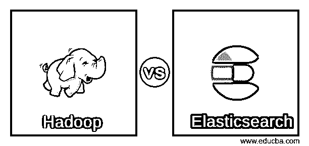
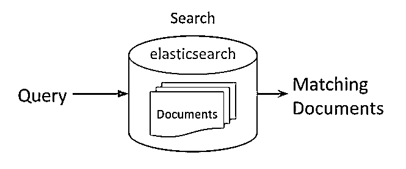

# Hadoop vs Elasticsearch

> 原文：<https://www.educba.com/hadoop-vs-elasticsearch/>

## Hadoop 与 Elasticsearch 的区别

下面这篇文章提供了 Hadoop vs Elasticsearch 的概要。 [Hadoop 是一个框架](https://www.educba.com/what-is-hadoop/)，有助于在几秒钟内处理大量数据，而传统方法无法处理这些数据。以分布式方式并行运行流程需要多台机器的支持。 [Elasticsearch](https://www.educba.com/course/comprehensive-elasticsearch-training/) 的工作方式就像是夹在 [Logstash](https://www.educba.com/what-is-logstash/) 和 Kibana 之间的三明治。Logstash 负责从任何数据源获取数据，而 elastic search 分析数据，最后， [kibana](https://www.educba.com/what-is-kibana/) 给出可操作的见解。这种解决方案使应用程序在复杂的搜索要求或需求中更加强大。

**让我们详细期待一下话题:**

<small>Hadoop、数据科学、统计学&其他</small>

其独特的[数据管理方式](https://www.educba.com/database-management-system/)(专为大数据设计)，其中包括端到端的存储、处理和分析流程。这种独特的方式被称为 MapReduce。开发人员在 MapReduce 框架中编写程序，在分布式处理器上并行运行大量数据。

那么问题就来了，在数据被分发到不同的机器上进行处理之后，输出是如何以类似的方式累积起来的？

答案是，MapReduce 生成一个唯一的键，它被附加到各种机器上的分布式数据中。MapReduce 跟踪数据的处理过程。一旦完成，这个唯一的键就被用来把所有处理过的数据放在一起。这给人一种所有工作都在一台机器上完成的感觉。

Hadoop 的 MapReduce 完美兼顾了可扩展性和可靠性。

以下是 MapReduce 的一些功能:

**1。Map then reduce:** 为了运行一个作业，它被分解成单独的块，这些块被称为 task。对于所有任务，映射器函数将总是首先运行，然后只有 reduce 函数才会出现。只有当 reduce 函数完成了所有分布式任务的工作时，整个过程才会被称为完成。

**2。容错:**举一个场景，当一个节点在处理任务的时候宕机了？该节点的心跳没有到达 MapReduce 引擎或主节点。然后，在这种情况下，主节点将该任务分配给某个不同的节点来完成该任务。此外，未处理和已处理的数据保存在 HDFS (Hadoop 分布式文件系统)中，这是 Hadoop 的存储层，默认复制因子为 3。这意味着，如果一个节点发生故障，仍有两个节点具有相同的数据。

**3。灵活性:**您可以存储任何类型的数据:结构化、半结构化或非结构化。

**4。同步:**同步是 Hadoop 的一个内置特性。这可确保 reduce 仅在所有映射器功能完成其任务后才会启动。“洗牌”和“排序”是使作业输出更平滑的机制。Elasticsearch 是一个基于 JSON 的简单而强大的分析工具，用于文档索引和强大的全文搜索。

在 ELK 中，所有组件都是开源的。ELK 在日志分析、web 分析、商业智能、合规性分析等 IT 环境中发展势头强劲。ELK 适用于需要快速分析和可视化数据的业务。

ELK 是一个很好的工具，适合那些无力购买像 [Splunk](https://www.educba.com/what-is-splunk-tool/) 这样的日志分析产品许可证的科技初创公司。此外，开源产品一直是 IT 行业的焦点。

### Hadoop 和 Elasticsearch 之间的直接比较(信息图)

以下是 Hadoop 和 Elasticsearch 之间的 9 大对比:

Key Difference Between Hadoop and Elasticsearch

以下列出了 Hadoop 和 Elasticsearch 之间的主要区别:

*   Hadoop 拥有为并行数据处理而设计的分布式文件系统，而 ElasticSearch 是搜索引擎。
*   与 es 相比，Hadoop 通过各种工具提供了更大的灵活性。
*   Hadoop 可以存储大量数据，而 ES 不能。
*   Hadoop 可以处理大量的处理和复杂的逻辑，而 ES 只能处理有限的处理和基本的聚合逻辑。

### Hadoop 与 Elasticsearch 对比表

以下是要点列表，描述 Hadoop 和 Elasticsearch 之间的比较。

| **比较的基础** | **Hadoop** | **弹性搜索** |
| **工作原理** | 基于 MapReduce。 | 基于 JSON 和特定领域语言。 |
| **复杂度** | 处理 MapReduce 相对复杂。 | 基于 JSON 的 DSL 非常容易理解和实现。 |
| **模式** | Hadoop 基于 [NoSQL](https://www.educba.com/courses/all/programming-languages/) 技术，因此可以轻松上传任何键值格式的数据。 | ES 建议数据在上传前采用通用的键值格式。 |
| **批量上传** | 批量上传在这里并不具有挑战性。 | ES 拥有一些缓冲限制。但是在分析了故障发生在哪个点之后，这可以被延长。 |
| **设置** | 

*   Setting up Hadoop in a production environment is simple and scalable.
*   Setting up Hadoop cluster is smoother than ES.

 | 

*   Setting ES involves active estimation of the amount of data. In addition, the initial setting also requires trial and error. When the amount of data increases, many settings need to be changed. For example, the fragmentation of each index must be set when the index is initially created. If that requires an adjustment that can't be done. You must create a new one.
*   Setting up the ElasticSearch cluster is error-prone.

 |
| **分析用法** | 带有 HBase 的 Hadoop 不具备 es 那样的高级搜索和分析搜索能力。 | es 中的[分析](https://www.educba.com/courses/all/business-analytics-technology/)更加先进，搜索查询更加成熟。 |
| **支持的编程语言** | Hadoop 没有多种编程语言支持它。 | ES 有很多 Ruby，Lua，Go 等。，这是 Hadoop 中没有的。 |
| **首选用途** | 用于批处理。 | 实时查询和结果。 |
| **可靠性** | Hadoop 从测试环境到生产环境都是可靠的。 | ES 在中小型环境中是可靠的。这不适合存在大量数据中心和集群的生产环境。 |

### 结论

最后，它实际上取决于数据类型、容量和用户正在处理的用例。如果简单的搜索和网络分析是重点，那么弹性搜索是更好的选择。然而，如果有扩展、大量数据和与第三方工具兼容的广泛需求，Hadoop instance 就是解决之道。然而，Hadoop 与 ES 的集成为大型应用程序打开了一个新的世界。充分利用 Hadoop 与 Elasticsearch 的优势，可以提供一个良好的平台来丰富大数据的最大价值。

### 推荐文章

这是 Hadoop 与 Elasticsearch 的对比指南。在这里，我们讨论了 Hadoop 与 Elasticsearch 的主要区别，并提供了信息图表和比较表。您也可以阅读以下文章，了解更多信息——

1.  [Hadoop vs Apache Spark](https://www.educba.com/hadoop-vs-apache-spark/)
2.  [HADOOP 与 RDBMS |了解 12 个有用的区别](https://www.educba.com/hadoop-vs-rdbms/)
3.  [Hadoop vs HBase](https://www.educba.com/hadoop-vs-hbase/)
4.  [Hadoop vs 红移](https://www.educba.com/hadoop-vs-redshift/)

