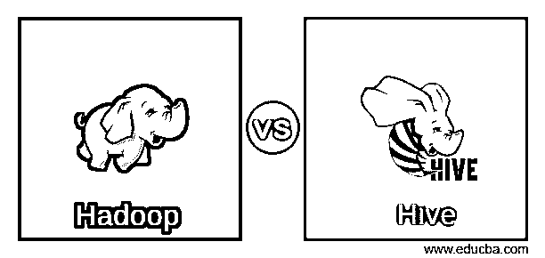
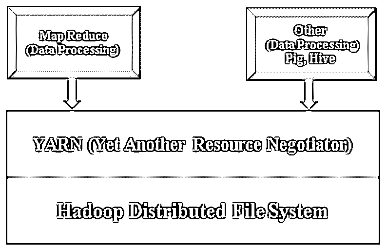
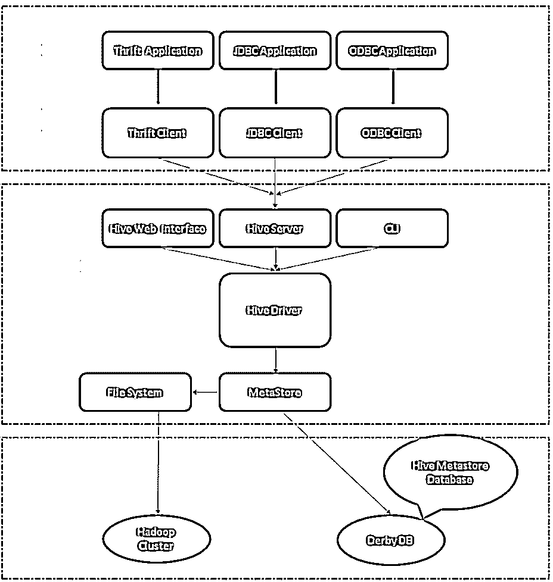

# Hadoop vs Hive

> 原文：<https://www.educba.com/hadoop-vs-hive/>

## Hadoop 和 Hive 的区别

[Hadoop 是](https://www.educba.com/what-is-hadoop/)一种框架或软件，是为了管理海量数据或大数据而发明的。Hadoop 用于存储和处理分布在商用服务器集群中的大数据。Hadoop 使用 Hadoop 分布式文件系统存储数据，并使用 Map-Reduce 编程模型处理/查询数据。Hive 是一个在 Hadoop 框架上运行的应用程序，它提供类似 SQL 的接口来处理/查询数据。在成为 Apache-Hadoop 项目的一部分之前，Hive 由脸书设计和开发。配置单元使用 HQL(配置单元查询语言)运行其查询。Hive 拥有与 RDBMS 相同的[结构，几乎相同的命令可以在 Hive 中使用。Hive 可以将数据存储在外部表中，因此不强制使用 HDFS，它还支持 ORC、Avro 文件、序列文件和文本文件等文件格式。](https://www.educba.com/what-is-rdbms/)

### Hadoop 的主要组件

<small>Hadoop、数据科学、统计学&其他</small>

**图 1，一个 Hadoop 组件的基本架构。**

**Hadoop Base/Common:**Hadoop Common 将为您提供一个安装其所有组件的平台。

**HDFS (Hadoop 分布式文件系统):** HDFS 是 [Hadoop 框架的主要部分](https://www.educba.com/hadoop-framework/)它负责管理 Hadoop 集群中的所有数据。它在主/从架构上工作，并使用复制来存储数据。

#### 主/从架构和复制

*   **主节点/名称节点:**名称节点存储 HDFS HDFS 存储的每个块/文件的元数据，只能有一个主节点(在 HA 的情况下，另一个主节点将作为第二主节点)。
*   **从节点/数据节点:**数据节点包含块中的实际数据文件。HDFS 可以有多个数据节点。
*   **复制:** HDFS 通过将数据分成块来存储数据。默认的块大小是 64 MB。由于复制数据存储在 3 个(默认复制系数，可以根据需要增加)不同的数据节点中，因此在任何节点出现故障的情况下，丢失数据的可能性最小。

**YARN(另一个资源协商者):**它主要用于管理 Hadoop 资源，在用户应用程序的调度中也起着重要的作用。

**MR (Map Reduce):** 这是 Hadoop 的基本编程模型。它用于在 Hadoop 框架内处理/查询数据。

### Hive 的主要组件

**图 2，Hive 的架构&它的主要组件。**

**Hive 客户端:**不仅仅是 SQL，Hive 还支持使用 ODBC、JDBC、Thrift 等各种驱动的 [Java、C、Python](https://www.educba.com/web-programming-languages/) 等编程语言。人们可以用其他语言编写任何 hive 客户端应用程序，并可以使用这些客户端在 Hive 中运行。

**Hive 服务:**在 Hive 服务下，执行命令和查询。Hive Web 界面有五个子组件。

*   配置单元提供的默认命令行界面，用于执行配置单元查询/命令。
*   Hive Web 界面:这是一个简单的图形用户界面。它是 Hive 命令行的替代选项，用于在 Hive 应用程序中运行查询和命令。
*   **Hive Server:** 又叫 Apache Thrift。它负责从不同的命令行界面获取命令，并将所有命令/查询提交给 Hive，还检索最终结果。
*   **Apache Hive 驱动程序:**它负责客户端从 CLI、web UI、ODBC、JDBC 或 Thrift 接口获取输入，并将信息传递给存储所有文件信息的 metastore。
*   **Metastore:** Metastore 是存储所有配置单元元数据信息的存储库。Hive 的元数据存储诸如表的结构、分区&列类型等信息。

**Hive Storage:** 它是执行实际任务的位置，从 Hive 运行的所有查询都在 Hive Storage 内部执行操作。

### Hadoop 和 Hive 的直接对比(信息图)

以下是 Hadoop 与 Hive 的 8 大区别:

### Hadoop 和 Hive 的主要区别

以下是描述 Hadoop 和 Hive 之间主要差异的要点列表:

1.Hadoop 是一个处理/查询大数据的框架，而 Hive 是一个基于 SQL 的工具，构建在 Hadoop 之上以处理数据。

2.Hive 使用 HQL (Hive 查询语言)处理/查询所有数据，这是一种类似 SQL 的语言，而 Hadoop 只能理解 Map Reduce。

3. [Map Reduce 是](https://www.educba.com/what-is-mapreduce-in-hadoop/)Hadoop 不可或缺的一部分，Hive 的查询首先被转换成 Map Reduce，然后由 Hadoop 处理来查询数据。

4.Hive 使用类似 SQL 的查询，而 Hadoop 只使用基于 Java 的 Map Reduce 来理解它。

5.在 Hive 中，早期使用的传统“关系数据库”命令也可以用于查询大数据，而在 Hadoop 中，必须使用与传统 Java 不相似的 Java 编写复杂的 Map Reduce 程序。

6.Hive 只能处理/查询结构化数据，而 Hadoop 适用于所有类型的数据，无论是结构化、非结构化还是半结构化数据。

7.使用 Hive，人们可以处理/查询数据，而无需复杂的编程，而在简单的 Hadoop 生态系统中，需要为相同的数据编写复杂的 Java 程序。

8.一方面 Hadoop 框架需要 100 行来准备基于 Java 的 MR 程序，另一方面 Hadoop with Hive 可以使用 8 到 10 行 HQL 来查询相同的数据。

9.在 Hive 中，很难将一个查询的输出作为另一个查询的输入插入，而使用 Hadoop with MR 可以轻松完成相同的查询。

10.当 Hadoop 在 HDFS (Hadoop 分布式文件系统)中存储其所有元数据时，并不强制在 [Hadoop 集群](https://www.educba.com/what-is-hadoop-cluster/)中拥有 Metastore。

### hadoop 与 hive 对比表

让我们看看 Hadoop 和 Hive 的对比表:

| **比较点** | **鼠标** | **Hadoop** |
| **设计和开发** | 脸谱网 | 谷歌 |
| **数据存储位置** |  数据可以存储在外部表，HBase 或 HDFS。 | 仅限 HDFS。 |
| **语言支持** | HQL(蜂巢查询语言) |  它可以使用多种编程语言，如 Java、Python、Scala 等等。 |
| **数据类型** | 它只能处理结构化数据。 |  它可以处理结构化、非结构化和半结构化数据。 |
| **数据处理框架** |  HQL(蜂巢查询语言) | 用 Java 写的 Map Reduce 程序而已。 |
| **计算框架** | 类似 SQL 的语言。 | SQL 和非 SQL。 |
| **数据库** |  Derby(默认)也支持 MYSQL、Oracle… | HBase，Cassandra 等。 |
| **编程框架** |  基于 SQL 的编程框架。 | 基于 Java 的编程框架。 |

### 结论

Hadoop 和 Hive 都用于处理大数据。Hadoop 是一个框架，为其他应用程序提供查询/处理大数据的平台，而 Hive 只是一个基于 SQL 的应用程序，使用 HQL (Hive 查询语言)处理数据

Hadoop 可以在没有 Hive 的情况下使用来处理大数据，而没有 Hadoop 就不容易使用 Hive。作为结论，我们无论如何、在任何方面都不能把 Hadoop 和 Hive 相提并论。Hadoop 和 Hive 是完全不同的。对于大数据用户来说，同时运行这两种技术可以使大数据查询过程变得更加容易和舒适。

### 推荐文章:

这是 Hadoop vs Hive 的指南。在这里，我们讨论 Hadoop 和 Hive 的组件，通过信息图和比较表进行面对面的比较。您也可以阅读以下文章，了解更多信息——

1.  [Hadoop vs Apache Spark——你需要知道的有趣事情](https://www.educba.com/hadoop-vs-apache-spark/)
2.  [HADOOP 与 RDBMS |了解 12 个有用的区别](https://www.educba.com/hadoop-vs-rdbms/)
3.  [大数据如何改变医疗保健的面貌](https://www.educba.com/healthcare-facilities/)
4.  [Hadoop vs Spark 的惊人指南](https://www.educba.com/hadoop-vs-spark/)

