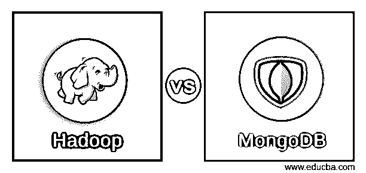

# Hadoop vs MongoDB

> 原文：<https://www.educba.com/hadoop-vs-mongodb/>

## Hadoop 和 MongoDB 的区别

Hadoop 是一个开源平台，用于存储和处理海量数据。它是一个基于 Java 的应用程序，包含分布式文件系统、资源管理、数据处理和其他组件的接口。

MongoDB 主要是为数据存储和检索而构建的。它还可以执行数据处理和可伸缩性。它是基于 C++的，属于 NoSQL 家族。相反，它不依赖于创建关系表；它将其记录存储为文档。

<small>Hadoop、数据科学、统计学&其他</small>

许多公司使用 Hadoop 和 MongoDB 平台来创建自己的大数据应用程序:

*   MongoDB 使用其平台进行实时操作流程，帮助最终用户和业务流程。
*   另一方面，Hadoop 从 MongoDB 获取数据；将不同来源的数据混合起来，产生机器学习模型，MongoDB 将使用它进行实时操作流程。

### Hadoop 和 MongoDB 之间的直接比较

Hadoop 和 MongoDB 在数据划分和一致性方面都很优秀，但是与 RDBMS 相比，它们在数据可用性方面表现不佳。以下是 Hadoop 和 MongoDB 的 9 大对比:

### 

Hadoop 和 MongoDB 的主要区别

Hadoop 与 MongoDB 之间的差异将在以下几点进行解释:

*   Hadoop 基于 Java，而 MongoDB 是用 C++语言编写的。
*   Hadoop 是一套产品，而 MongoDB 是一个独立的产品。
*   Hadoop 的硬件成本更高，因为它是不同软件的集合。然而，与 Hadoop 相比，MongoDB 的硬件成本更低。
*   与 Hadoop 相比，MongoDB 更加灵活，它可以取代现有的 RDBMS。另一方面，Hadoop 也可以执行所有任务，但需要添加其他软件。
*   MongoDB 具有地理空间索引功能，这在地理空间分析中非常有用。这个特性在 Hadoop 中并不容易实现。
*   Hadoop 最适合大规模处理应用，而 MongoDB 最适合实时数据挖掘和处理。
*   MongoDB 属于 NoSQL 家族，而 Hadoop 使用 SQL 来处理数据。
*   Hadoop 在格式数据上比较灵活；它可以是任何可用的格式，而 MongoDB 只导入 [CSV 和 JSON](https://www.educba.com/json-vs-csv/) 格式的数据。
*   Hadoop 是一个可以有很多软件进行处理的框架，而 MongoDB 是一个数据库类型。

### Hadoop 和 MongoDB 对照表

下面是比较表

| **比较依据** | **MongoDB** | **Hadoop** |
| **RDBMS 系统** | 它旨在取代或增强 RDBMS 系统，为其提供各种用例。 | 这并不意味着要取代 RDBMS 系统，而是作为一种补充，帮助归档数据或提供重要的用例。 |
| **概要** | 它实际上是一个数据库，是用 C++写的。 | 创建数据处理框架的不同软件的集合。它是基于 Java 的应用程序。 |
| **框架** | 将数据存储在集合中，可以一次查询每个数据字段。数据存储为二进制 JSON 或 BSON，可用于查询、聚合、索引和复制。 | 由不同的软件组成，重要的组件是 Hadoop 分布式文件系统(HDFS)和 MapReduce。 |
| **强度** | 它提供了比 Hadoop 更强大、更灵活的解决方案。可以取代现有的 RDBMS。 | Hadoop 最大的优势在于它是为处理大数据而构建的。它非常适合处理批处理和长时间运行的 ETL 作业。 |
| **设计好的** | 旨在处理和分析大量数据。 | 这是一个数据库，主要用于数据存储和检索。 |
| **弱点** | 关于 MongoDB 的主要抱怨是容错问题，这会导致数据丢失。 | 它主要依赖于“NameNode”，这是唯一的失败点 |
| **数据格式** | 应该是 CSV 或 JSON 格式，以便导入数据。 | 可以是任何可用的格式，它可以处理结构化和非结构化数据。 |
| **硬件成本** | 成本效益，因为它是一个单一的产品。 | 成本更多，因为它是一个软件集合。 |
| **内存处理** | 高效处理内存，因为它是用 C++编写的 | 它具有优化空间利用率的能力，这是 MongoDB 所缺乏的。 |

### 结论

上述差异表明，对于需要大量数据处理和结构化的海量数据，Hadoop 是最佳选择。MongoDB 最适合需要实时处理和高数据可用性的数据。

*   在任何组织中，数据都是非常重要的，数据每天都在增长，单个应用程序不可能处理如此庞大的数据量。强烈建议任何处理大数据的组织都应该同时使用 Hadoop 和 MongoDB。
*   有了所有的建议，非常重要的是要知道 Hadoop 和 MongoDB 都不是为了吹嘘安全性而构建的。这两个应用程序都意味着以其优秀的特性和很少的缺点来管理大量的数据。
*   如果您的组织拥有低延迟的实时数据，或者需要完全删除现有的 RDBMS 并启动新的事务系统，那么您需要使用 MongoDB。
*   如果您的组织需要一个批处理解决方案，在运行分析的同时仍然能够利用 SQL 和查询数据，那么 Hadoop 是最佳选择。
*   由于众所周知 Hadoop 可以处理大量数据，提供大规模解决方案，因此可以考虑它的灵活性和可扩展性。无论哪种方式，即使 MongoDB 在分析大量复杂数据的可伸缩性方面也非常出色，并且比 RDBMS 更高效。
*   当 Hadoop 和 MongoDB 同时使用时，它可以解决彼此的缺点和优点。
*   这两个平台都可以用作大数据解决方案，但了解这些解决方案是否可以与您的业务环境结合使用非常重要。如果配置不正确，将会给这些平台及其数据带来灾难。

### 推荐文章

这是 Hadoop vs MongoDB 的指南。在这里，我们还将讨论 Hadoop 与 MongoDB 的直接比较、主要差异以及信息图表和比较表。您也可以查看以下文章以了解更多信息—

1.  [节点 JS vs Java 对比](https://www.educba.com/java-vs-node-js/)
2.  [Hadoop 与 SQL 的 6 大最佳对比](https://www.educba.com/hadoop-vs-sql/)
3.  [Hadoop 与红移的区别](https://www.educba.com/hadoop-vs-redshift/)
4.  [使用 MongoDB 的网络应用](https://www.educba.com/how-to-build-web-applications-using-mongodb/)
5.  [HADOOP 与 RDBMS |了解 12 个有用的区别](https://www.educba.com/hadoop-vs-rdbms/)
6.  [Hadoop vs Spark:有什么好处](https://www.educba.com/hadoop-vs-spark/)
7.  [MongoDB vs PostgreSQL:差异](https://www.educba.com/mongodb-vs-postgresql/)
8.  [MongoDB 与 Hadoop 有哪些区别](https://www.educba.com/hadoop-vs-mongodb/)
9.  [关于 MongoDB vs Cassandra 的惊人指南](https://www.educba.com/mongodb-vs-cassandra/)

