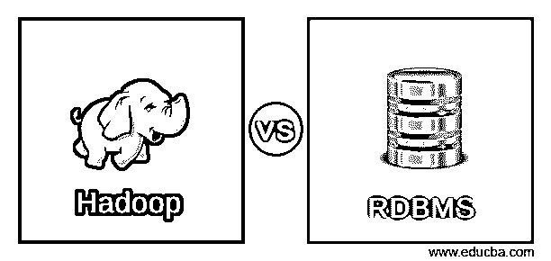

# Hadoop 与 RDBMS

> 原文：<https://www.educba.com/hadoop-vs-rdbms/>

## Hadoop 与 RDBMS 的区别

Hadoop 软件框架的工作是非常结构化的半结构化和非结构化数据。它还实时支持各种数据格式，如 XML、JSON 和基于文本的平面文件格式。 [RDBMS 高效工作](https://www.educba.com/dbms-vs-rdbms/)当存在定义完善的实体关系流时，因此数据库模式或结构可以增长，否则不受管理。即，RDBMS 很好地处理结构化数据。在需要[大数据处理](https://www.educba.com/big-data-concepts/)的环境中，Hadoop 将是一个很好的选择，在这些环境中，正在处理的数据没有可靠的关系。

### Hadoop 是什么？

[Hadoop 从根本上说](https://www.educba.com/what-is-hadoop/)是一种开源基础设施[软件框架](https://www.educba.com/defect-life-cycle/)，允许分布式存储和处理大量数据，即大数据。这是一个[集群](https://www.educba.com/courses/all/cluster-analysis-technology/)系统，采用主从架构。因此，通过这种架构，可以并行存储和处理大量数据。不同类型的数据可以被分析、结构化(表格)、非结构化(日志、电子邮件正文、博客文本)和半结构化(媒体文件元数据、XML、HTML)。

<small>Hadoop、数据科学、统计学&其他</small>

### Hadoop 的组件

1.  **HDFS:** Hadoop 分布式文件系统。谷歌发表了论文 GFS，并在此基础上开发了 HDFS。它声明文件将被分成块并存储在分布式体系结构的节点中。道格切割和雅虎！对模型 GFS 进行逆向工程，构建并行 Hadoop 分布式文件系统(HDFS)
2.  **Yarn:** 另一个资源协商器用于[作业调度](https://www.educba.com/job-searching/)并管理集群。它是在 Hadoop 2 中引入的。
3.  **Map Reduce:** 这是一个框架，帮助 Java 程序使用键值对对数据进行并行计算。该映射获取输入数据，并将其转换为可以在键值对中计算的数据集。Map 的输出由 reduce 任务消耗，然后 reducer 的输出给出期望的结果。
4.  **Hadoop 常用:**这些 Java 库用于启动 Hadoop，并被其他 Hadoop 模块使用。

### 什么是 RDBMS？

RDBMS 代表关系数据库管理系统。[它是基于 Edgar F. Codd 在 1970 年规定的关系模型的数据库系统](https://www.educba.com/what-is-rdbms/)。Oracle server、My SQL、IBM DB2 等数据库管理软件都是基于关系型[数据库管理系统](https://www.educba.com/database-management-system-advantages/)。

[RDBMS](https://www.educba.com/what-is-rdbms/) 中表示的数据是行或元组的形式。该表基本上是相关数据对象的集合，由列和行组成。规范化在 RDBMS 中起着至关重要的作用。它包含表的组，每个表包含主键。

### RDBMS 的组件

下面提到了 RDBMS 的组成部分。

#### 桌子

在 RDBMS 中，表是以垂直加水平网格形式存储的记录。它由一组字段组成，例如数据的名称、地址和产品。

#### 行

每个表格中的行代表水平值。

#### 列

表中的列是水平存储的，每一列代表一个数据字段。

#### 键

它们是每行数据的识别标签。

Hadoop 和 RDBMS 对于存储、处理和检索数据/信息有不同的概念。Hadoop 是市场上的新产品，但 RDBMS 大约是。50 岁。久而久之，数据正以指数曲线增长，对[数据分析](https://www.educba.com/data-analysis-techniques/)和报告的需求也在增长。

在当前行业中，在合理的时间内存储和处理如此大量的数据变得至关重要。RDBMS 更适合于关系数据，因为它处理的是表。关系数据库的主要特性包括在维护和加强某些数据关系的同时使用表进行数据存储的能力。

### Hadoop 和 RDBMS 之间的直接比较(信息图表)

以下是 Hadoop 和 RDBMS 之间的 8 大区别:

### Hadoop 和 RDBMS 的主要区别

以下是 Hadoop 和 RDBMS 之间的主要区别:

RDBMS 能很好地处理结构化数据。在需要[大数据处理](https://www.educba.com/big-data-concepts/)的环境中，Hadoop 将是一个不错的选择，在这些环境中，正在处理的数据没有可靠的关系。当数据的大小对于复杂的处理和存储来说太大或者不容易定义数据之间的关系时，那么将提取的信息以一致的关系保存在 RDBMS 中就变得很困难。Hadoop 软件框架的工作是非常结构化的半结构化和非结构化数据。RDBMS 数据库技术是一种非常可靠、一致、成熟的技术，并得到了世界上最好的公司的大力支持。它能很好地处理数据描述，如[数据类型](https://www.educba.com/database-management-system-advantages/)，数据之间的关系，约束等。因此，这更适合于在线事务处理(OLTP)。

与 Bigdata 和 Hadoop 相比，RDBMS 的未来会如何？你认为 RDBMS 会很快被废除吗？

**“RDBMS 和 Hadoop 之间现在没有关系，它们将是互补的。这与淘汰和替换无关:我们不会淘汰 RDBMS 或 MPP，而是使用正确的工具来完成正确的工作——这在很大程度上取决于价格。”——alis dair Anderson 在 Hadoop 峰会上说。**

 **### Hadoop 和 RDBMS 对照表

下面是 Hadoop 和 RDBMS 的对比表。

| **功能** | **RDBMS** | **Hadoop** |
| **数据种类** | 主要针对结构化数据。 | 用于结构化、半结构化和非结构化数据 |
| **数据存储** | 平均尺寸数据(GBS) | 用于大型数据集(TB 和 Pbs) |
| **查询** | SQL 语言 | HQL(蜂巢查询语言) |
| **模式** | 写入时需要(静态模式) | 阅读时需要(动态模式) |
| **速度** | 阅读速度很快 | 读写都很快 |
| **成本** | 许可证 | 自由的 |
| **用例** | [OLTP](https://www.educba.com/what-is-oltp/) (在线交易处理) | 分析(音频、视频、日志等)，数据发现 |
| **数据对象** | 处理关系表 | 处理键/值对 |
| **吞吐量** | 低的 | 高的 |
| **可扩展性** | 垂直的 | 水平的 |
| **硬件配置文件** | 高端服务器 | 商品/实用硬件 |
| **完整性** | 高(酸性) | 低的 |

### 结论

通过以上比较，我们已经知道，与 RDBMS 相比，HADOOP 是处理大数据的最佳技术。随着时间的推移，使用的数据越来越多，因此更好地处理如此大量的数据成为一项令人紧张的任务。大数据的分析和存储只有借助 Hadoop 生态系统才比传统的 RDBMS 方便。Hadoop 是一个大规模的开源软件框架，致力于可扩展、分布式、数据密集型计算。该框架将大型数据分解为较小的可并行化数据集并处理调度，将每个部分映射到中间值，容错、可靠，并支持数千个节点和数 Pb 的数据，目前用于开发、生产和测试环境和实施选项。

### 推荐文章

这是 Hadoop 与 RDBMS 的对比指南。在这里，我们讨论了 Hadoop 与 RDBMS 的直接比较、主要差异以及信息图和比较表。您也可以阅读以下文章，了解更多信息——

1.  [节点 JS 与 Java 差异](https://www.educba.com/java-vs-node-js/)
2.  [找出 Java 与 Node JS 的区别](https://www.educba.com/java-vs-node-js/)
3.  [如何破解 Hadoop 开发者面试？](https://www.educba.com/hadoop-developer-interview-questions/)
4.  [Hadoop vs Apache Spark——你需要知道的有趣事情](https://www.educba.com/hadoop-vs-apache-spark/)
5.  [为什么创新是大数据最关键的方面？](https://www.educba.com/why-innovation-is-the-most-critical-aspect-of-big-data/)
6.  [想了解 Hadoop vs Spark](https://www.educba.com/hadoop-vs-spark/)

**