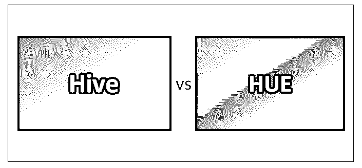

# 蜂巢 vs 色调

> 原文：<https://www.educba.com/hive-vs-hue/>

## 蜂房和色调的区别

[大数据](https://www.educba.com/big-data-vs-data-science/)简单来说就是结构化和非结构化业务数据的组合。大数据处理当前业务的日常事务性数据，本质上非常复杂。自诞生以来，大数据就被评为全球市场上最好的[人工智能](https://www.educba.com/artificial-intelligence-tools-applications/)工具之一。然而，大数据在存储、大小、分析、搜索、共享和向业务用户呈现数据方面有其自身的局限性。

由服务器、数据库和用户组成的传统企业方法由最终用户发起。但是，数据库服务器在单个处理器上处理大量数据时遇到了瓶颈。为了克服这个限制，Google 引入了 Map Reduce 算法，它可以在一组分布式系统中处理数据。这个算法和大数据后来被 Doug Cutting 和他的团队转化为一个开源的 Java 框架，称为 [Hadoop](https://www.educba.com/hadoop-vs-hive/) 。Hadoop 由全球多家供应商分发，具体取决于他们的业务需求。本文旨在阐明[大数据技术，即 Hive](https://www.educba.com/hive-installation/) 和 Hue。

<small>Hadoop、数据科学、统计学&其他</small>

Hadoop 生态系统中的大多数操作都是通过命令行界面进行的，但在 Hadoop 的初始版本中并没有设计任何用户界面。Hue 是一个 web 用户界面，它执行 Hadoop 生态系统或基于 Hadoop 的框架的一些常见[活动。Hue 由一个名为 Cloudera 的开源 Hadoop 框架推出并开发。](https://www.educba.com/hadoop-ecosystem/)

Hive 是由脸书在开发的初始阶段推出的，后来被 Apache 软件基金会接管。Hive 上的这个 Apache 项目已经将其嵌入到 Hadoop 生态系统中。Hive 旨在与存储在 HDFS (Hadoop 发行版文件系统)中的数据进行交互。Hive 类似于类似 SQL 的查询语言。Hive 基本上是用来查询和检索来自 HDFS 的数据。这种使用 Hive 的查询语言被称为 HiveQL 或 HQL。

### Hive 和 Hue 的直接对比(信息图)

以下是 Hive 和 HUE 的 6 大对比:

### Hive 和 Hue 的主要区别

以下是描述 Hive 和 HUE 之间主要区别的要点列表:

*   Hue 是一个 web 用户界面，它在基于 Cloudera 的 Hadoop 框架中提供了许多服务。一些关键功能包括 HDFS 文件浏览器、Pig 编辑器、Hive 编辑器、作业浏览器、Hadoop shell、用户管理权限、Impala 编辑器、Ozzie web 界面和 Hadoop API 访问。但是，Hive 是一种分析 SQL 查询语言，可以查询或操作存储在数据库中的数据。Hive 的一些关键功能包括 Map-Reduce 算法、OLAP(在线分析处理)、在数据库上创建模式、执行 DML 和 DDL 操作，如在 HDFS 上创建、更改、插入、选择、更新、删除、删除语句。
*   Hue 提供了一个 web 用户界面以及浏览 HDFS 的文件路径。这种 web UI 布局帮助用户浏览文件，类似于普通的 windows 用户在自己的机器上查找文件。Hue 中的这一附加功能还可以帮助用户通过 web UI 在不同的目录之间手动上传或移动文件。存储在 HDFS 上的文件可以使用 Hue 上的文件浏览器选项进行访问。对于不喜欢 UNIX 命令行界面的用户来说，Hue 是一个方便的工具。但是，Hive 是用来创建模式、数据库和查询数据库的。Hive 中的 DML & DDL 语句(创建、更改、插入、选择、更新、删除、丢弃)帮助用户根据业务需求分析存储在 HDFS 上的数据。 [Hive 可以手动处理](https://www.educba.com/hive-installation/)，将文本文件中的数据上传到表格中。但是它不能跨不同的目录移动文件。
*   Hue 提供了一个用户界面来跟踪 map reduce 作业的作业状态。这些作业可以通过 web 用户界面上的作业浏览器选项进行浏览。色调上的工作状态以颜色编码的形式表示(红色、绿色、黄色和黑色)。绿色-成功完成的作业，黄色-当前正在运行的作业，红色-失败的作业，黑色-用户手动放弃的作业。但是，另一方面，Hive 使用 Map-Reduce 算法来处理存储在 HDFS 上的数据。Hive 既可以使用命令行界面操作，也可以使用 Hue 之类的 web 编辑器操作。Hive 通常用于分析复杂的非结构化数据。使用 Hive 执行的这种类型的分析操作在 Hadoop 生态系统中被安排为 Map-Reduce 作业。
*   Hue 为像 [Hive](https://www.educba.com/course/hive-concepts-and-managing-data-in-hive/) 这样的编程语言提供了一个 web 用户界面，这可以成为用户在执行查询时避免语法错误的便捷工具。在成功执行查询后，Hue 还会返回结果集和日志。Hue 还以图表(饼图和条形图)的形式为用户提供数据分析。可以通过 Hue 上的查询编辑器选项访问配置单元编辑器。但是，没有 hue 的 Hive 无法通过 web 编辑器访问。[可视化效果](https://www.educba.com/data-visualisation-vs-data-analytics/)无法使用 Hive 创建。Hive 仅在命令提示符级别显示结果集。
*   Hue 允许用户在 HDFS 上创建和配置文件权限。可以通过浏览器上列出的安全选项来访问文件权限和用户角色。Hue 为用户提供跟踪 Ozzie 工作流的功能，以处理作业浏览器上安排的作业。Hue 还允许用户通过 metastore 管理器和数据库编辑器浏览和访问表和数据库。但是，Hive 已经使用 Kerberos 2.0 身份验证和 Hadoop 集群进行了保护。无法使用 Hive 跟踪使用 Ozzie 安排的工作流。所有以模式和数据库形式存储的数据也可以使用 HiveQL 或 Hive 查看。

### 蜂房和色调对照表

下面是 Hive 和 Hue 的对比表。

| **比较的基础** | **t1**鼠标**** | **色相** |
| **发明者/发明** | Hive 是由 Apache 软件基金会推出的。 | Hue 由 Cloudera 推出。 |
| **范围/含义** | Hive 或 [HiveQL](https://www.educba.com/hiveql/) 是一种分析查询语言，用于处理和检索数据仓库中的数据。 | Hue 是一个 Web UI，方便用户与 Hadoop 生态系统进行交互。 |
| **安装/配置** | 可以使用 Hadoop 生态系统的命令行界面安装或配置 Hive。 | 只能使用 web 浏览器安装或配置 Hue。 |
| **Functionality** | Hive 使用 map-reduce 算法来处理和分析数据。 | Hue 提供了 Web UI 编辑器来访问 Hive 和其他编程语言。 |
| **实施** | Hive 是使用命令行界面或 web UI 界面实现和访问的。 | Hue 在 web 浏览器上实现，可以访问安装在 Cloudera 上的多个程序。 |
| **依赖关系** | Hive 可以跨多个 [Hadoop 框架](https://www.educba.com/hadoop-framework/)嵌入。 | Hue 仅在基于 Cloudera 的 Hadoop 框架上可用。 |

### 结论

总之，我们介绍了大数据技术 Hive 与 Hue 的简介、主要差异和一些比较。我们还看到了 Hive 中的一些[相似之处，它们也存在于 SQL 查询语言中。Hue 是一个一站式网络](https://www.educba.com/what-is-a-hive/) [UI 应用](https://www.educba.com/ui-design-tools/)，拥有跨越 [Hadoop 大数据生态系统](https://www.educba.com/hadoop-ecosystem/)的所有服务。Hive 和 Hue 都可以在基于 Hadoop 的框架中使用和配置，具体取决于最终用户的需求。网上有很多信息以及预配置的 Hadoop 虚拟机，可以让你对 Hive & Hue 实现有一个简单的了解。Hive 和 Hue 都在现代大数据分析中扮演着关键角色。

### 推荐文章

这是一个蜂巢 vs 顺化的指南。在这里，我们讨论了 Hive 与 Hue 的直接比较、关键差异以及信息图和比较表。您也可以阅读以下文章，了解更多信息——

1.  [Hadoop 与 Hive–找出最佳差异](https://www.educba.com/hadoop-vs-hive/)
2.  [蜂巢 vs 黑斑羚](https://www.educba.com/hive-vs-impala/)

