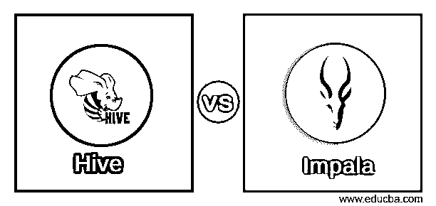

# 蜂巢 vs 黑斑羚

> 原文：<https://www.educba.com/hive-vs-impala/>

## 蜂巢和黑斑羚的区别

Hive 是一个建立在 APACHE HADOOP 之上的数据仓库软件项目，由脸书的 Jeff 团队开发，目前发布了 2.3.0 的稳定版本。用于汇总[大数据](https://www.educba.com/big-data-vs-data-science/)，方便查询分析。Apache [Hive 是 Hadoop 中 SQL 的有效标准](https://www.educba.com/hive-installation/)。Impala 是一个运行在 Apache Hadoop 上的并行处理 SQL 查询引擎，用于处理存储在[h base](https://www.educba.com/hbase-vs-cassandra/)([Hadoop Database](https://www.educba.com/hadoop-database/))和 Hadoop 分布式文件系统中的数据。Impala 是一个开源产品，用于并行处理(MPP) SQL 查询引擎，用于存储在 Apache Hadoop 上运行的本地系统集群中的数据。Apache Hive 和 Impala 都是 Hadoop 系统的关键部分。

**所以让我们来详细研究一下蜂巢和黑斑羚:**

<small>Hadoop、数据科学、统计学&其他</small>

**鼠标**

*   Apache Hive 有助于分析存储在 Hadoop 文件系统(HDFS)和其他兼容文件系统中的庞大数据集。
*   hive QL–用于查询存储在 [Hadoop 集群](https://www.educba.com/what-is-hadoop-cluster/)中的数据。
*   通过翻译利用 Hadoop 的可扩展性。
*   配置单元不是一个完整的数据库。
*   它不提供记录级更新。
*   Hadoop 是面向批处理的系统。
*   由于 MapReduce，配置单元查询具有高延迟。
*   蜂巢不提供它接近 [OLAP](https://www.educba.com/what-is-olap/) 的功能。
*   最适合数据仓库应用。
*   通过 MapReduce 执行查询。
*   查询语言可用于自定义标量函数(UDF 函数)、聚合函数(UDAF 函数)和表函数(UDTF 函数)。
*   Hive 还提供索引加速，索引类型包括压缩和位图索引从 0.10 开始，更多的索引类型正在计划中。
*   Hive 支持的存储类型有 RCfile、HBase、ORC 和纯文本。
*   类似 SQL 的查询(Hive QL)，它们被隐式转换成 MapReduce 或 Tez，或者 Spark 作业。
*   默认情况下，Hive 将元数据存储在嵌入式 Apache Derby 数据库中。

**黑斑羚**

*   [Impala 是一个运行在 Hadoop 上的](https://www.educba.com/what-is-impala/)查询引擎。It 公测版于 2012 年 10 月发布，并于 2013 年 5 月正式发布。
*   它支持 HDFS[Apache h base](https://www.educba.com/apache-hbase/)存储和亚马逊 S3。
*   读取 Hadoop 文件格式，包括文本、拼花、Avro、RCFile、LZO 和序列文件。
*   支持 Hadoop 安全性(Kerberos 身份验证)。
*   使用 Apache Hive 中的元数据、ODBC 驱动程序和 SQL 语法。
*   它支持多种压缩编解码器:

(a) Snappy(因其在压缩比和解压缩速度之间的有效平衡而被推荐)，

(b) Gzip(当实现最高级别的压缩时推荐)，

(c) Deflate(文本文件不支持)、Bzip2、LZO(仅适用于文本文件)；

*   它允许您查询嵌套结构，包括映射、结构和数组。
*   它允许多用户并发查询，还允许基于查询的优先级和队列的准入控制。

### 蜂巢和黑斑羚的面对面比较(信息图)

以下是 Hive 和 Impala 的 20 大对比:

### 蜂巢和黑斑羚的主要区别

Hive 和 Impala 的区别如下:

*   Hive 是由杰夫在脸书的团队开发的，而 Impala 是由 Apache 软件基金会开发的。
*   Hive 支持 Zlib 压缩的优化行列(ORC)格式的文件格式，而 Impala 支持 snappy 压缩的 Parquet 格式。
*   Hive 是 Java 写的但是 Impala 是 C++写的。
*   Hive 中的查询处理速度很慢，但 Impala 比 Hive 快 6-69 倍。
*   蜂房的潜伏期很长，但黑斑羚的潜伏期很短。
*   Hive 支持 RC 文件和 ORC 的存储，但是 Impala 存储支持的是 Hadoop 和 Apache HBase。
*   Hive 在编译时生成查询表达式，但在 Impala 中,“大循环”的代码生成发生在运行时。
*   Hive 不支持并行处理，但 Impala 支持并行处理。
*   Hive 支持 MapReduce，但 Impala 不支持 MapReduce。
*   在 Hive 中，没有安全特性，但是 Impala 支持 Kerberos 认证。
*   在兼容性和速度都很重要的任何项目的升级中，Hive 是理想的选择，但对于新项目，Impala 是理想的选择。
*   Hive 是容错的，但是 Impala 不支持容错。
*   Hive 支持复杂类型，但 Impala 不支持复杂类型。
*   Hive 是基于批处理的 Hadoop MapReduce，而 Impala 是 MPP 数据库。
*   Hive 不支持交互式计算，但 Impala 支持交互式计算。
*   Hive 查询有一个“冷启动”的问题，但是在 Impala 守护进程中，进程是在启动时启动的。
*   Hive 资源管理器是 YARN(又一个资源协商器)，但是在 Impala 中，资源管理器是 native *YARN。
*   Hive 发行版都是 Hadoop 发行版，Hortonworks (Tez，LLAP)但是在 Impala 发行版是 Cloudera MapR (* [Amazon EMR](https://www.educba.com/aws-emr/) )。
*   Hive 的受众是数据工程师，而 Impala 的受众是数据分析师和数据科学家。
*   蜂箱的吞吐量很高，但黑斑羚的吞吐量很低。

### 蜂巢和黑斑羚对照表

蜂巢和黑斑羚之间的主要比较在下面讨论。

| **序列号** | **比较依据** | **鼠标** | **黑斑羚** |
| **1。** | **由**开发 | 脸谱网 | Apache 软件基金会 |
| **2。** | **文件格式** | 

*   Sequence file.
*   Text file.
*   Optimize ORC format with Zlib compression.
*   RC file format.

 | 

*   It has a crisp and compressed patchwork format.
*   欧罗欧欧欧罗欧欧欧欧欧欧欧欧欧欧欧欧欧欧欧欧欧欧欧欧欧欧欧欧欧欧欧欧欧欧欧欧欧
*   LZO
*   Sequence file.

 |
| **3。** | **语言** | 用 JAVA 写的 | 用 C++写的 |
| **4。** | **加工速度** | 蜂巢很慢 | 黑斑羚速度很快 |
| **5。** | **等待时间** | 高的 | 低的 |
| **6。** | **存储支持** | RC 档，ORC | Hadoop，Apache HBase |
| 7 .**。** | **代码转换** | 在**编译**时生成查询表达式 | 代码生成发生在运行时。 |
| **8。** | **支持并行处理** | 不 | 是 |
| **9。** | **MapReduce 支持** | 是 | 不 |
| 10。 | **Hadoop 安全性** | 不 | 支持 Kerberos 身份验证。 |
| **11。** | **用途** | 项目升级的理想选择 | 开始新项目的理想选择。 |
| **12。** | **容错** | Hive 是容错的。 | 不支持容错。 |
| 13。 | **复杂类型** | [Hive 支持](https://www.educba.com/hive-installation/)复杂类型。 | Impala 不支持复杂类型。 |
| **14。** | **数据库类型** | Hive 是一个基于批处理的 Hadoop MapReduce。 | 这是 MPP 数据库 |
| 15。 | **互动计算** | 不支持交互式计算。 | 支持交互式计算。 |
| 16。 | **执行** | 配置单元查询有“冷启动”问题 | Impala 进程总是在守护进程启动时启动。 |
| **17。** | **资源管理** | 故事 | 天然*纱线 |
| 18。 | **分布** | HIVE–所有 Hadoop 发行版，Horton works(LLAP 技术开发中心) | Cloudera MapR，
(*亚马逊 EMR) |
| **19。** | **观众** | 数据工程师 | 数据分析师/数据科学家 |
| 20。 | **吞吐量** | 高流通量 | 低吞吐量 |

### 结论

在本文中，我们尝试展示了什么是两种技术，即 Hive 和 Impala，以及这些技术之间的基本区别。实际上，我们可以说 Hive 和 Impala 不是竞争对手，它们都属于同一个基础，即执行查询的 MapReduce，两者的使用可能会产生差异。根据我们的需要，我们可以一起使用它，或者根据兼容性、需要和性能选择最佳方案。Hive 查询语言是 **Hive QL** ，这是一种非常通用的语言，而 Impala 是内存密集型的，不适合处理大量数据操作，例如连接查询。如果在你的项目中，工作与大量数据的批处理相关，那么[配置单元](https://www.educba.com/hive-interview-questions/)会更好，如果你的工作与数据的实时处理相关，那么 Impala 会更好。

### 推荐文章

这是一个蜂巢 vs 黑斑羚的指南。在这里，我们已经讨论了 Hive 和 Impala 的直接比较，主要差异，以及信息图和比较表。您也可以阅读以下文章，了解更多信息——

1.  [Apache Hive vs Apache Spark SQL–13 个惊人的差异](https://www.educba.com/apache-hive-vs-apache-spark-sql/)
2.  [Hive VS HUE——值得学习的 6 大有用对比](https://www.educba.com/hive-vs-hue/)
3.  [Hadoop 与 Hive–找出最佳差异](https://www.educba.com/hadoop-vs-hive/)
4.  [在配置单元中使用 ORDER BY 函数](https://www.educba.com/hive-group-by/)
5.  [Impala 数据库完整指南](https://www.educba.com/impala-database/)

