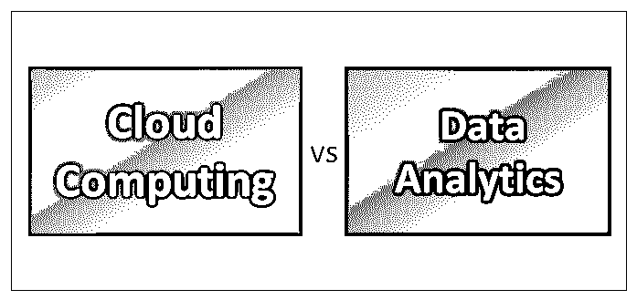

# 云计算与数据分析

> 原文：<https://www.educba.com/cloud-computing-vs-data-analytics/>

## 云计算和数据分析的区别

云计算是指从数据中心交付 IT 即服务。“云”这个词被用来比喻互联网，因为它拥有巨大的资源库和信息，可以满足不同用户的需求。云中的资源包括服务器、带宽、网络、存储等。以及软件和操作系统平台。云使 IT 资源作为一种工具可用，这类似于我们家中的电力工具。云计算的概念来源于计算架构，如网格计算和虚拟化相结合以提供实用服务计算。

云涉及资源(硬件和软件)的集中化，这些资源作为服务提供。云服务由云服务提供商(CSP)提供。CSP 的一些例子是 Amazon Web services、Microsoft Azure、Google、IBM 等。消费者/用户基于消耗的每种资源以及一段时间内可用的资源来计费。云具有许多优势，这使得它成为各种规模组织的最理想选择。云的一些特征包括，

<small>Hadoop、数据科学、统计学&其他</small>

*   可扩展性、可用性、可靠性和健壮性
*   经济高效且灵活
*   增强的商业价值和灵活性
*   提高运营效率

[云服务分为服务模型](https://www.educba.com/cloud-service-models/)和部署模型。服务模式包括:

*   基础设施即服务(IaaS)
*   平台即服务(PaaS)
*   软件即服务(SaaS)

云部署模式包括:

*   **私有云:**这种模式是内部或外包的私有数据中心基础设施，具有良好的安全性，但价格昂贵。
*   **公有云:**这是一种性价比很高的模式，大部分可以在网上免费获得。例子包括 Google Gmail，Google Drive 等。这里的数据并不完全安全。
*   **混合云:**这种模式是私有云和公有云模式的结合。安全性是这里的一个问题。

所有的云资源和模型都可以通过互联网获得。使用任何标准的浏览器软件或任何连接到互联网的设备都可以访问该资源。

由于新技术的出现，我们正在目睹大数据的泛滥，这是由于企业与消费者、企业与企业以及组织之间的交互发生了巨大变化。新数据不断产生，尤其是在面向客户的组织中，在所有交易的每个阶段。正确建模后，所有这些数据都可以进行分析，以支持组织中的有效决策。因此，由各种设备和互联网推动的数据增长有可能带来前所未有的机遇。

数据分析可以理解为分析建模或为准确的定量分析准备数据。需要数据分析来提取有洞察力的信息，以推动持续改进并了解趋势和业务绩效。因此，分析被理解为对来自大数据源的数据进行测量和估计。实时流数据的新分析趋势能够快速响应多变的需求、更高的质量和价值，为数字化驱动的组织铺平了道路。

处理来自多个来源的大数据需要高端计算系统和网络，云服务提供商可以轻松提供这些系统和网络。数据分析可以在云中使用，因为它可以确保高水平的效率以及处理互联网上大量大数据的计算和存储能力。因此，数据分析已成为组织从不同数据源获取与其产品或服务相关的宝贵见解的必要手段。

数据分析对组织非常重要，因为它有助于，

*   通过识别冗余流程或操作降低成本
*   了解客户偏好，提供定制产品或服务，从而提高竞争力
*   基于当前信息做出更快、更有效的决策

### 面对面比较云计算和数据分析(信息图表)

以下是云计算与数据分析之间的五大对比

### 

云计算与数据分析的主要区别

下面是提到的主要差异:

*   云计算和数据分析平台都可以帮助组织降低成本、提高效率，从而实现业务敏捷性。然而，云计算是一种提供连续和动态 IT 服务的技术或基础设施，而数据分析是一种从多个来源聚合数据的技术，用于[数据建模](https://www.educba.com/data-modeling-tools/)和为更深入的分析做数据准备。
*   云为大数据应用提供可扩展的计算、存储和网络带宽能力。另一方面，数据分析需要 IT 基础架构来高速处理传入的数据流并对其建模。因此，云和数据分析可以一起进行。
*   云服务为所有类型的数据密集型流程提供解决方案。这与执行深入洞察和发现以提高组织绩效的分析相反。
*   云基础设施可以与现有系统很好地集成，因此它们可以链接整个组织的不同部门和数据，以构建一个集中的数据模型。与分布式数据存储相比，数据分析在集中式数据中更容易执行。
*   云服务是通过互联网访问的，因此组织可以利用开发的分析模型与其他组织合作，监控市场并获得竞争力。

### 云计算与数据分析对比表

云计算与数据分析之间的差异在以下几点进行了解释:

| **比较依据** | **云计算** | **数据分析** |
| 意义 | 

*   IT service delivery infrastructure, which can be used for different service and deployment models.

 | 

*   A framework or tool for processing data from multiple streams to create an analysis model for gaining insight

 |
| 概念 | 

*   Provide access to IT resources through the Internet
*   Involving virtualization and abstraction. IT is characterized by availability, robustness, flexibility and scalability to support various IT requirements.

 | 

*   It involves analysis algorithms, mathematics, statistics, mining and other technologies.
*   Modeling and analyzing data from multiple sources
*   Tools can model and manage big data sources.

 |
| 形成的基础 | 

*   Cloud service infrastructure delivers dynamic IT services to organizations.
*   IT service standardization
*   Ensure IT management cost reduction
*   Outsourcing system

 | 

*   Help organizations achieve competitiveness.
*   Establish a data model for data-driven discovery and innovation
*   Integrate data from multiple sources in real time
*   Support effective decision-making based on actual information

 |
| 应用领域 | 

*   How big is the application of cloud it service delivery.
*   Meet all kinds of enterprise computing and IT infrastructure needs
*   Implemented by almost all departments (products and services)
*   Cloud services can be customized for all organizations, regardless of their size.

 | 

*   Big data modeling and analysis
*   Business and personal insight
*   Medical care-disease diagnosis and prediction
*   Retail solutions
*   Understand consumer behavior
*   finance
*   Risk management and fraud detection

 |
| 方法 | 

*   Outsourcing IT services
*   IT cost reduction
*   And launch innovative new products or service.
*   Shorten time to market
*   Customers need to have service availability and robustness.

 | 

*   Verify the effectiveness of business processes.
*   Improve operational efficiency
*   Monitor organizational performance

 |

### 结论

因此，综上所述，值得注意的是云计算服务和最理想的数据分析应用。这是因为，随着大数据的快速增长，组织需要一个适当且充分的环境来管理由云服务支持的大数据流程。在组织中，云计算和数据分析技术实施将相互补充，以实现更好的性能和价值。

### 推荐文章

这是云计算与数据分析、它们的含义、直接比较、主要差异、比较表和结论的指南。您也可以阅读以下文章，了解更多信息——

1.  [Azure Paas 与 Iaas——您需要知道的最好的事情](https://www.educba.com/azure-paas-vs-iaas/)
2.  [兴奋地想知道——什么是云计算&它是如何工作的？](https://www.educba.com/cloud-computing-features/)
3.  [数据可视化与数据分析——你需要知道的 7 件事](https://www.educba.com/data-visualisation-vs-data-analytics/)
4.  [如何在云技术领域开始职业生涯](https://www.educba.com/cloud-computing-technology/)
5.  [5 个必须知道的挑战&大数据分析解决方案](https://www.educba.com/challenges-of-big-data-analytics/)

