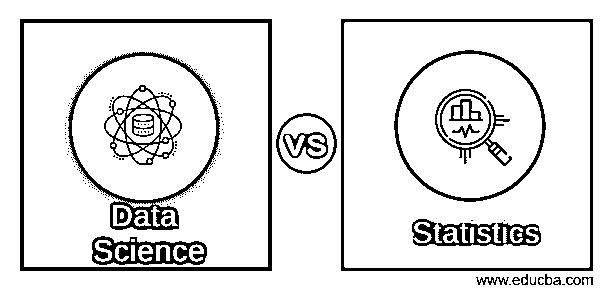

# 数据科学与统计学

> 原文：<https://www.educba.com/data-science-vs-statistics/>

## 数据科学与统计学的区别

数据科学是计算领域快速发展的趋势之一，是一个广阔的多学科领域。数据科学结合了计算机科学、软件工程、数学和统计、编程、经济学和商业管理等学科的应用。数据科学基于大量信息的收集、准备、分析、管理、可视化和存储。简单来说，数据科学可以被理解为与包括[大数据](https://www.educba.com/big-data-vs-data-science/)和计算机科学在内的数据库有着紧密的联系。数据科学家是指拥有与所解决问题相关的足够领域知识的个人。

大数据与数据科学紧密结合，事实上，在不同的应用程序和使用案例中，大数据也随之发展。我们知道，大数据大多以非结构化格式提供，并且包含非数字数据。有用的信息很容易被淹没在由博客、音频/视频文件、图像、短信、社交网络等组成的大数据中。所有这些数据都只是噪音，除非对其进行分析，并从中提取有用的信息。此外，由于社交网络日益增长的作用及其商业潜力，如今企业将互联网视为他们的主要信息渠道。数据科学家对所有这些数据非常感兴趣，因为通过使用这些数据，可以为组织和社会解决许多问题。

<small>Hadoop、数据科学、统计学&其他</small>

[数据科学](https://www.educba.com/data-science-career/)是一项专业技能，可以理解为:

*   4A 的设计和实施——数据架构、采集、分析和归档
*   应用数学和统计学中的高级技术对数据进行建模，以便进行深入分析
*   足够的编程和开发技能，算法开发技能
*   分析和道德推理技能
*   沟通和商业技能

因此，很明显，数据科学是一个跨学科的领域，需要各种技能来掌握这个领域。数据科学中的用例与[数据分析](https://www.educba.com/8-data-analytics-trends-that-will-dominate-2019/)相似——它们从清晰的问题陈述和决策开始，最终以定义良好的指标结束。因此，数据科学家被认为熟悉业务模型和范例，他们提出好的业务问题，以从给定的数据集中获得有意义的见解。

统计学是另一个涉及数据研究的广泛学科，广泛应用于众多领域。统计学提供了从数据中得出结论的方法。它给出了收集数据、分析数据和解释结果的不同方法，并被科学家、研究人员和数学家广泛用于解决问题。统计是数据密集型活动的同义词，即收集、处理和解释经过处理的数据。

虽然统计学提供了数据收集和分析的方法，但它有助于从数字和分类数据中获取信息。分类数据是指独特的数据，例如一个人的血型、婚姻状况等。统计学在与数据相关的研究中非常重要，

*   决定解决给定问题所需的数据类型
*   组织和汇总数据
*   从数据中得出结论的分析
*   评估结果的有效性并评估不确定性

统计提供的方法包括:

*   为规划和开展研究而设计
*   包含探索和总结数据的描述
*   利用数据所代表的现象进行预测和推断

### 数据科学和统计学之间的直接比较(信息图表)

以下是数据科学和统计学之间的五大对比:

### 数据科学和统计学的主要区别

下面给出了数据科学和统计学之间的主要区别:

*   数据科学结合了多学科领域和计算来解释数据以进行决策，而统计学是指使用量化模型来表示给定数据集的数学分析。
*   数据科学更倾向于大数据领域，它寻求从大量复杂数据中提供洞察信息。另一方面，统计学提供了从数据中收集、分析和得出结论的方法。
*   数据科学使用工具、技术和原理将大量数据筛选和分类到适当的数据集或模型中。这与统计学相反，统计学将自己局限于诸如频率分析、均值、中值、[方差分析](https://www.educba.com/variance-analysis-formula/)、相关和回归等工具。
*   数据科学将调查和检查数据，以推断事实，定量和统计推断。这与统计学相反，统计学侧重于使用涉及数学公式和方法的标准技术进行分析。
*   数据科学家必须具备分析和简化问题的技能，使用复杂的数据集来计算信息，而统计学家将使用数字和定量分析技术。

### 数据科学与统计对照表

数据科学与统计学之间的差异将在以下几点进行解释

| **比较依据** | **数据科学** | **统计数据** |
| **意为** | 

*   Interdisciplinary field of science and technology
*   Similar to the process, algorithm and system of data mining
*   Extracting insight information from data (structured or unstructured)

 | 

*   Provides a series of methods to represent data.
*   A branch of mathematics
*   The method of designing experiment is provided.
*   Collection, analysis and presentation of planned data for further evaluation

 |
| **概念** | 

*   Based on scientific computing technology
*   Including machine learning, other analysis processes, business models
*   Using Advanced Mathematics and Statistics to Get New Information from Big Data
*   A wide range of disciplines, involving programming, understanding of business models, trends and so on.

 | 

*   It is the science of statistics.
*   It is used to measure or estimate attributes.
*   Apply statistical functions or algorithms to data sets to determine values suitable for the problem under study.

 |
| **形成的基础** | 

*   Solve data-related problems
*   Modeling and analyzing big data to understand trends, patterns, behaviors and business performance.
*   Support decision

 | 

*   Design and formulate real-world problems based on data
*   Represent data in the form of tables, charts and graphs.
*   Understand the skills of data analysis.
*   Support decision

 |
| **应用领域** | 

*   medical system
*   finance
*   Fraud and Intrusion Detection
*   Manufacturing, engineering
*   Market analysis, etc.

 | 

*   business and trade
*   industry
*   Population research, economics
*   psychology
*   And biophysical science.
*   Astronomy and so on.

 |
| **接近** | 

*   Using random data to apply scientific methods to solve problems
*   Determine the data requirements of a given problem
*   Determine the techniques to achieve the desired results.
*   Use data to provide value to the organization.

 | 

*   Use mathematical formulas, models and concepts
*   Analyze random data
*   Estimate the values of different data attributes.
*   Determine behavior based on data

 |

### 结论

总之，可以指出的是，数据科学和统计学是不可区分的，而且密切相关。很明显，统计学是数据科学的工具或方法，而数据科学是一个广阔的领域，其中统计方法是一个重要的组成部分。数据科学和统计学将继续存在，这两个学科之间有很大的重叠。还要注意的是，不是所有的统计学家都能成为数据科学家，反之亦然。数据科学最近随着大数据而发展，并将在未来几年继续发展，因为数据增长似乎永无止境。

### 推荐文章

这是数据科学与统计学的指南。在这里，我们讨论了数据科学与统计的直接比较、关键差异以及信息图和比较表。您也可以阅读以下文章，了解更多信息——

1.  [数据科学 Vs 数据工程](https://www.educba.com/data-science-vs-data-engineering/)
2.  [统计学或机器学习](https://www.educba.com/statistics-vs-machine-learning/)
3.  [数据科学 vs 软件工程](https://www.educba.com/data-science-vs-software-engineering/)
4.  [数据科学 vs 机器学习](https://www.educba.com/data-science-vs-machine-learning/)

