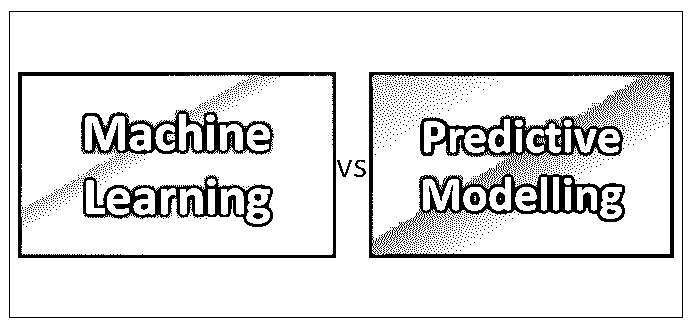

# 机器学习与预测建模

> 原文：<https://www.educba.com/machine-learning-vs-predictive-modelling/>

## 机器学习和预测建模之间的差异

机器学习是计算机科学的一个领域，它使用认知学习方法对系统进行编程，而不需要显式编程。换句话说，众所周知，随着经验的增加，这些机器会发展得更好。
机器学习与其他数学技术相关，也与[数据挖掘](https://www.educba.com/data-mining-techniques/)相关，后者包括监督和非监督学习等术语。
[预测建模](https://www.educba.com/course/predictive-modling-and-implementation-using-ms-excel/)另一方面，是一种利用统计学进行预测的数学技术。它的目的是在事件触发后，根据提供的信息得出最终结论。

简而言之，当谈到数据分析时，机器学习是一种用于设计和生成复杂算法和模型的方法，这些算法和模型有助于预测。这通常被称为商业用途中的预测分析，研究人员、工程师、数据科学家和其他分析师使用它来做出决策并提供结果，以及通过利用历史学习来揭示隐藏的见解。在这篇文章中，我们将详细研究这些差异。

<small>Hadoop、数据科学、统计学&其他</small>

### 机器学习与预测建模的面对面比较(信息图)

以下是机器学习和预测建模之间的 8 大对比:

### 机器学习和预测建模之间的主要区别

以下是要点列表，描述了机器学习和预测建模之间的主要区别:

1.  机器学习是一种人工智能技术，其中算法被给予数据，并被要求在没有一套预定的规则和规定的情况下进行处理，而[预测分析](https://www.educba.com/predictive-analysis-vs-forecasting/)是对历史数据以及现有外部数据的分析，以发现模式和行为。
2.  机器学习算法被训练来从它们过去的错误中学习以提高未来的性能，而预测算法仅基于关于未来事件的历史数据来做出明智的预测
3.  机器学习是新一代技术，它基于更好的算法和大量数据，而预测分析是一项研究，而不是在机器学习出现之前很久就存在的特定[技术](https://www.educba.com/technology-to-improve-productivity/)。艾伦·图灵在第二次世界大战期间就已经利用这种技术破译了这些信息。
4.  机器学习的相关实践和学习技术包括监督和非监督学习，而对于预测分析，它是描述性分析、诊断性分析、预测性分析、规定性分析等。
5.  一旦我们的机器学习模型针对相对较小的数据集进行了训练和测试，那么同样的方法可以应用于隐藏数据。数据实际上不需要有偏差，因为这会导致糟糕的决策。在预测分析的情况下，当数据是完整的、准确的和实质性的时，它是有用的。最初接收数据时，需要注意数据质量。组织利用这一点来预测预报、消费者行为，并根据他们的发现做出合理的决定。一个成功的案例肯定会促进业务和公司的收入。

### 机器学习与预测建模对照表

以下是显示机器学习和预测建模之间的比较的要点列表。

| **比较依据** | **机器学习** | **预测建模** |
| **定义** | 用于设计复杂算法和模型以进行预测的方法。这是预测建模背后的核心原则 | 基本描述性分析的高级形式，利用当前和历史数据集来提供结果。这可以说是机器学习的子集和应用。 |
| **作案手法** | 自适应技术，系统足够智能，能够在添加一组新数据时进行适应和学习，而无需直接编程。先前的计算将用于提供有效的结果 | 已知模型利用分类器和检测理论来猜测给定一组输入数据的结果的概率 |
| **方法和模型** | 

*   Decision tree learning
*   Association rule learning
*   artificial neural network
*   [Deep learning](https://www.educba.com/course/deep-learning-tutorials/)
*   Inductive logic programming
*   support vector machine
*   cluster
*   Bayesian network
*   [Intensive learning](https://www.educba.com/supervised-learning-vs-reinforcement-learning/)
*   Express learning
*   Similarity and metric learning
*   Sparse dictionary learning
*   inheritance

 | 

*   Packet data processing method
*   [Naive Bayes](https://www.educba.com/naive-bayes-algorithm/)
*   K- nearest neighbor algorithm
*   Majority classifier
*   support vector machine
*   Boosting tree
*   Random forest
*   Cart (classification and regression tree)
*   spark
*   neural network
*   (American Cinema Editors)美国电影电视剪接师协会和 AVAS
*   Ordinary least square method

 |
| **应用程序** | 

*   bioinformatics
*   brain-computer interface
*   Classify DNA sequences
*   Computational anatomy
*   Computer vision
*   Object recognition
*   Detecting credit card fraud
*   [Network fraud detection](https://www.educba.com/fraud-detection-analytics/)
*   linguistics
*   marketing management
*   machineperception
*   medical diagnosis
*   economics
*   insurance

*   Sequential mining
*   Sentiment Analysis
*   And handwriting recognition.
*   Financial market analysis
*   time series prediction

 | 

*   Uplift modeling
*   archaeology
*   [Customer Relationship Management](https://www.educba.com/customer-relationship-management-tools/)
*   auto insurance
*   medical care
*   algorithmic trading
*   Remarkable features of predictive modeling
*   Limitations of data fitting
*   Marketing activity optimization
*   Fraud detection
*   risk reduction
*   And improve and simplify operations.
*   Customer maintenance
*   Customer segmentation
*   Prevent loss
*   Financial modeling
*   Market trends and analysis
*   Credit score

 |
| **更新处理** | 统计模型会自动更新 | 数据科学家需要多次手动运行模型 |
| **需求澄清** | 需要提供一组适当的需求和业务理由 | 需要阐明一组适当的业务理由和需求 |
| **驾驶技术** | 机器学习是数据驱动的 | 预测建模是用例驱动的 |
| **弊端** | 

*   [处理不连续的损失函数](https://www.educba.com/loss-functions-in-machine-learning/),这些函数很难区分、优化和合并到机器学习算法中
*   问题需要非常具有描述性，以便找到正确的算法来应用 ML 解决方案
*   在该算法投入实际使用之前，需要创建大量数据需求和训练数据，如深度学习数据

 | 

*   Need a lot of data, the more historical data, the more accurate the results.
*   All past trends and patterns are needed.
*   The voting failure takes into account a specific set of parameters, which are not real-time, so the current scene will affect the voting.
*   Human resource analysis is hindered by the lack of understanding of human behavior.

 |

### 结论

这两种技术都在各自的领域为世界各地的组织提供解决方案。像谷歌、亚马逊、IBM 等顶级组织。正在大力投资这些人工智能和机器学习算法，以更好、更有效的方式解决现实世界的问题。这是由你来决定什么样的方法，你的业务需要。请在下面的评论区给我们写信，告诉我们哪项技术以何种方式让你受益。
关注我们的博客，获取更多基于大数据和当前技术的文章。

### 推荐文章

这是机器学习与预测建模的指南。在这里，我们讨论了机器学习与预测建模的直接比较、关键差异以及信息图表和比较表。您也可以阅读以下文章，了解更多信息——

1.  [统计 vs 机器学习](https://www.educba.com/statistics-vs-machine-learning/)
2.  [13 种最佳预测分析工具](https://www.educba.com/predictive-analytics-tool/)
3.  [预测分析或预测](https://www.educba.com/predictive-analysis-vs-forecasting/)
4.  [什么是强化学习？](https://www.educba.com/what-is-reinforcement-learning/)

