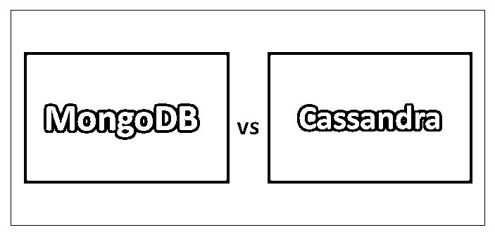

# MongoDB vs Cassandra

> 原文：<https://www.educba.com/mongodb-vs-cassandra/>

## MongoDB 和 Cassandra 的区别

Mongo DB 是一个开源的免费数据库软件，是一个 NoSQL 类型的数据库程序。它支持跨平台，是一个面向文档的数据库。它是基于 C++、C 和 JavaScript 编程语言编写的。MongoDB 是在 Apache 许可下授权的。它支持不同的操作系统，如 Windows、Linux、免费 BSD、Linux、OS X、Solaris 等。Apache Cassandra 是一个开源和免费分发的非 SQL 数据库管理系统,开发和设计用于处理跨分布式商用服务器的大规模数据。Cassandra a No SQL 数据库的主要目标是简单的设计结构、高可用性和水平伸缩性等。

**让我们更详细地研究一下 MongoDB 和 Apache Cassandra:**

<small>Hadoop、数据科学、统计学&其他</small>

*   Mongo DB 也有各种许可版本。它由 MongoDB Inc .开发，于 2009 年首次出现并发布。MongoDB 也可以用作文件系统。Apache Cassandra 由 Apache Software Foundation 开发，最初于 2008 年发布。它支持跨平台操作系统 Cassandra 数据库提供高可用性和零单点故障。
*   在可扩展性的情况下也是赢的。与关系数据库相比，NoSQL 数据库通过遵循 ACID(原子性、一致性、隔离性和持久性)属性来支持强大的查询和事务。
*   Apache Cassandra 具有弹性可伸缩性、快速线性性能、易于分布的架构、更快的查询和事务支持、更快的读写能力。它最初是在脸书开发的，用于搜索收件箱中的信息，后来由脸书开源。Cassandra 有一种叫做 CQL [的查询语言，也就是 Cassandra 查询语言](https://www.educba.com/cassandra-query-language/)。

### MongoDB 和 Cassandra 的正面比较(信息图)

以下是 MongoDB 和 Cassandra 的 10 大区别:

### MongoDB 和 Cassandra 的主要区别

让我们讨论一下 MongoDB 和 Cassandra 之间的一些主要差异:

1.  Mongo DB 支持特别查询、复制、索引、文件存储、负载平衡、聚合、事务、集合等。，而 Apache Cassandra 有主要的核心组件，如节点、数据中心、内存表、集群、提交日志等。
2.  Mongo DB 存储数据的方式是将数据存储在磁盘上的 BSON 文件中，而 Apache Cassandra Node 将数据存储在其中，其数据中心由所有节点组成。
3.  Mongo DB 集群包含不同的组件，如 shard、mongos 和 config 服务器，用于存储元数据信息和配置设置细节，而 Apache [Cassandra 集群](https://www.educba.com/cassandra-cluster/)分布在不同的机器上，用于处理故障和维护副本，以保持高可用性的操作和事务。
4.  Mongo DB 的工作方式是复制整个服务器中的所有实例，这不是针对单个数据库级别完成的，而 Apache Cassandra 有一个复制因子，它定义了跨不同机器接收多个数据副本的数据副本数量，以保持容错和高可用性。
5.  Mongo DB 可以方便地向整个集合中的每个文档添加一个新字段，这是可适应的，而 Apache Cassandra 除了传统的基于关系的数据库系统之外，还可以随时随地添加列。
6.  Mongo DB 支持不同类型的数据类型以及一些二进制数据和对象类型，而 Apache Cassandra 处理非结构化数据，并具有灵活的模式来处理数据读写操作。
7.  Mongo DB 架构的设计方式是，当数据按照要求增长时，它会使用其内置功能在共享集群中自动平衡数据，而 Apache Cassandra 是基于宽列的存储架构[，基于大数据技术](https://www.educba.com/big-data-technologies/)和 Dynamo DB 数据库。
8.  Mongo DB 在引擎排名方面排名前 5，而 Apache Cassandra 在 DB 引擎排名的受欢迎程度和趋势方面得分较低。
9.  Mongo DB 发布于 2009 年，而 Apache Cassandra 最初发布于 2008 年 2 月。
10.  Mongo DB 支持 Linux、Solaris、Windows、BSD、OS X 等多种跨平台操作系统。而 Apache Cassandra 支持 Linux、OS X、Windows、BSD 操作系统。
11.  Mongo DB 支持 Java，Perl，PHP，node.js，C++，C#。NET，Python 等。而 Apache Cassandra 支持大多数流行的面向对象编程语言，如 C#、C++、Java、Go、Erlang、JavaScript、Perl、PHP、Python、Ruby、Scala 等。

### MongoDB 和 Cassandra 对照表

下面讨论 MongoDB 和 Cassandra 之间的主要比较:

| **比较的基础** | **MongoDB** | 卡桑德拉 |
| **执照** | 开放源代码没有在 Apache 许可下许可的 SQL 数据库 | 开源没有由 Apache 开源项目开发的 SQL 数据库 |
| **环境** | 由 MongoDB Inc .开发，支持跨平台系统 | 由 Apache 项目提供，对分布式环境很有用 |
| **性能** | 由于模式简单，提供了更快的查询执行性能 | 提供高度可扩展的线性性能 |
| **可扩展性** | 在 MongoDB 中编写可伸缩性是有限的 | 高可扩展性。 |
| **定价** | 开源，依赖于实现，也有不同的许可版本 | 开源并依赖于实现 |
| **速度** | 在读取操作方面不比 Cassandra 快 | 对于较小脚本的查询更快 |
| **查询速度** | 执行多查询时降低网络速度 | 多查询执行能力 |
| **数据整合** | 快速灵活地使用不同的应用程序和工具，如大数据。 | 快速灵活地使用不同的工具 |
| **数据格式** | BSON 和 JSON 数据格式。 | 没有 SQL，JSON 数据格式。 |
| **易用性** | 更容易编写脚本 | 更容易编写脚本和查询。 |

### 结论

Mongo DB 不是 SQL 和面向文档的数据库，Apache Cassandra 也是一个非基于 SQL 的数据库系统，其中 Elasticsearch 在最新的面向对象或非 SQL 数据库方面显然是赢家，它基于 Apache 开发的 Lucene，这是一个很好的基于索引的搜索引擎。就性能可伸缩性和特性而言，Apache Cassandra 可以被认为是要处理大量数据的情况下以及就查询执行速度和优化而言的最佳数据库。

MongoDB 的优点是，由于提供了 JSON 格式支持，复杂数据可以很容易地建模。这使得 Mongo DB 比 Cassandra 更受欢迎。MongoDB 和 Cassandra 性能数据库都有更大的优势，这取决于应用程序中要处理的数据量和需求。

### 推荐文章

这是 MongoDB 和 Cassandra 之间最大差异的指南。在这里，我们还讨论了 MongoDB 和 Cassandra 的主要区别，以及信息图和比较表。你也可以看看下面的文章 MongoDB vs Cassandra 来了解更多信息

1.  [Hadoop vs Cassandra](https://www.educba.com/hadoop-vs-cassandra/)
2.  [MongoDB vs Postgres](https://www.educba.com/mongodb-vs-postgres/)
3.  [MongoDB vs Hadoop](https://www.educba.com/hadoop-vs-mongodb/)
4.  [MongoDB vs DynamoDB](https://www.educba.com/mongodb-vs-dynamodb/)

